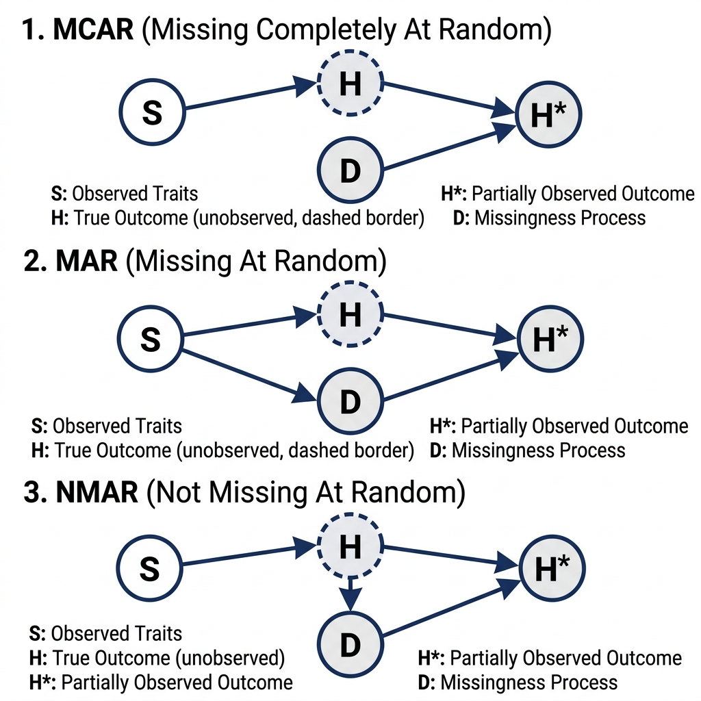

## General Principles

In many real-world datasets, some observations or parameters may be missing or partially known. In a standard frequentist approach, these missing values are often dropped—a practice known as *complete case analysis*. While sometimes justifiable, ignoring missing data frequently leads to biased estimates and a loss of valuable information @mcelreath2018statistical. 

In the Bayesian framework, **missing data are simply treated as unknown parameters to be estimated within the model itself**. The generative model fundamentally does not distinguish between unobserved parameters (e.g., regression coefficients) and unobserved data. The entire joint distribution is evaluated, allowing the model to smoothly "impute" the missing values based on the observed data and prior structural relationships @stan_missing_data. 

Conceptually, the probability model (likelihood) designed for the measurement constraint serves as the prior distribution for the unobserved data.

### Missingness Mechanisms

From a causal inference perspective, the strategy for handling missing data hinges on the underlying mechanism causing the missingness @mcelreath2018statistical. Imagine evaluating an animal's true lifespan or waiting time until adoption ($H$) based on some underlying trait like coat color or species ($S$). However, a missingness process ($D$)—such as a sensor failing, a researcher ending the study, or the trailing event occurring unobserved—might result in an incomplete, partially observed record ($H^*$):

1. **Missing Completely At Random (MCAR)**: *Random sensor failure.* The missingness ($D$) is entirely independent of the animal's traits ($S$) or its true lifespan ($H$). 
   - **Strategy**: Dropping incomplete cases (complete case analysis) is okay and generally unbiased, but it results in a loss of statistical efficiency.

2. **Missing At Random (MAR)**: *Missingness conditional on traits.* The missingness ($D$) is systematically related to other observed variables, such as the animal's species or behavior ($S$) affecting the likelihood of consistent tracking. 
   - **Strategy**: Statistical inference can be rescued by correctly conditioning on the structural causes of the missingness (e.g., $S$) to close backdoor estimation paths.

3. **Not Missing At Random (NMAR)**: *Missingness caused by the outcome itself.* The probability of missingness ($D$) is directly caused by the unobserved value itself ($H$) (e.g., animals that wait the longest to be adopted outlast the study duration and are therefore missing/right-censored).
   - **Strategy**: Usually hopeless unless we can explicitly model the missingness mechanism (the censoring process), such as right-censored waiting times in survival analysis.

{#fig-missingness width=80%}

## Considerations

::: callout-note
- **Parameters vs. Data**: In generative models, there is no philosophical distinction between "unobserved parameters" and "unobserved data". Both are simply unknowns governed by probability distributions. The likelihood of an observed data point behaves identically to the prior for an unobserved one.
- **Imputation vs. Marginalization**: Bayesian Inference offers two primary computational strategies. **Imputation** treats each missing value as a parameter, yielding full posterior distributions for the unknowns; it is highly flexible and transparent but computationally intensive. **Marginalization** mathematically integrates over the unknowns, which is often faster but can be analytically opaque or numerically unstable for certain density functions.
- **JAX Arrays are Immutable**: `BayesInference` uses JAX in the backend. JAX arrays do not support direct heterogeneous assignments (e.g., `y[ii_mis] = y_mis`). When splicing missing data into a larger array, you must use `.at[...].set(...)` operations.
- **Partial Knowledge**: Sometimes covariance or correlation matrices are only partially known. Instead of discarding the known parts, we only sample the unknown cells uniformly within mathematically valid positive-definite bounds and reconstruct the matrix deterministically.
:::

## Examples

Below are four typical missing data patterns translated into the **BayesInference (BI)** framework. Each example demonstrates a specific strategy discussed in the [General Principles](#general-principles) and [Considerations](#considerations) sections.

### 1. Simple Missing Imputation

This example demonstrates the core concept of **Imputation** vs. **Marginalization** (from *Considerations*). Missing observations are modeled as latent variables. Because we treat unobserved data as parameters (as per *Parameters vs. Data*), the likelihood of the observed points serves as the prior for the missing points. This can be viewed as an MCAR or MAR strategy where we explicitly estimate the missing values.

::: {.panel-tabset group="language"}

## Python
```python
from BI import bi
import numpy as np
import jax.numpy as jnp

m = bi(platform="cpu")

def missing_data_model(y_obs, N_mis):
    mu = m.dist.normal(0, 10, name="mu")
    sigma = m.dist.half_normal(10, name="sigma")
    
    # Treat missing data block as latent parameters
    with m.dist.plate("missing_obs", N_mis):
        y_mis = m.dist.normal(mu, sigma, name="y_mis")
        
    # Likelihood for OBSERVED data
    m.dist.normal(mu, sigma, obs=y_obs)
```

## R
```r
library(BayesianInference)
m <- importBI(platform = "cpu")
jnp <- reticulate::import("jax.numpy")

missing_data_model <- function(y_obs, N_mis) {
    mu <- m$dist$normal(0, 10, name="mu")
    sigma <- m$dist$half_normal(10, name="sigma")
    
    # Treat missing data block as latent parameters
    tmp <- m$dist$plate("missing_obs", N_mis)
    y_mis <- m$dist$normal(mu, sigma, name="y_mis")
        
    # Likelihood for OBSERVED data
    m$dist$normal(mu, sigma, obs=y_obs)
}
```

## Julia
```julia
using BayesianInference
using PythonCall

m = importBI(platform="cpu")
jnp = pyimport("jax.numpy")

@BI function missing_data_model(y_obs, N_mis)
    mu = m.dist.normal(0, 10, name="mu")
    sigma = m.dist.half_normal(10, name="sigma")
    
    # Treat missing data block as latent parameters
    tmp = m.dist.plate("missing_obs", N_mis)
    m.dist.normal(mu, sigma, name="y_mis")
    # Note: In Python, `with plate:` is used. For Julia, follow the macro constraints or vectorized shape arguments as supported.
        
    # Likelihood for OBSERVED data
    m.dist.normal(mu, sigma, obs=y_obs)
end
```
:::

### 2. Partially Known Parameters (Covariance)

This example illustrates how to handle **Partial Knowledge** (from *Considerations*). We have observed variances but an unobserved covariance. Rather than discarding the known variances, we deterministically assemble the covariance matrix by sampling the unknown covariance within mathematically valid positive-definite bounds.

::: {.panel-tabset group="language"}

## Python
```python
def partially_known_model(y, var1, var2):
    # Determine bounds based on positive-definite requirements
    max_cov = jnp.sqrt(var1 * var2)
    min_cov = -max_cov
    
    mu = m.dist.normal(0, 5, shape=(2,), name="mu")
    # Sample the unknown covariance within valid bounds
    cov = m.dist.uniform(min_cov, max_cov, name="cov")
    
    # Deterministically assemble the partially known matrix
    Sigma = jnp.array([
        [var1, cov],
        [cov,  var2]
    ])
    
    # Fit the Likelihood
    m.dist.multivariatenormal(loc=mu, covariance_matrix=Sigma, obs=y)
```

## R
```r
partially_known_model <- function(y, var1, var2) {
    # Determine bounds based on positive-definite requirements
    max_cov <- jnp$sqrt(var1 * var2)
    min_cov <- -max_cov
    
    mu <- m$dist$normal(0, 5, shape=c(2L), name="mu")
    # Sample the unknown covariance within valid bounds
    cov <- m$dist$uniform(min_cov, max_cov, name="cov")
    
    # Deterministically assemble the partially known matrix
    Sigma <- jnp$array(list(
        list(var1, cov),
        list(cov,  var2)
    ))
    
    # Fit the Likelihood
    m$dist$multivariatenormal(loc=mu, covariance_matrix=Sigma, obs=y)
}
```

## Julia
```julia
@BI function partially_known_model(y, var1, var2)
    max_cov = jnp.sqrt(var1 * var2)
    min_cov = -max_cov
    
    mu = m.dist.normal(0, 5, shape=(2,), name="mu")
    cov = m.dist.uniform(min_cov, max_cov, name="cov")
    
    # Assemble the matrix row-by-row
    row1 = jnp.stack([var1, cov])
    row2 = jnp.stack([cov, var2])
    Sigma = jnp.stack([row1, row2])
    
    # Fit the Likelihood
    m.dist.multivariatenormal(loc=mu, covariance_matrix=Sigma, obs=y)
end
```
:::

### 3. Sliced Missing Data (Time Series)

This example highlights the technical implementation detail of **JAX Arrays are Immutable** (from *Considerations*). When missing data points are sprinkled within a time series, we cannot mutate arrays in-place. We must use `.at[...].set(...)` to cleanly insert the imputed latent variables into the full array before evaluating the state-space likelihood.

::: {.panel-tabset group="language"}

## Python
```python
def sliced_missing_model(y_obs, ii_obs, N_mis, ii_mis, N_total):
    sigma = m.dist.gamma(1, 1, name="sigma")
    
    # Missing points are parameters
    y_mis = m.dist.normal(0, 10, shape=(N_mis,), name="y_mis")
    
    # Assemble full array without in-place mutation using JAX .at
    y_full = jnp.zeros(N_total)
    y_full = y_full.at[ii_obs].set(y_obs)
    y_full = y_full.at[ii_mis].set(y_mis)
    
    # State-Space Time Series Likelihood: y[t] ~ normal(y[t-1], sigma)
    m.dist.normal(0, 100, obs=y_full[0])
    m.dist.normal(y_full[:-1], sigma, obs=y_full[1:])
```

## R
```r
sliced_missing_model <- function(y_obs, ii_obs, N_mis, ii_mis, N_total) {
    sigma <- m$dist$gamma(1, 1, name="sigma")
    
    # Missing points are parameters
    y_mis <- m$dist$normal(0, 10, shape=c(N_mis), name="y_mis")
    
    # Assemble full array without in-place mutation using JAX .at
    y_full <- jnp$zeros(N_total)
    y_full <- y_full$at[ii_obs]$set(y_obs)
    y_full <- y_full$at[ii_mis]$set(y_mis)
    
    # State-Space Time Series Likelihood
    m$dist$normal(0, 100, obs=y_full[0L])
    m$dist$normal(y_full[0L:(N_total-2L)], sigma, obs=y_full[1L:(N_total-1L)])
}
```

## Julia
```julia
@BI function sliced_missing_model(y_obs, ii_obs, N_mis, ii_mis, N_total)
    sigma = m.dist.gamma(1, 1, name="sigma")
    y_mis = m.dist.normal(0, 10, shape=(N_mis,), name="y_mis")
    
    # Assemble full array using JAX immutable setters
    y_full = jnp.zeros(N_total)
    y_full = y_full.at[ii_obs].set(y_obs)
    y_full = y_full.at[ii_mis].set(y_mis)
    
    m.dist.normal(0, 100, obs=y_full[0])
    m.dist.normal(y_full[0:end-1], sigma, obs=y_full[1:end])
end
```
:::

### 4. Censored Data via Survival Analysis (NMAR)

This example corresponds closely to the **Not Missing At Random (NMAR)** mechanism (from *Missingness Mechanisms* in *General Principles*). The waiting times are right-censored—the probability of missingness is caused by the outcome itself outlasting the observation window. Instead of explicitly imputing values for each missing observation, survival analysis intrinsically leverages **Marginalization** (from *Considerations*), utilizing a survival object to correctly evaluate the probability of the censored event without dropping the partial knowledge.

::: {.panel-tabset group="language"}

## Python
```python
# Explicitly modeling the probability of an event being censored
def mastectomy_survival_model():
    from importlib.resources import files
    
    # Load survival dataset with censored values
    data_path = m.load.mastectomy(only_path=True)
    m.data(data_path, sep=',') 

    # Clean data flags
    m.df.metastasized = (m.df.metastasized == "yes").astype(np.int64)
    m.df.event = jnp.array(m.df.event.values, dtype=jnp.int32)

    # Automatically construct the censored survival objects
    m.models.survival.surv_object(time='time', event='event', cov='metastasized', interval_length=3)

    # Plot censoring (the missingness mechanism)
    m.models.survival.plot_censoring(cov='metastasized')

    def model(intervals, death, metastasized, exposure):
        lambda0 = m.dist.gamma(0.01, 0.01, shape=intervals.shape, name='lambda0')
        beta = m.dist.normal(0, 1000, shape=(1,), name='beta')
        
        # Hazard rate based on covariates
        lambda_ = m.models.survival.hazard_rate(cov=metastasized, beta=beta, lambda0=lambda0)
        mu = exposure * lambda_

        # Poisson likelihood accounts for observed events over the exposure timeframe
        y = m.dist.poisson(mu + jnp.finfo(mu.dtype).tiny, obs=death)

    m.fit(model, progress_bar=False) 
    m.models.survival.plot_surv()
```

## R
```r
mastectomy_survival_model <- function() {
    # Load survival dataset with censored values
    data_path <- m$load$mastectomy(only_path=TRUE)
    m$data(data_path, sep=',') 

    # Clean data flags
    m$df$metastasized <- as.integer(m$df$metastasized == "yes")
    m$df$event <- jnp$array(as.integer(m$df$event))

    # Automatically construct the censored survival objects
    m$models$survival$surv_object(time='time', event='event', cov='metastasized', interval_length=3L)

    # Plot censoring (the missingness mechanism)
    m$models$survival$plot_censoring(cov='metastasized')

    model <- function(intervals, death, metastasized, exposure) {
        lambda0 <- m$dist$gamma(0.01, 0.01, shape=intervals$shape, name='lambda0')
        beta <- m$dist$normal(0, 1000, shape=c(1L), name='beta')
        
        # Hazard rate based on covariates
        lambda_ <- m$models$survival$hazard_rate(cov=metastasized, beta=beta, lambda0=lambda0)
        mu <- exposure * lambda_

        # Poisson likelihood accounts for observed events over the exposure timeframe
        tiny <- jnp$finfo(mu$dtype)$tiny
        y <- m$dist$poisson(mu + tiny, obs=death)
    }

    m$fit(model, progress_bar=FALSE) 
    m$models.survival$plot_surv()
}
```

## Julia
```julia
@BI function mastectomy_survival_model()
    # Load survival dataset with censored values
    data_path = m.load.mastectomy(only_path=true)
    m.data(data_path, sep=",") 

    # Clean data flags
    # Note: Using Python pandas interop for column modification
    df = m.df
    df.metastasized = (df.metastasized .== "yes")
    df.event = jnp.array(df.event.values, dtype=jnp.int32)

    # Automatically construct the censored survival objects
    m.models.survival.surv_object(time="time", event="event", cov="metastasized", interval_length=3)

    # Plot censoring (the missingness mechanism)
    m.models.survival.plot_censoring(cov="metastasized")

    @BI function model(intervals, death, metastasized, exposure)
        lambda0 = m.dist.gamma(0.01, 0.01, shape=intervals.shape, name="lambda0")
        beta = m.dist.normal(0, 1000, shape=(1,), name="beta")
        
        # Hazard rate based on covariates
        lambda_ = m.models.survival.hazard_rate(cov=metastasized, beta=beta, lambda0=lambda0)
        mu = exposure * lambda_

        # Poisson likelihood accounts for observed events over the exposure timeframe
        tiny = jnp.finfo(mu.dtype).tiny
        y = m.dist.poisson(mu + tiny, obs=death)
    end

    m.fit(model, progress_bar=false) 
    m.models.survival.plot_surv()
end
```
:::

## Mathematical Details

### *Bayesian Formulation*

Missing data imputation assumes that the underlying generative process connects both the observed variables $Y_{\text{obs}}$ and the missing variables $Y_{\text{mis}}$. 

For a simple Gaussian imputation, the joint posterior of the parameters $(\mu, \sigma)$ and the missing data $Y_{\text{mis}}$ is proportional to:
$$
P(\mu, \sigma, Y_{\text{mis}} | Y_{\text{obs}}) \propto P(Y_{\text{obs}} | \mu, \sigma) \, P(Y_{\text{mis}} | \mu, \sigma) \, P(\mu, \sigma)
$$

Because both $Y_{\text{obs}}$ and $Y_{\text{mis}}$ are generated from the identical normal distribution $\text{Normal}(\mu, \sigma)$, the sampler naturally infers values for $Y_{\text{mis}}$ that are highly plausible given the parameters $\mu, \sigma$ fitted to $Y_{\text{obs}}$. Conceptually, the likelihood function $P(Y_{\text{mis}} | \mu, \sigma)$ acts as the structural prior for the missing observations $Y_{\text{mis}}$. By sampling $Y_{\text{mis}}$ during execution, we perform **Bayesian Imputation**, averaging over the uncertainty of the missing values.

### *Marginalization*

Alternatively, **Marginalization** analytically integrates out the missing values, removing the need to estimate thousands of imputed parameters. For unobserved variables, the likelihood of the observed dataset is evaluated by integrating over all possible values of the missing data:
$$
P(Y_{\text{obs}} | \mu, \sigma) = \int P(Y_{\text{obs}}, Y_{\text{mis}} | \mu, \sigma) \, dY_{\text{mis}}
$$
While marginalization is computationally more expedient by shrinking the parameter space, it can be analytically challenging and numerically unstable for models with extreme density tails. In models where missingness limits are known, such as right-censored survival data, marginalization relies on tools like the Complementary Cumulative Distribution Function (CCDF) to calculate the remaining cumulative probability beyond the censoring threshold.

### *Constraints*

For partially known covariance matrices, the reconstructed parameter $\Sigma$ is mathematically bound by the positive-definite limits of a $2 \times 2$ matrix, leading to:
$$
\det(\Sigma) > 0 \implies \text{var}_1 \text{var}_2 - \text{cov}^2 > 0 \implies |\text{cov}| < \sqrt{\text{var}_1 \text{var}_2}
$$

## Notes{#notes}

::: callout-note
- **Missing Completely At Random (MCAR) vs Not Missing At Random (NMAR)**: The structural examples shown above effectively operate under the assumption that the probability of data being missing is independent of the value itself (MCAR or MAR). If the missingness mechanism depends on the missing value itself (NMAR)—e.g., people with low income refusing to report their income, or right-censored animal adoption waiting durations—a secondary likelihood must explicitly model the probability of the data being missing or censored to prevent inferential bias.
- **Censored Data**: Censoring is a special form of missingness where partial information is retained (e.g., an observation is known to exceed a specific threshold, $D > D_{\text{censor}}$). By explicitly truncating the imputation prior or utilizing the CCDF, the generative model extracts information from the censored record without distorting rate estimates.
:::
