## What sharding does

`m.fit(..., shard=True)` (or `BF_SHARD=1` as the default) enables **data
sharding**: every eligible
array in the observation dictionary is split along its **leading axis (axis 0)**
into `n_devices` contiguous slices, one per device (CPU virtual device or GPU).
XLA then computes each device's slice of the log-likelihood in parallel and
aggregates the result.

This is distinct from **chain parallelism** (`num_chains=N`, one MCMC chain per
device via `pmap`). Sharding parallelizes *one* chain's likelihood across
devices; chain parallelism runs independent chains. The automatic path pairs
sharding with `chain_method='vectorized'`.

::: callout-important
Data sharding is **experimental** and **off by default**. It is declared
per-fit with `m.fit(..., shard=True)` (or set the default with `BF_SHARD=1`);
there is no construction-time flag — `bf(cores>1)` just builds the device mesh.
The experimental-limits warning prints on the first sharded fit, and the
safeguards (static HLO scan + runtime value check) run once at that fit's setup,
falling back to replicated on a correctness mismatch. Inspect what happened with
`m.shard_report()`.
:::

## The one rule that governs correctness

> Sharding axis 0 is correct **if the model is a composition of two patterns
> over that axis**:
>
> - **Map** — output row *i* depends only on input row *i*
>   (elementwise ops, *left*-matmul `X_(N,P) @ W`, per-row gather `a[group]`).
> - **Reduce** — an associative/commutative combine over axis 0
>   (`sum`, `mean`, `logsumexp`, `max`) → XLA all-reduce.

Equivalently, in statistical terms:

> Shard an axis **only if the joint distribution factorizes into a product along
> it** — the slices are *conditionally independent given the parameters*,
> $p(Y\mid\theta)=\prod_i p(Y_i\mid\theta)$ — and **replicate everything else**.

If that holds, the likelihood is automatically a *reduce* of per-slice *map*
terms, and none of the failure families below can arise in the likelihood.

::: callout-note
Reductions and normalizations (softmax, mean-centering) *along* axis 0 are
**safe** — they lower to all-reduce. The danger is only a non-map / non-reduce
operation that touches the sharded axis, or a full-length result consumed by a
replicated sink.
:::

## Correctness vs. cost — two separate questions

Once axis 0 is the genuine independent axis and structural arrays are replicated,
the failure families below generally do **not** produce wrong numbers — XLA
inserts the necessary collective (allgather / transpose / halo / all-reduce) and
computes the correct answer. What remains is:

1. **Deadlock risk** under `chain_method='vectorized'` — the per-chain `vmap` can
   stall at the inserted collective.
2. **Communication cost** — the collective can erase the speed-up.

The exception is **Family 6** (wrong leading axis), which mis-assigns semantics
and silently produces **wrong numbers**. Model rewriting is therefore mostly the
craft of *eliminating the collectives* (avoiding deadlock and cost), and only for
Family 6 the craft of *picking the right axis*.

## The six failure families

| # | Family | Example operations | Why it breaks |
|---|--------|--------------------|---------------|
| 1 | **Cross-position coupling** | `diff`, `cumsum`/`cumprod`, `lax.scan` *over the sharded axis*, AR/Kalman/HMM/RNN/ODE, convolution, `sort`/`argsort`, `roll`, FFT, rank/quantile | row *i* needs rows *j≠i* across the device boundary |
| 2 | **All-to-all / pairwise** | outer products using axis 0 both ways, Gram / distance / kernel matrices, attention, reciprocity `Y + Y.T` | needs every pair (i,j) → cross-device |
| 3 | **Contraction over the sharded axis** | `W @ X` where X's axis 0 is the *inner* dim; two sharded operands multiplied | the contracted dim is split, not a clean reduction |
| 4 | **Whole-array linear algebra** | `cholesky`, `inv`, `solve`, `qr`, `svd`, `eig`, `det`, `lstsq` | factorization needs the full (N,N); row-shard → non-square local |
| 5 | **Index / segment ops crossing partitions** | `scatter`, `segment_sum`, `bincount`, `unique`, permutation gather `X[perm]` | segment/index spans both devices |
| 6 | **Wrong semantic leading axis** | feature-major `(D,N)`, time-major `(T,N)`, transition `(K,K)`, parameter grids | axis 0 was never the observation axis → **silent wrong numbers** |

::: callout-warning
**Same primitive, opposite verdict.** What matters is *which axis* the operation
ranges over, not the operation itself:

- `a[group]` with `group` per-observation → **map, safe**.
  `b[group[:,None], group[None,:]]` using `group` as a matrix dimension → **breaks**.
- `lax.scan` over a *within-row* dimension under `vmap` over axis 0 → **map, safe**.
  `lax.scan` *over the sharded axis* (carry crosses rows) → **Family 1**.
:::

## What WORKS out of the box

```python
# A1 — linear regression: axis 0 = observations, per-row factorized
def model(X, y):                  # X (N,P), y (N,)  → both sharded
    beta  = m.dist.normal(0, 1, shape=(X.shape[1],), name="beta")
    sigma = m.dist.half_normal(1, name="sigma")
    m.dist.normal(X @ beta, sigma, obs=y, name="y")   # X@beta = map; loglik sum = reduce
```

```python
# A2 — hierarchical: `group` is ALSO per-observation
def model(group, y):              # group (N,) int, y (N,)
    a = m.dist.normal(0, 1, shape=(G,), name="a")     # (G,) replicated
    m.dist.normal(a[group], 1, obs=y, name="y")       # a[group] = per-row gather = map
```

```python
# A3 — scan WITHIN a row, vmapped over the sharded axis (see benchmark_shard.py)
def model(X, y):
    w = m.dist.normal(0, 1, name="w")
    def process_one(x):                               # x is ONE observation
        final, _ = lax.scan(lambda c, _: (jnp.tanh(w*c + x), None),
                             x, None, length=100)      # scans 100 inner steps, NOT N
        return final
    mu = jax.vmap(process_one)(X)                      # map over axis 0 → safe
    m.dist.normal(mu, 1, obs=y, name="y")
```

## What CRASHES loudly (safe failures — you find out)

```python
# B1 — SRM receiver effect: receiver_predictors axis 0 is a COLUMN dimension
r = receiver_predictors @ r_eff      # sharded → (N/d,) not (N,)
s[:, None] + r[None, :]              # (N/d,1)+(1,N/d) → (N/d,N/d) ≠ (N/d,N) → crash

# B3 — covariance Cholesky on a sharded (N,N): non-square local block → crash
L = jnp.linalg.cholesky(Sigma)
```

## What RUNS but DEADLOCKS or is SILENTLY WRONG (the dangerous tier)

```python
# C1 — AR(1) on an OBSERVED series, time sharded: y[t] needs y[t-1] on another device
eps = y[1:] - rho * y[:-1]           # boundary term → halo exchange → deadlock (vectorized)

# C3 — leading axis is structural, not observations (Family 6): silent wrong numbers
mu = jnp.einsum("tn,t->n", X_time, w)   # X_time (4,N) sharded over the 4 "time-features"
```

## Visualizing the operations on small arrays

Every figure below traces one operation on a tiny example — **N = 6 observations
across 2 devices**:

- **device 0** holds rows 0–2 (blue), **device 1** holds rows 3–5 (orange);
- **grey** = replicated on both devices;
- **red** = cross-device communication (allgather / halo / all-to-all) or breakage;
- **green** = local / safe.

All figures are generated by `viz_sharding_ops.py` in this folder — rerun it to
regenerate the `op_*.png` files.

### Safe patterns: map + reduce

`MAP` — output row *i* depends only on input row *i* (elementwise, `X @ β`,
per-row gather `a[group]`). Each device works on its own rows with no comms.

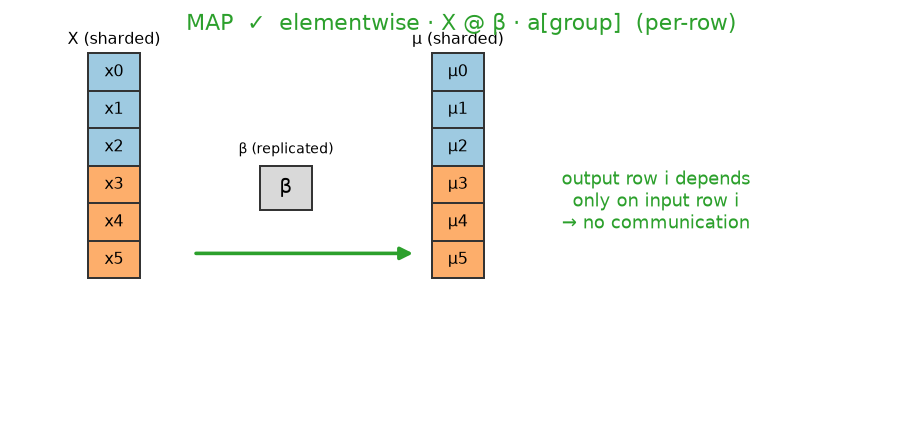{#fig-map width=80%}

`REDUCE` — `sum` / `mean` / `logsumexp` / `max` over axis 0 lower to a single
all-reduce of a **scalar** (this is what aggregates the log-likelihood).

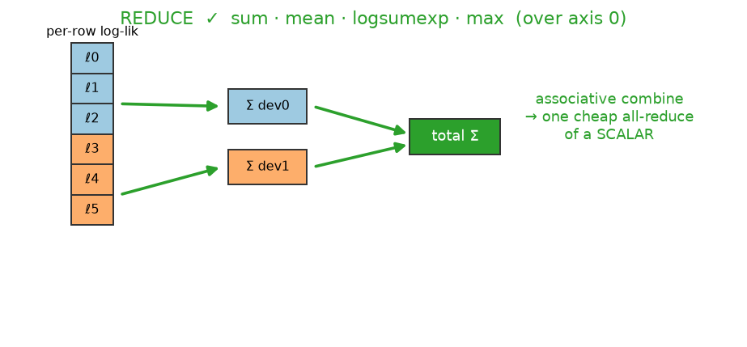{#fig-reduce width=80%}

### Family 1 — cross-position coupling

Row *i* needs other rows *j ≠ i*, which live on another device.

`diff` / lag (`jnp.diff`, `y[1:] − ρ·y[:-1]`) — the pair straddling the boundary
needs a value from the other device:

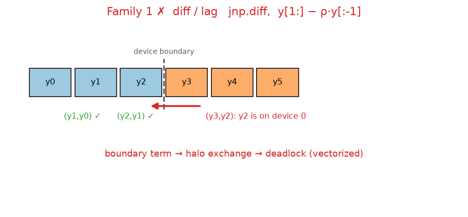{#fig-lag width=80%}

`cumsum` / `cumprod` — a prefix scan carries a running total across the boundary:

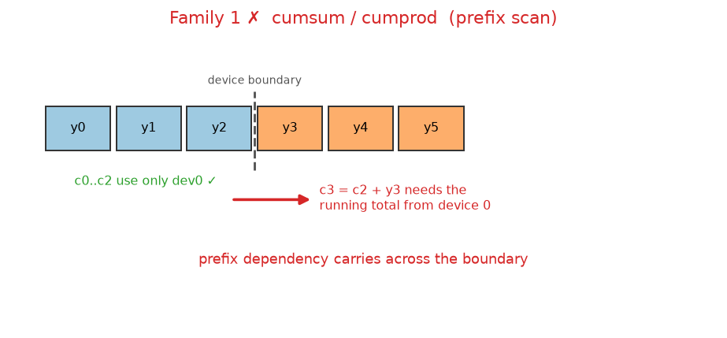{#fig-cumsum width=80%}

`lax.scan` — **over the sharded axis** the carry crosses the boundary (breaks);
**within a row** under `vmap` it is local (safe). Same primitive, opposite verdict:

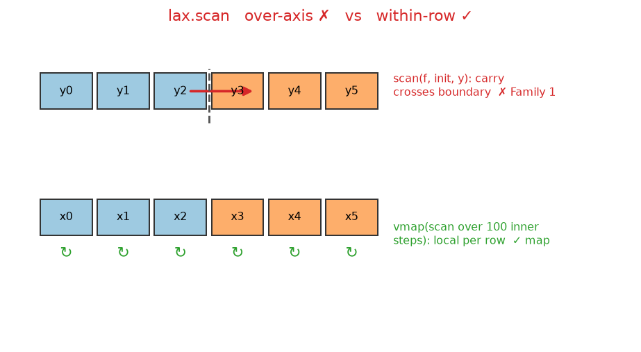{#fig-scan width=85%}

`sort` / `argsort` / `roll` / `FFT` — reordering moves elements between devices:

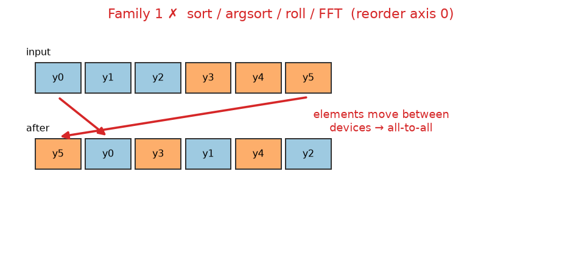{#fig-roll-sort width=80%}

`convolution` — a kernel window at the boundary needs a neighbour from the other
device (a halo exchange):

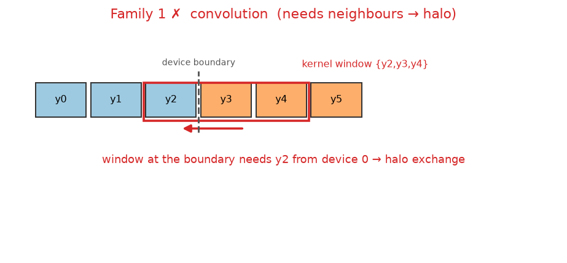{#fig-conv width=80%}

### Family 2 — all-to-all / pairwise

`transpose` / reciprocity `Y + Y.T` — a row-sharded matrix has its columns spread
across devices:

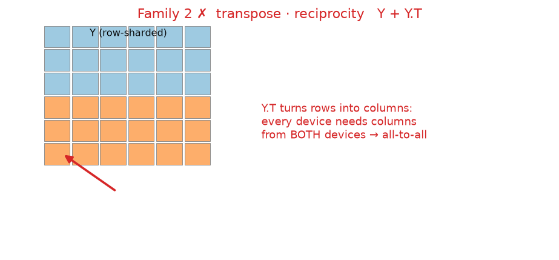{#fig-transpose width=75%}

outer product / Gram / distance / kernel / attention — element `(i,j)` needs both
`xᵢ` and `xⱼ`, which sit on different devices:

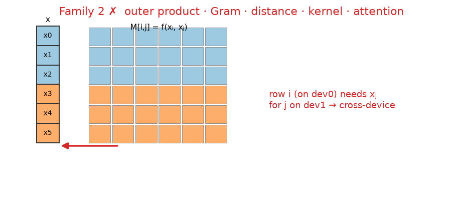{#fig-outer width=80%}

### Family 3 — contraction over the sharded axis

`W @ X` where `X`'s axis 0 is the *inner* (contracted) dimension — the split
dimension cannot be contracted locally:

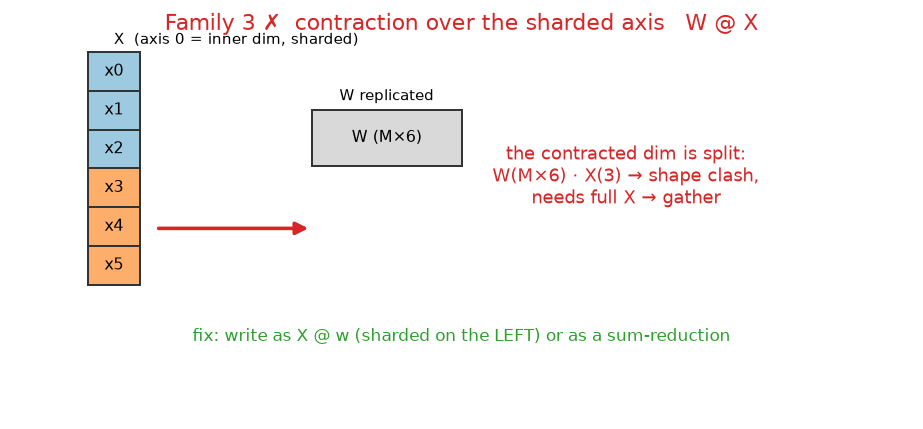{#fig-contraction width=85%}

### Family 4 — whole-array linear algebra

`cholesky` / `inv` / `solve` / `qr` / `svd` / `eig` / `det` — a factorization
couples every row with all columns; a row block is not even square:

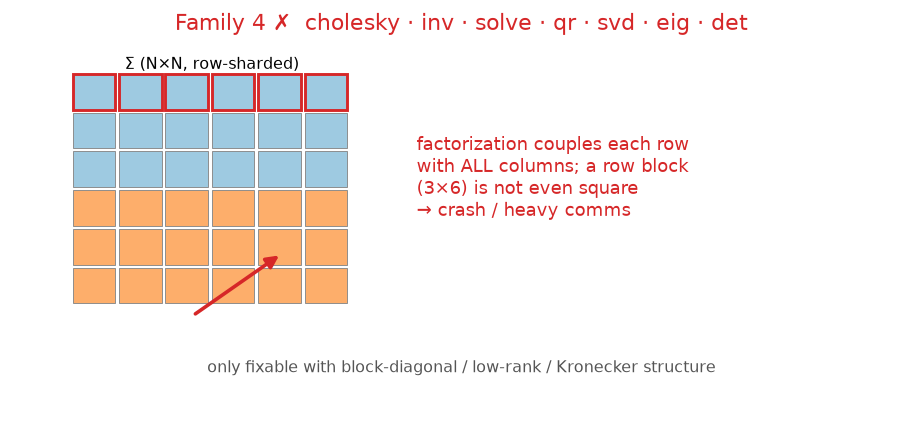{#fig-linalg width=80%}

### Family 5 — index / segment ops crossing partitions

`segment_sum` / `scatter` / `bincount` — a segment that spans the boundary needs a
cross-device combine:

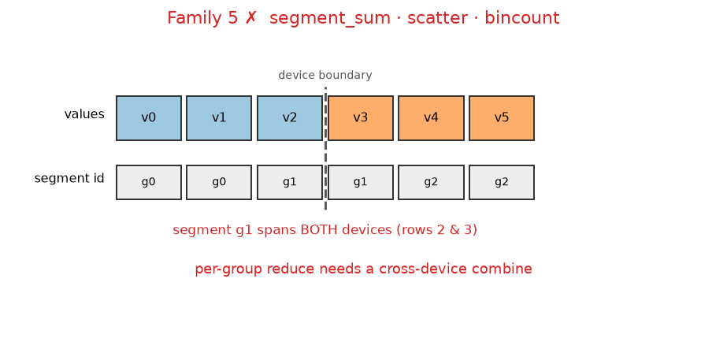{#fig-segment width=80%}

permutation gather `X[perm]` / `unique` — arbitrary indices pull rows across
devices:

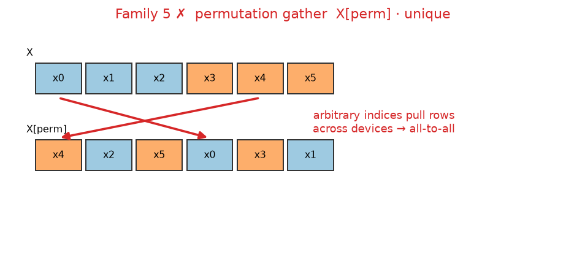{#fig-perm-gather width=80%}

### Family 6 — wrong leading axis

A feature- or time-major array `(D, N)` sharded on axis 0 splits the *feature*
axis, not observations — each device sees a subset of features and computes a
wrong result with **no crash**:

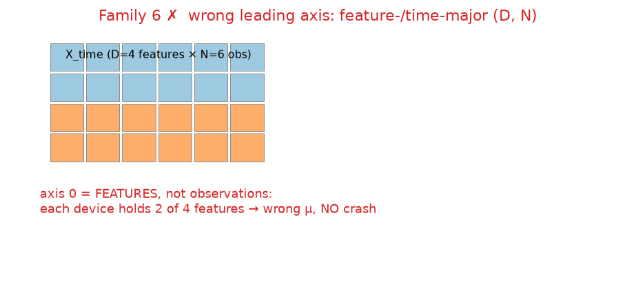{#fig-wrong-axis width=70%}

### The reframing fixes

Materialize observed lags (Family 1) — two aligned arrays, each transition carries
its own neighbour, so the computation becomes elementwise (map):

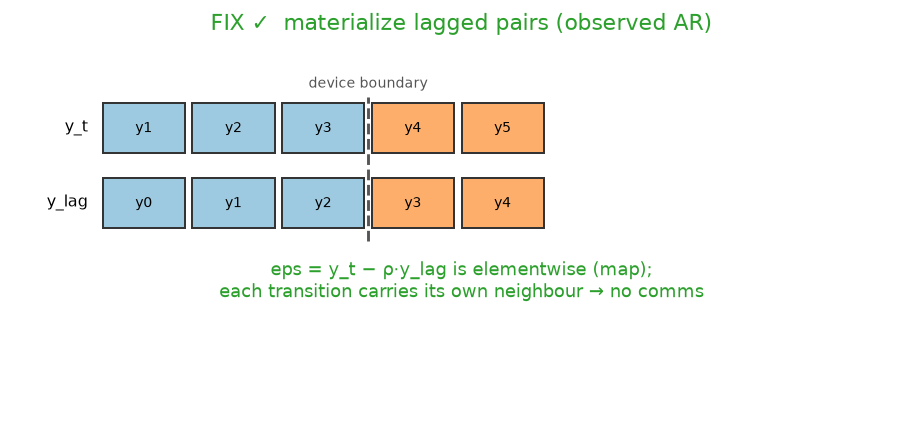{#fig-fix-lag width=80%}

SRM outer sum (Family 2) — a sharded column plus a **replicated** `O(N)` row gives
the full matrix locally, with no transpose:

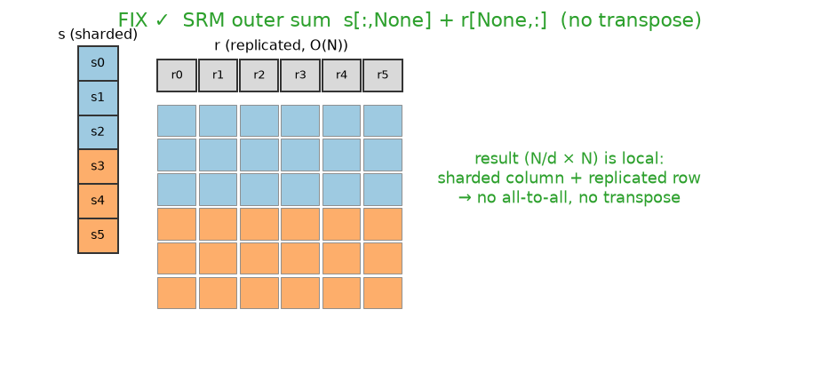{#fig-fix-srm width=80%}

## Reframing a model to be shard-compatible

Model rewriting can convert several families into the safe **map + reduce** form
— *when the model has algebraic structure to exploit.*

### Replicate small coupled vectors instead of transposing (Family 2)

For the SRM, the receiver effect needs the full node axis, but it is a length-$N$
**vector** ($O(N)$), not an $O(N^2)$ matrix. Do **not** transpose the sharded
$(N,N)$ matrix — a transpose is an all-to-all communication that merely relocates
the cost. Instead replicate the small vector and use an outer sum:

```python
# model_effects2.sender_receiver — the correct pattern
s = s_fixed + sr_rf[:, 0]     # sender: sharded, per-row  (the "by-row" case)
r = r_fixed + sr_rf[:, 1]     # receiver: REPLICATED length-N vector
return s[:, None] + r[None, :]   # (N/d, N) per device — local broadcast, no transpose
```

::: callout-tip
**The lesson:** don't try to make every term row-parallel. Make the *big* things
($O(N^2)$ data) map+reduce, and **replicate the *small* things** ($O(N)$ node
vectors). A transpose is never free — it is communication.
:::

### Materialize observed lags as data (Family 1, observed case)

A fully-observed AR(p) only *looks* sequential. Its likelihood factorizes,
$p(y_{1:T}\mid y_0,\theta)=\prod_t \mathcal{N}(y_t\mid\rho y_{t-1},\sigma)$, and
each factor depends only on **observed** $y_t,y_{t-1}$. Materialize the lag as a
second aligned array on the host and the cross-row coupling disappears:

```python
# host preprocessing — each row carries its own copy of the neighbour
y_t, y_lag = y[1:], y[:-1]           # both shard along the transition axis

def ar1(y_t, y_lag):
    rho   = m.dist.uniform(-1, 1, name="rho")
    sigma = m.dist.half_normal(1, name="sigma")
    m.dist.normal(rho * y_lag, sigma, obs=y_t, name="y_t")  # elementwise = map
```

This is just **AR-as-regression**: for AR(p), build the $(T{-}p)\times p$ lagged
design matrix `Z` and write `Z @ phi`. Cost: $(p{+}1)\times$ memory; benefit: full
shardability, no boundary communication.

::: callout-warning
This gives the likelihood **conditional on the first $p$ observations** (it drops
the $y_0$ stationary marginal) — the standard choice. The *exact* full likelihood
uses the dense $T{\times}T$ Toeplitz covariance + Cholesky, which is **Family 4**
and is not shardable this way.
:::

### The hard boundary: observed vs. latent coupling

The lag-materialization trick works because $y_{t-1}$ is **data**. It fails the
moment the recursion is over an **unobserved** quantity, because you cannot
precompute an unknown.

| Cross-row coupling is among… | Reframe as lagged data? | Shardable? |
|---|---|---|
| **observed** values (AR, VAR, observed Markov, NARX) | ✅ materialize lags | ✅ map + reduce |
| **latent** values (Kalman, HMM, stochastic volatility, MA, ARMA) | ❌ can't precompute unknowns | ❌ latent path stays replicated |

For latent state-space models, the transition prior `x[1:] - rho*x[:-1]` is a
cross-row op on a **parameter** vector. That vector must be **replicated** on every
device; sharding can then only parallelize the conditionally-independent
observation layer $y_t\mid x_t$, and only if that layer is the expensive part.

## Can reframing fix every family?

| Family | Fixable by rewriting? | Condition |
|---|---|---|
| 3 — contraction over sharded axis | ✅ Yes | write as `X @ w` (sharded left) or a sum-reduction |
| 6 — wrong leading axis | ✅ Yes | pick the right axis / replicate structural arrays |
| 1 — cross-position coupling | ⚠️ Partly | **observed** lags → materialize; **latent** → cannot |
| 2 — pairwise / transpose | ⚠️ Partly | only with structure (separable / low-rank / outer-sum, e.g. SRM) |
| 5 — scatter / segment | ⚠️ Partly | only if grouping aligns with shard boundary or becomes a dense reduce |
| 4 — dense linear algebra | ❌ No | unless block-diagonal / low-rank / Kronecker structure exists |

## Multiple independent axes

A 1-D device mesh (`PartitionSpec('device')`) can shard **only one** axis;
everything coupled to it must be replicated. That suffices when the
non-sharded axes are small enough to replicate. It is **not** enough when:

- **Multiple data arrays have different natural axes** (panel / longitudinal /
  spatio-temporal) and the replicated axis is itself too large to fit; or
- The structure is **crossed / bipartite** — e.g. the SRM at large $N$, where
  $Y[i,j]$ is conditionally independent across the 2-D *dyad* index. Row-sharding
  handles senders but the receiver/column structure must be replicated ($O(N^2)$
  memory wall).

Both require an **N-D mesh** with per-array `PartitionSpec` (e.g. block-shard
sender × receiver across a 2-D mesh) — beyond the current 1-D implementation, and
they intrinsically need a *declarative* placement because two different axes
cannot be inferred automatically.

## Practical checklist

1. **Opt in explicitly:** `m.fit(..., shard=True)`; read the warning.
2. **Identify the conditional-independence axis** and make it axis 0.
3. **Replicate everything coupled to it** that is not indexed by it
   (`m.replicate(...)`), especially $O(N)$ node vectors and $(N,N)$ covariates.
4. **Do cross-row preprocessing on the host** (materialize lags, differences,
   sorts) — never inside the model on a sharded array.
5. **Keep cross-row primitives off the sharded axis** (`scan`/`cholesky`/`diff`
   either operate within-row under `vmap`, or on replicated parameters).
6. **Ensure aligned arrays share the exact partition** (same length, same order).
7. **Audit with `m.shard_report()`** and validate the posterior against a
   single-device (replicated) run before trusting a sharded fit.

::: callout-note
For genuinely silent cases (Family 6), the only automatic safeguard is a runtime
check that compares the model's log-density replicated vs. sharded on the real
data and falls back to replication on mismatch. This is the recommended next step
for making automatic sharding safe without a declarative spec.
:::

## alternative appraoche with user sharding spec

```python
# model author declares intent once:
SHARD_SPEC = {
    "Y_mat": "shard", "dyadic_predictors_mat": "shard", "sender_predictors": "shard",
    "receiver_predictors": "replicate", "Any": "replicate", "Merica": "replicate",
}
def _auto_shard_data(self, data, spec=None):
    spec = spec or getattr(self.model, "_shard_spec", {})
    out = {}
    for k, v in data.items():
        how = spec.get(k, "replicate")          # safe default = replicate
        if how == "shard":
            arr = jnp.asarray(v)
            if arr.shape[0] % self.n_devices != 0:
                raise ValueError(f"{k}: leading dim {arr.shape[0]} not divisible by n_devices={self.n_devices}")
            out[k] = jax.device_put(arr, self._data_sharding)
        else:
            out[k] = jax.device_put(jnp.asarray(v), self._rep_sharding)
    return out
```

## Results: validating the safeguards

Two automatic safeguards were implemented and tested
(`sharding_safeguards.py`, `test_sharding_safeguards.py` in this folder):

1. **Static check (fit setup):** lower + compile the function under the intended
   shardings and scan the optimized HLO for array-moving collectives
   (`all-gather` / `all-to-all` / `collective-permute` / `reduce-scatter`); a
   scalar `all-reduce` — the likelihood sum — is treated as benign. A coarse
   jaxpr primitive scan complements it for index ops.
2. **Runtime value check:** evaluate the function with data **replicated** vs.
   **sharded** and compare against a trusted reference.

### One case per family (2 CPU devices, N = 6)

| case | family | static check | runtime value |
|------|--------|--------------|---------------|
| `safe_map` | safe | none (all-reduce only) | match |
| `safe_reduce` | safe | none (all-reduce only) | match |
| `fam1_lag` | 1 | **collective-permute** | match |
| `fam1_cumsum` | 1 | **all-gather** + `cumsum` | match |
| `fam1_sort` | 1 | **all-gather** + `sort` | match |
| `fam1_conv` | 1 | **collective-permute** + `conv` | match |
| `fam1_scan` | 1 | **all-gather** | match |
| `fam2_transpose` | 2 | **all-to-all** | match |
| `fam2_outer` | 2 | **all-to-all** | match |
| `fam3_contraction` | 3 | none (benign all-reduce) | match |
| `fam4_cholesky` | 4 | **all-gather + all-to-all** + `cholesky` | match |
| `fam5_segment` | 5 | `scatter-add` (no array collective) | match |
| `fam5_perm_gather` | 5 | `gather` (no array collective) | match |
| `fam6_shardmap` (no `psum`) | 6 | **none** | **MISMATCH** |

### The key finding: GSPMD makes sharding a *performance* decision, not a *correctness* one

Every plain-JAX case returned the **same value sharded as replicated** — lag,
cumsum, sort, transpose, cholesky, gather, all of them. This is not luck: under
GSPMD (`jax.jit` + `device_put`, which is exactly the BayesForge auto-shard
path), the partitioned program is **sharding-invariant by construction** — XLA
inserts whatever collectives are needed so the result equals the single-device
result.

::: callout-important
This **corrects** the earlier framing in this document. Under pure GSPMD even a
"wrong leading axis" (Family 6) is *numerically correct* — contracting the wrong
axis is still a reduction, which XLA aggregates correctly. The only genuinely
**silent wrong number** appeared when leaving GSPMD via a manual `shard_map`
without its `psum` (`fam6_shardmap`). So:

- **Correctness is essentially never the risk under GSPMD auto-sharding.**
- **The dominant real risk is the collectives** XLA inserts for the coupled
  families — they cause the deadlock under `chain_method='vectorized'` and the
  loss of speed-up.
- **Silent wrong numbers require manual SPMD** (`shard_map`, `custom_jvp`,
  device-dependent logic).
:::

### What each safeguard is for, and why both are needed

|  | detects WRONG numbers | detects DEADLOCK / cost |
|--|:--:|:--:|
| static HLO + primitive scan | no (except via crash) | **yes** |
| runtime value check | **yes** | no |

- The **static check** answers *"will this sharding be slow / deadlock?"* — the
  common risk. It precisely flagged the collective-inducing families, stayed
  quiet on map/reduce and on contraction (benign all-reduce), and the primitive
  scan caught `gather`/`scatter` that GSPMD had optimized into a cheap path (so
  the HLO scan alone missed them — the precise-vs-conservative trade-off).
- The **runtime check** answers *"is the number still correct?"* — it confirmed
  all 13 GSPMD cases and was the **only** check to catch the `shard_map` bug,
  where a *missing* collective leaves no trace in the HLO.

Neither alone is sufficient; together they cover both axes.

### Manual per-operation sharding (`manual_ops/`)

Declaring sharding for one operation *inside* the model — keeping data replicated
and parallelizing only a chosen op — was validated in
`manual_ops/test_manual_ops.py`:

| model | correct? | collectives |
|-------|----------|-------------|
| `with_sharding_constraint` (shard one op) | match | none at N=6 (scatter/gather at scale) |
| `shard_map` + `psum` (explicit map+reduce) | match | none (scalar psum only) |
| SRM outer sum (shard `s`, replicate `r`) | match | none — no transpose |
| `shard_map` **without** `psum` | **WRONG** | none → caught by value check |

This confirms the surgical approach: GSPMD constraints stay correct
automatically; explicit `shard_map` gives no-hidden-comms control but puts
correctness on the author — exactly where the value check earns its keep.

### Do the safeguards slow down sampling?

**No.** Both run **once, at fit setup, before the MCMC loop** — never inside the
per-leapfrog hot path:

- **Static check** — one extra `lower().compile()` plus a `make_jaxpr` trace. The
  compilation is the only real cost (seconds for a large model), a fixed setup
  overhead amortized to ~nothing over the thousands of gradient steps a run
  performs. **Zero per-step cost.**
- **Runtime value check** — two *forward* evaluations (no autodiff), once.
  Negligible next to MCMC's thousands of gradient evaluations.

The sampling itself is unchanged. The only price is a one-time setup bump
(dominated by the extra compile), which can be gated to the first run.


Beyond accessibility, a structural bottleneck in modern Bayesian analysis is purely computational. Massive social networks spanning years of observation, high-frequency animal tracking datasets, and simultaneous phylogenetic inferences across thousands of candidate trees demand structured tensor computation at a scale that traditional Markov Chain Monte Carlo (MCMC) samplers cannot efficiently handle. \textit{BayesForge} eliminates this barrier by acting as an accessible interface to modern, deep-learning-backed computation engines. By leveraging \textit{JAX}, \textit{NumPyro}, and \textit{TensorFlow Probability}, \textit{BF} inherits state-of-the-art computational efficiencies, including Just-In-Time (JIT) compilation, automatic differentiation, and massive parallelization and vectorization natively on hardware accelerators (GPUs and TPUs). Additionally, contrary to \textit{NumPyro}, \textit{TensorFlow Probability} and \textit{PyMC}, \textit{BF} have builtin automatic sharding for each mathematical operations, drastically increasing spead on multi-cores, multi-GPU and multi-TPU . This allows models that previously required days of computation to be fit in only in few minutes.

At its computational core, \textit{BF} delivers unprecedented \textit{scalability} by bypassing the bottlenecks of traditional MCMC samplers. It delegates all heavy tensor operations to modern, PPLs, specifically \textit{JAX}, \textit{NumPyro} and \textit{TensorFlow Probability}. This architecture provides automatic differentiation, Just-In-Time (JIT) compilation, and native hardware acceleration (GPU/TPU) entirely under the hood. Furthermore, while frameworks like \textit{NumPyro}, \textit{TensorFlow Probability}, and \textit{PyMC} require users to manually configure device meshes and data partitioning to achieve distributed computing, \textit{BF} features a custom engine that automatically shards any \textit{JAX} mathematical operation. This built-in auto-sharding drastically accelerates execution speeds across multi-core CPUs, multi-GPU, and multi-TPU clusters, yielding massive performance gains with zero manual configuration required from the researcher. By abstracting these low-level backend complexities into a high-level, language-agnostic API, \textit{BF} brings state-of-the-art computational \textit{scalability} to applied researchers. This empowers ecologists to fit models that where once computationally prohibitive---e.g., tracking disease transmission across densely connected spatial matrices \citep{craft2015infectious}---without requiring deep expertise in computer science or tensor mathematics.


\section{Automated Distributed Computing via Intelligent Sharding}

\subsection{The Limits of Traditional Parallelism and the Sharding Solution}
Standard Bayesian software typically scales computation through replication: running multiple independent MCMC chains in parallel across different CPU cores. While this approach efficiently generates multiple posterior samples, the execution time is ultimately bottlenecked by the speed of a single chain. For massive ecological datasets\textbf{---such as fitting Joint Species Distribution Models (JSDMs) across continental-scale monitoring networks---}a single MCMC chain can still require days or weeks to converge. To accelerate individual chains, modern computation must leverage \textit{sharding} (data partitioning), which splits the actual data and mathematical operations across multiple devices (e.g., multi-core CPUs, GPUs, or TPUs) simultaneously.

While modern deep-learning-backed frameworks like \textit{NumPyro}, \textit{TensorFlowProbability}, and \textit{PyMC} support multi-device execution, leveraging this capability typically requires users to manually configure device meshes, explicitly annotate array splits, and write complex distribution protocols. \textit{BayesForge} (\textit{BF}) eliminates this technical barrier by featuring a custom engine that automatically shards \textit{JAX} mathematical operations on observed data, delivering distributed computing with zero manual configuration required from the researcher.

\subsection{The Rules of Distributed Computing: Favorable Regimes}
Whether sharding successfully accelerates a computation is governed by two core properties of the operations involved: their \textit{data-parallelism} along the partitioned axis, and their \textit{arithmetic intensity} (the ratio of arithmetic performed to memory traffic incurred).

Sharding is highly advantageous for operations that are data-parallel---where each output depends only on local data along the sharded axis, requiring minimal inter-device communication. It is most effective when operations are compute-intensive, ensuring that the work distributed across devices dominates the fixed cost of coordination. Element-wise transforms, broadcasts, and batched independent likelihood evaluations belong strictly to this class. For example,
evaluating the likelihood of millions of independent animal GPS telemetry pings scales perfectly under sharding because the parallelizable work grows with the dataset size, while communication overhead does not.

Our internal benchmarks confirm this scaling efficiency even on a single multi-core CPU. By holding the hardware fixed and increasing the compute per observation, \textit{BF}'s automatically sharded execution overtakes standard replicated multi-chain execution at progressively smaller datasets, reaching speed-ups exceeding an order of magnitude for large, compute-bound workloads. Crucially, this advantage is bounded by a crossover threshold: because sharding incurs a fixed coordination cost that the distributed work must first amortize, replication remains preferable below the crossover---for small or computationally cheap datasets \textbf{(e.g., a standard linear regression on 50 site counts)}, partitioning the data only adds overhead. The crossover shifts to smaller datasets as the compute per observation rises, so the heavier the per-datum computation \textbf{(e.g., evaluating complex non-linear spatial kernels for each observation)}, the sooner sharding pays off.

\subsection{Communication Penalties: When Naive Sharding Fails}
However, indiscriminately partitioning all data is dangerous. Sharding becomes severely disadvantageous---and can significantly slow down execution---under two specific conditions. The first involves operations that require data points to interact, or ``talk'' to one another, across the sharded axis. To understand this, imagine distributing the records of 1,000 animals across four different processing devices. If the model evaluates independent traits, the devices never need to communicate. However, if the model evaluates pairwise (all-to-all) interactions---such as calculating the social distance between every possible pair of animals---the device holding Animal A must constantly pause its calculations to query the other devices for the attributes of Animals B, C, and D.

Other mathematical operations that force this cross-device communication include calculating global population averages (global contractions) \textbf{such as mean-centering a morphological trait across all recorded individuals}, cross-shard indexing, and calculating gradients for parameters shared across every individual\textbf{, such as a single global climate-forcing hyperparameter that simultaneously impacts every sub-population}. Because the devices must constantly halt their math to exchange massive amounts of data over the hardware's communication network (triggering collective routines known as ``all-gather'' or ``all-reduce'' transfers), the communication overhead completely
swallows the computational gains. In dense ecological models---such as the all-to-all dyadic network interactions in a Social Relations Model (SRM)---the volume of required communication, \emph{when the model is partitioned along the node (individual) axis}, does not shrink with the device count and may even grow with the model size, making naive sharding highly detrimental.

The second failure condition involves memory-bandwidth-bound operations of low arithmetic intensity executed on a single shared-memory host (e.g., a standard multi-core desktop CPU). \textbf{An example of this is applying basic intercept lookups or simple log-link transformations across a massive, sparse presence/absence matrix; the system moves huge amounts of data but performs very little actual math on it.} In this scenario, multiple CPU cores contend for a single memory bus. Adding more cores supplies no further memory bandwidth, yielding zero speedup. Such workloads only accelerate on advanced hardware---such as multi-GPU or multi-TPU clusters---where the aggregate memory bandwidth physically scales with the device count.

\subsection{The Axis Problem and the BayesForge Solution}
Importantly, the decision of whether to distribute an operation is complicated by the geometry of the data. The exact same mathematical computation may fall into a favorable or unfavorable regime depending entirely on the axis along which it is partitioned. A structural coupling that is global along one axis (causing severe slowdowns) is frequently local and independent along another (allowing massive speedups). Therefore, the choice of the specific partition axis, not merely the decision to shard, dictates the outcome.

The Social Relations Model makes this concrete. Partitioned along the node axis, it is the intractable all-to-all case described above: each device holds a subset of individuals, yet the dyadic interaction effects couple every individual with every other, forcing the gradient of these shared effects to be reconciled across all devices on every iteration---an $O(N^2)$ communication cost that does not diminish as devices are added. Partitioned instead along the \emph{dyad} axis---so that each device owns a block of the pairwise relationships outright---the very same computation becomes communication-light: the expensive interaction effects are computed entirely locally, and only the comparatively small individual-level quantities must be exchanged, reducing communication from $O(N^2)$ to $O(N)$. The model does not change; only the axis of partition does, and with it the outcome flips from prohibitive to scalable.

To protect applied researchers from these hidden traps, \textit{BF} pairs its auto-sharding engine with static and runtime safeguards. Before sampling, it statically scans the compiled computation for the array-moving collective routines (all-gather, all-to-all, collective-permute) that signal cross-shard coupling---while correctly treating the cheap scalar reduction of an independent likelihood as benign---and at runtime it verifies that the sharded log-density matches its replicated counterpart. If either check flags a hazard---a globally coupled operation that would trigger heavy communication, or a partition that alters the numerical result---\textit{BF} automatically falls back to standard multi-chain replication. Consequently, the ecologist obtains the speed advantages of distributed execution where they exist, while being protected from the silent slowdowns and, critically, the estimation errors that naive data partitioning can introduce.
