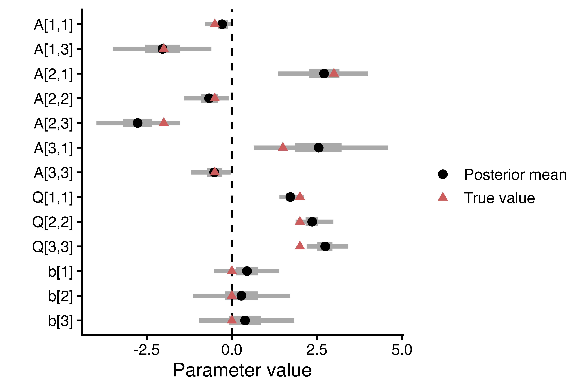

# Abstract {.unnumbered}

Phylogenetic comparative methods are widely used to study trait coevolution across biological and cultural domains. The most common methods are phylogenetic generalized linear (mixed) models, phylogenetic path analysis, Pagel's 'discrete' method, and Ornstein-Uhlenbeck models. While some frameworks like generalized linear mixed models are quite flexible in terms of the data structure, they are ill-suited for inferring causal effects; others, like Pagel’s ‘discrete’ can more explicitly infer causal sequences, but are limited in the number and types of traits that can be modelled (see @tbl-compare). Here, we develop a novel class of *generalized dynamic phylogenetic models* (GDPMs) that overcomes these limitations and synthesizes the strengths of existing methods into a flexible framework for dynamic inference. Treating the phylogeny as an implicit time series, GDPMs model trait coevolution for any number of traits undergoing both deterministic adaptation and stochastic drift, capable of inferring directed evolution ($X \leftarrow Y$ vs $Y \leftarrow X$), feedback ($X \leftrightarrow Y$), and contingencies (e.g., first $X$, then $Y$). We introduce the `coevolve` R package, a user-friendly interface for fitting GDPMs in a Bayesian framework using Stan. To demonstrate the GDPM framework, we first work through a biologically-motivated synthetic example of predation and mating system among Cichlid fish. We also perform simulation-based calibration as a computational validation of our models. Additionally, we present some empirical applications of GDPMs, including analyses of brain size in non-human primates and societal complexity across human populations. These examples highlight the flexibility and potential of the GDPM framework, which allows researchers to model latent variables, multilevel structures and repeated measures, measurement error, missing data, and other complexities inherent in comparative data.

# Introduction

Phylogenetic comparative methods (PCMs) are commonly used to study trait coevolution spanning topics such as anatomy and physiology [@Dunn2015; @Garland2005; @Navalon2019; @OConnor2022; @Thayer2018], life history and behavior [@Bielby2007; @Clayton1994; @MacLean2012; @Salguero2016], and cultural evolution [@Mace2005; @Navarrete2016; @Watts2016]. "Coevolution" in this work refers to covariance *among traits* within lineages over time [@gintis2011gene; @xu2024sexual; @Sheehan2018] -- not reciprocal selection between interacting species (e.g., predator-prey, host-parasite). Trait coevolution can be investigated using a diverse family of statistical techniques depending on the research question and type of data available [@Garamszegi2014; @Harvey1991; @Nunn2011].

Phylogenetic generalized linear (mixed) models [@Grafen1989; @Hadfield2010; @Symonds2014], phylogenetic path analysis [@GonzalezVoyer2014; @vonHardenberg2013], Pagel's [-@Pagel1994] discrete method, and Ornstein-Uhlenbeck models of adaptation [@hansen1997stabilizing; @bartoszek2024fast] are the most popular approaches for assessing trait coevolution. While each of these methods has clear benefits, they are all limited in their generality by strong assumptions regarding the direction of causal effects among traits, the process of evolutionary change, and/or the statistical properties of the traits under investigation. We therefore introduce a novel class of PCM designed to address these challenges in a flexible statistical framework, implemented in the Stan probabilistic programming language [@Carpenter2017].

We begin by briefly reviewing the strengths and limitations of current PCMs, particularly with regard to causal inference and the types of data that can be modeled. We then introduce a novel class of *generalized dynamic phylogenetic models* (GDPMs). We provide a worked synthetic example of trait coevolution involving three continuous traits--predation, promiscuity, and sperm size among Cichlid fish (inspired by [@Fitzpatrick2009])--to demonstrate the types of inferences that can be made with GDPMs. We also provide an accompanying code tutorial using our `coevolve` R package to aid empiricists in applying basic GDPMs. We then demonstrate the flexibility of our method with two empirical applications, which extend the model to non-Gaussian, higher-dimensional scenarios using latent variables. Specifically, (1) a comparative dataset on primate brain size and life history traits [@DeCasien2017], and (2) two studies of cultural evolution across a global and a regional sample of non-industrial human societies [@Ringen_preprint; @Sheehan2023].

# Current approaches and motivation

Fundamental to PCMs is adjustment for shared evolutionary history using a phylogenetic tree (or set of trees) and a statistical model. In a basic sense, phylogenetic adjustment is crucial for causal inference, as shared evolutionary history tends to generate trait correlations among closely related species with similar phenotypes, creating the illusion of convergent trait coevolution even when traits evolve independently. Adjustment for phylogeny thus reduces the risks of type I (false-positive), type II (false-negative), type M (magnitude), and type S (sign) errors during statistical inference [@felsenstein1985phylogenies; @harvey1998phylogenetic]. Nonetheless, adjustment for phylogeny is not a magic fix for all sources of unobserved confounding [@uyeda2018rethinking], nor does it guarantee that resulting estimates are causally interpretable [@Hansen2014]. PCMs vary widely in their assumptions about the trait co-evolutionary process, with most commonly used methods focusing--often implicitly--on evolutionary correlation (@fig-dags a) rather than causation (@fig-dags b-e).

![Graphical models of trait coevolution \| Examples of distinct formal approaches to describing and explaining patterns of trait coevolution (large letters), with important properties represented in each graph highlighted by blue arrows and text. Approaches range in complexity from (a) simple non-causal models of phylogenetic correlations (indicated by bidirectional arrows; note that this is not a causal model, as the correlation could arise from multiple underlying causal processes such as mutational pleiotropy or correlational selection), to (b-e) directed acyclic graph models, which can be used to represent the causal effects (directed arrows) driving trait associations. Explicit causal models are crucial for deciding which traits should be included or excluded from a multiple regression analysis to avoid potential biases due to phenomena such as forks (b) and colliders (c). Causal models can also be further distinguished by whether they model relationships among traits as static (b-c) or dynamic (d-e). Only dynamic models can be used to quantify feedback processes ($t_{-1} \rightarrow t \rightarrow t_{+1}$) generated by reciprocal causation (blue arrows) among traits and autoregressive effects within traits (grey arrows) over time (d). For high dimensional problems, one might consider the inclusion of latent causes into the DAG (e), capturing dimensions of evolutionary integration among multiple traits.](figures/dags/dags.png){#fig-dags}

## Phylogenetic generalized linear (mixed) models

Phylogenetic generalized linear (mixed) models are used to quantify how much trait (co)variation between species or populations is due to shared evolutionary history (likewise for their predecessor, independent contrasts) [@Blomberg2012; @Grafen1989; @Hadfield2010; @Lynch1991; @Symonds2014]. The most commonly assumed model of trait evolution is Brownian motion, which assumes that covariance (within a trait) for a given pair of species or populations is proportional to their amount of shared history [@felsenstein1985phylogenies]. This process is often interpreted as evolutionary drift (or neutral evolution), though for macroevolutionary traits such as body size and brain size it more likely reflects randomly fluctuating selection or movement of the adaptive peak over time [@hansen1997stabilizing]. Empirically, the actual degree of covariance between related species or populations may be less than expected under a pure Brownian motion model; in these cases, the "phylogenetic signal" will be weaker [@Blomberg2003; @Kamilar2013], motivating various branch length transformations [@Pagel1999]. Beyond Brownian motion, early burst models of adaptive radiation allow the rate of change to decrease over time [@harmon2010early], while Ornstein-Uhlenbeck models characterize evolutionary change as the product of both stochastic and deterministic processes [@Hansen2014; @butler2004phylogenetic].

Despite their differences, these models share often unstated assumptions. Specifically, they correspond to the static causal structures in @fig-dags b-c, where trait relationships are contemporaneous: there is no reciprocal causation between traits over time, and the effects of past predictor values on the response are fully blocked by current predictor values. These are strong assumptions that are likely to be violated in many empirical datasets, limiting the applicability of phylogenetic generalized linear (mixed) models for theory testing and development. In contrast, the dynamic structures in @fig-dags d-e allow for feedback and temporal contingencies that these models cannot represent. In addition, the most commonly used implementation of these models, phylogenetic generalized least squares (PGLS), suffers from various other constraints such as being limited to Gaussian errors, overfitting due to a lack of parameter regularization, and a failure to accommodate many common data features such as repeated measures, missing data, and measurement error (but see [@ives2007within]). While generalized multilevel/mixed-effects approaches can be used to address these concerns [@Hadfield2010; @Ives2010; @Ives2011; @Lynch1991; @Martin2020; @Ringen2019], they nonetheless share the same basic limitations and are not well-suited for modelling adaptation [@Hansen2014], see @nte-attenuation.

::: {#nte-attenuation .callout-note}
## Traditional phylogenetic regression models underestimate causal effects

An unintuitive aspect of traditional "static" PCMs is that regression coefficients estimated using cross-sections of contemporary species are used to infer the change in some trait $Y$ in response to another trait $X$ over evolutionary time. The slope of a response trait on a predictor trait is known as the "evolutionary regression coefficient" [@Pagel1993]. But these coefficients tend to underestimate causal effects: because evolution by natural selection is generally a gradual process, the total causal effect of one trait on another -- which we define as the change in the optimal trait value of $Y$ as a function of the value of $X$ (@Scholkopf2013 gives a similar definition of causal effects in systems of ordinary differential equations) -- can take a long time to be fully realized. As such, we do not in general expect to observe species at equilibrium. This attenuation bias is a joint product of the strength of selection on the response trait and the rate of change in the predictor trait [@hansen2008comparative; @Hansen2014]. Intuitively, if one trait changes too quickly, then the other will always be playing catch-up. See @fig-evo-reg-coef for an illustration of this process. A solution to this problem is to move beyond traditional regression-based PCMs and explicitly model trait change and the adaptive process using *dynamic* phylogenetic models. Ornstein-Uhlenbeck models and their extensions address this attenuation bias by directly estimating the effects of selection.

{#fig-evo-reg-coef}
:::

## Phylogenetic path analysis

An advance in recent decades has been to realize that even conventional regressions with observational data can be used to infer causal effects, in some circumstances [@Shipley2016]. This is because specific causal models, usually represented as directed acyclic graphs (DAGs, see @fig-dags), imply testable patterns of statistical independence among variables [@Pearl2009]. Following Pearl's do-calculus or the potential outcomes framework [@Rubin2005], researchers can identify sets of variables to adjust for (or not) in order to test their causal hypotheses [@cinelli2024crash]. Transparency about causal assumptions has become standard in fields such as epidemiology [@tennant2021use] and is increasingly popular in evolutionary biology and ecology to justify modelling decisions [@Deffner2022; @McElreath2020; @Shipley2016; @Warrell2020].

Phylogenetic path analysis incorporates some of these insights by fusing traditional path analysis with phylogenetic generalized least squares [@GonzalezVoyer2014; @vonHardenberg2013]. In this framework, researchers posit different graphical models and compare their fit to the data. For instance, @Navarrete2016 presented several path models that all included links between life history and social group size with brain size, with variable direct or indirect effects of diet and technical intelligence.

However, the applicability of phylogenetic path analysis is limited to static causal models lacking any reciprocal effects over time. This is an issue because positive (or negative) evolutionary feedback loops are predicted by many theoretical models, e.g. in response to life history tradeoffs and various forms of frequency- and density-dependence, suggesting that reciprocal causation is likely to be a widespread phenomenon impacting patterns of trait coevolution [@schoener2011newest; @svensson2018reciprocal]. For example, @McNamara2022 presents a model of the trait coevolution of paternal care and extrapair paternity, which is driven by a frequency-dependent feedback loop over evolutionary time between males' tendency to seek extrapair copulations and the benefits of their paternal care. The inability to estimate dynamic feedback effects (as well as their general weakness for traits subject to selection, see @nte-attenuation) is a fundamental limitation of static regression models, thus motivating the use of dynamic methods.

## Dynamic methods for discrete traits

In contrast to the 'static' PCMs discussed thus far, dynamic PCMs treat the phylogeny as an implicit time series, opening the door for quasi-longitudinal analyses. To date, Pagel's [-@Pagel1994; -@pagel2006bayesian] "discrete" is the most widely-used dynamic PCM. It is based on a continuous-time Markov model unfolding over the phylogenetic tree, with transition rates corresponding to the probability of moving between binary states. By reconstructing the coevolutionary sequence of two traits, researchers can infer directed and potentially reciprocal trait co-evolution through temporal contingency, referred to as "Granger causality" in economics [@Granger1969]. For example, researchers can infer that $X$ evolved first, or that the evolution of $X$ made the subsequent evolution of $Y$ more likely (although such inferences are purely descriptive in the absence of strong causal assumptions). This method has resulted in many high-profile publications [@Cornwallis2017; @Fitzpatrick2009; @Kappeler2019; @Sheehan2018; @Shultz2011; @Watts2016].

Despite its innovative approach to causal inference, Pagel's method is fundamentally limited to investigating the coevolution of discrete traits. Application of this method to continuous traits (e.g. morphology, life history, brain size, etc.) thus requires that researchers falsely dichotomize naturally occurring variation [e.g. @Cornwallis2017; @Fitzpatrick2009; @Sheehan2018; @Watts2016], which generally leads to loss of power, biased effect sizes, and sensitivity of results to choice of cutoffs [@Dawson2012; @Royston2006]. For instance, @Fitzpatrick2009 dichotomized continuously-measured sperm length and speed by classifying traits below the species mean as "low" and those above the species mean as "high", and they collapsed a four-point scale of female promiscuity, based on behavioral and paternity data, into "low" (levels 1 and 2) and "high" (levels 3 and 4). Using Pagel's method, they then showed that sperm evolved to be faster and longer in response to increases in female promiscuity. Dichotomization is especially problematic for inferring Granger causality, as it conflates a species' distance from the arbitrary cutoff threshold with true causal temporal lags: species with trait values far from the threshold will take longer to transition in response to a causal variable, not because of genuine causal delays but because of the measurement artifact.

The limitation of Pagel's method to binary traits is further exacerbated when studying the (co)evolution of multiple continuous traits, which often motivates the use of latent variables (@fig-dags e). We use "latent variable" here in the statistical/measurement sense: unobserved constructs that are indexed by multiple observed indicators, not in the causal sense of unmeasured confounders. Such constructs are widely used in biology to capture theoretically pertinent dimensions that are difficult to quantify using a single measurement, such as size and shape dimensions in morphometrics [@zelditch2012geometric], environmental quality and climate metrics in ecology [@arhonditsis2006exploring], life history variation [@Stott2024], and canonical axes of correlational selection in evolutionary quantitative genetics [@blows2003measuring]. Prior research has used data reduction techniques such as phylogenetic principal component analysis to handle high-dimensional data and then applied Pagel's method to the resulting scores [e.g. @Cornwallis2017], but this approach still demands discretization and the principal component axes are merely linear combinations of observed variables rather than constructs embedded in a generative evolutionary model.

Pagel's method is subsumed under the more general "Mk" model [@lewis2001likelihood], which can, in principle, accommodate any number of *k* discrete, unordered states. Unfortunately, this generalization suffers from the curse of dimensionality: the number of potential discrete-state combinations grows exponentially, demanding more data than is realistically attainable for most comparative analyses. One way to reduce this complexity is by imposing ordered constraints, i.e., specifying that a species cannot jump directly from the lowest and highest levels of a trait without first transitioning through intermediate levels. Alternatively, one might use Hidden Markov models (HMMs) [@krogh1994hidden], wherein a small number of latent discrete states map onto continuous observed variables. In the phylogenetic context, HMMs have been used for estimating rate heterogeneity of discrete traits over time [@boyko2021generalized] and for modeling structured dependencies among character states [@tarasov2019integration; @porto2025structured]. A related approach is phylogenetic factor analysis [@tolkoff2018phylogenetic; @hassler2022phylogenetic], which maps a small number of latent factors onto observed variables -- including discrete traits via the threshold model [@felsenstein2005using; @felsenstein2012comparative] -- but does not model dynamic causal processes. Regardless, HMMs and factor models are at best inefficient if the underlying process of evolution is continuous--and we expect continuity for most phenotypic traits. Synthesizing continuous and multivariate methods with dynamic causal inference thus remains a major unmet need in contemporary PCMs.

## Dynamic methods with continuous traits {#sec-OU}

There are several other approaches to dynamic PCMs, based on the Ornstein-Uhlenbeck (OU) model [@uhlenbeck1930theory], that are capable of modelling continuous traits but that are subject to limitations in their current forms. The basic OU model is a mean-reverting, stationary Gauss-Markov process. It describes change in a trait due to both Gaussian noise and mean-reversion towards some central tendency that might change over time. In evolutionary biology, the mean-reverting quality is loosely interpreted as "selection" and the Gaussian noise is labeled "drift" [@hansen1997stabilizing; @Hansen2014]. The basic OU form describing the change in some trait ($dy$) over time ($t$) is:

$$
dy(t) = \alpha(\theta - y_{t}) + \sigma dW(t)
$$

Following @hansen1997stabilizing, $\alpha$ is understood as the rate of adaptation towards the primary optimum $\theta$, and $\sigma$ as the strength of stochastic evolution (which in macroevolution likely includes fluctuating selection rather than neutral drift alone). The simplest OU models assume a single evolutionary optimum ($\theta$), or estimate an ancestral optimum along with a global optimum. More elaborate OU models imagine that $\theta$ changes as a function of other variables, turning it into a trait coevolutionary process with varying selection regimes (i.e., the Hansen model; [@hansen1997stabilizing]). These approaches exploit the fact that, if selection regimes are piecewise-constant, the OU process can be solved for the expectation and covariance of a trait. [@butler2004phylogenetic] provided a maximum-likelihood algorithm for this approach, and Bayesian implementations have been developed by [@ross2016origins] and [@grabowski2024blouch]. They assume that one trait influences the evolution of another, but not vice-versa (i.e., no feedback), and have been used to study the adaptive evolution of continuous traits such as brain size [@Smaers2021] and immune system function [@malmstrom2016evolution]. The multivariate OU model was further extended to allow the estimation of reciprocal, directed evolution between traits [@bartoszek2012phylogenetic], a method that has been implemented in the mvslouch [@bartoszek2024fast] and mvMORPH [@clavel2015mvmorph] R packages. This approach aligns closest with our goals. However, current implementations only allow for traits with Gaussian errors and use maximum-likelihood estimation, demanding many repeated refits to stabilize potentially unreliable parameter estimates [@bartoszek2024fast]. Overall, current methods for dynamic continuous trait co-evolution lack sufficient flexibility to accommodate the diversity of comparative analyses in ecology and evolution, such as accounting for latent variables, missing data, and repeated measures.

# Generalized dynamic phylogenetic models

The limitations of current PCMs can be overcome by combining their respective strengths into an integrative framework. We have attempted to do so through the development of what we refer to as generalized dynamic phylogenetic models (GDPMs). In contrast to existing methods for dynamic discrete [@Pagel1994] and continuous [@bartoszek2012phylogenetic; @bartoszek2024fast] trait-coevolution, our approach lifts restrictions on the type and number of traits that can be included, bringing the flexibility of generalized multilevel modeling (e.g. @Hadfield2010) to dynamic models. This is achieved by adapting the continuous-time structural equation modeling framework of @Driver2017 to the phylogenetic context. Crucially, GDPMs have two layers: (1) a latent species or population-level evolutionary model, where "latent" refers to the unobserved continuous evolutionary process ($\pmb{\eta}$) underlying the observed data, and (2) an observation-level measurement model that links $\pmb{\eta}$ to potentially non-Gaussian observations at the tips. By decoupling the latent trait co-evolutionary dynamics from the measurement process, GDPMs attain a high degree of structural flexibility. Our Bayesian implementation in the Stan probabilistic programming language [@Carpenter2017] provides a foundation for phylogenetic modelling that can accommodate the diversity of comparative data. We provide a high-level summary of our method in comparison to other methods in @tbl-compare.

```{r, echo = FALSE}
#| label: tbl-compare
#| tbl-cap: "Comparison of GDPMs with other popular PCMs used for inferring trait coevolution. Software listed are examples for each method, not intended as a comprehensive list. Phylo Unc. = phylogenetic uncertainty (ability to marginalize over a sample of trees); Meas. Err. = measurement error. *Discrete traits only. Software references: caper [@orme2013caper], MCMCglmm [@hadfield2010mcmc]; brms [@burkner2017brms]; BayesTraits [@meade_bayestraits_2016]; mvSLOUCH [@bartoszek2024fast]; coevolve [@coevolve]."
#| layout-nrow: 2

options(tinytable_html_mathjax = TRUE)
library(tinytable)
d_methods_compare <- data.frame(
  Method = c("PGLS", "PGLMM", "Discrete", "Multivariate OU", "GDPM"),
  Software = c("caper", "MCMCglmm, brms", "BayesTraits", "mvSLOUCH", "coevolve"),
  Dynamic = c(" ", " ", "$\\checkmark$", "$\\checkmark$", "$\\checkmark$"),
  `Non-Gaussian` = c(" ", "$\\checkmark$", "$\\checkmark$*", " ", "$\\checkmark$"),
  `Repeated` = c(" ", "$\\checkmark$", " ", " ", "$\\checkmark$"),
  `Phylo Unc.` = c(" ", "$\\checkmark$", "$\\checkmark$", " ", "$\\checkmark$"),
  `Meas. Err.` = c(" ", "$\\checkmark$", " ", "$\\checkmark$", "$\\checkmark$"),
  `Missing` = c(" ", "$\\checkmark$", "$\\checkmark$", "$\\checkmark$", "$\\checkmark$"),
  Estimation = c("ML", "MCMC", "MCMC", "ML", "MCMC"),
  check.names = FALSE
)
tt(d_methods_compare, width = 1) |>
  style_tt(fontsize = 0.7) |>
  style_tt(i = 5, bold = TRUE, fontsize = 0.7)
```

## Latent evolutionary model

At the core of a GDPM is a system of stochastic differential equations that partitions evolutionary change into state-dependent deterministic selection and state-independent Brownian motion, similar to a multivariate OU process. The evolutionary history of a species' or population's traits are modeled as a time series unfolding across the segments of a phylogenetic tree:

$$
  \begin{aligned}
  d\pmb{\eta}(t) = (\textbf{A}\pmb{\eta}(t) + \textbf{b}) + \textbf{G}dW(t) \\
  dW(t) \sim \sqrt{dt}\mathcal{N}(0, 1)
  \end{aligned}
$$ {#eq-ou-evo-model}

Here $\pmb{\eta}(t) \in \mathbb{R}^K$ is a vector of latent variables at time $t$, the matrix $\textbf{A} \in \mathbb{R}^{K \times K}$ represents "selection" with strictly negative autoregressive terms on the diagonal analogous to $-\alpha$ in the univariate OU process (@sec-OU). Off-diagonals may be positive or negative, controlling the effect of each trait on the others (e.g., $\textbf{A}[2,1]$ represents the effect of $\eta_1$ on $\eta_2$), and $\textbf{b} \in \mathbb{R}^{K}$ is a vector of continuous time intercepts that, along with $\textbf{A}$, determine the equilibrium values of $\eta$. Without $\textbf{b}$, all traits would revert back to 0. The matrix $\textbf{G}$ is the Cholesky decomposition of the positive semi-definite "drift" covariance matrix $\textbf{Q} \in \mathbb{R}^{K \times K}$ (not to be confused with the $Q$ matrix of discrete-state continuous-time Markov models), such that $\textbf{Q} = \textbf{G}\textbf{G}'$, which scales the Brownian motion process ($W(t)$). The square root of the diagonals in $\textbf{Q}$ are equivalent to $\sigma$ in the OU process (@sec-OU), with off-diagonals representing correlated stochastic evolution. We retain scare quotes around "drift" throughout to emphasize that the stochastic component in macroevolution likely reflects a mixture of processes including fluctuating selection, rather than neutral genetic drift per se.

Following [@driver2018hierarchical], we can solve @eq-ou-evo-model for any finite time interval $t - t_0$, representing the amount of time between parent and child nodes on the tree. We decompose change due to selection ($\pmb{A}_{\Delta})$, change due to the continuous time intercept ($\pmb{b}_{\Delta}$), and the drift covariance ($\pmb{Q}_{\Delta}$):

$$
  \label{eq:solution}
  \begin{aligned}
    \textbf{A}_{\Delta} = e^{\textbf{A}(t - t_0)} \\
    \textbf{b}_{\Delta} = \textbf{A}^{-1}(\textbf{A}_{\Delta} - \textbf{I})\textbf{b} \\
    \textbf{Q}_{\Delta} = \textbf{Q}_{\Delta_{\infty}} - \textbf{A}_{\Delta} \textbf{Q}_{\Delta_{\infty}}\textbf{A}_{\Delta}^{\intercal}\\
        \textbf{Q}_{\Delta_{\infty}} = \text{irow}(-(\textbf{A} \otimes \textbf{I} + \textbf{I} \otimes \textbf{A})^{-1} \text{row}(\textbf{Q}))
  \end{aligned}
$$

with $\otimes$ denoting the Kronecker product. $\textbf{I}$ is an identity matrix, $\text{row()}$ is an operation that takes elements of a matrix row-wise and puts them in a column vector, and $\text{irow()}$ is the inverse of the row operation. Solving via the asymptotic covariance ($\textbf{Q}_{\Delta_{\infty}}$) is efficient because it only needs to be calculated once for the whole tree (in the absence of clade-specific or time-varying parameters) [@driver2018hierarchical].

The $\textbf{Q}$ matrix can be understood as governing the variance/covariance of random, short-term fluctuations, whereas the $\textbf{A}$ matrix controls long-term selection and mean-reversion. Drift dominates at very small timescales because the differential effect of selection is proportional to $dt$, whereas for drift it is proportional to $\sqrt{dt}$.

## Phylogenetic tree traversal {#sec-traversal}

The stochastic differential equation (SDE) solution described above applies to a single time interval. To model trait evolution across an entire phylogeny, we traverse the tree from root to tips, applying the SDE solution to each branch segment (@fig-algorithm). The algorithm proceeds as follows:

1. **Initialize at root**: The ancestral trait values $\pmb{\eta}_0$ at the root of the tree are treated as parameters to be estimated (a reasonable default is to set a prior centered on the sample mean, otherwise an informative prior based on domain knowledge).

2. **Pre-order traversal**: The tree is traversed in pre-order (root-first, depth-first), visiting each internal node before its descendants. This ensures that parent trait values are always computed before their children's values are needed.

3. **Segment-wise SDE solution**: For each branch connecting a parent node (at time $t_0$) to a child node (at time $t$), we apply the discrete-time solution:
$$\pmb{\eta}(t) = \textbf{A}_{\Delta} \pmb{\eta}(t_0) + \textbf{b}_{\Delta} + \pmb{\varepsilon}$$
where $\pmb{\varepsilon} \sim \mathcal{N}(\textbf{0}, \textbf{Q}_{\Delta})$ represents the accumulated stochastic drift over the branch, and the branch length $\Delta t = t - t_0$ determines $\textbf{A}_{\Delta}$, $\textbf{b}_{\Delta}$, and $\textbf{Q}_{\Delta}$ via the equations above.

4. **Tip values**: At the tips of the tree, the latent trait values $\pmb{\eta}$ are linked to observed data through the observational model (described below).

![Schematic of the GDPM tree traversal algorithm. Top panel: Two latent traits ($\eta_1$ and $\eta_2$) co-evolve in continuous time according to the SDE, with their values at segment boundaries serving as inputs to subsequent segments. Bottom panel: The phylogenetic tree is decomposed into segments, with internal nodes (blue circles) representing latent trait values at branching points and tips (red circles, A--E) where latent values are linked to observed data. The algorithm traverses the tree from root (time $t_0$) to tips, computing trait values at each node using the SDE solution (shown in the equation box). Branch lengths ($\Delta t_1$, $\Delta t_2$, etc.) determine the amount of deterministic selection and stochastic drift accumulated along each segment.](figures/dpm_algorithm_updated.png){#fig-algorithm}

## Observational model

Let $y_{[n,j]}$ denote the observed value for trait $j \in J$ from species or population $n \in N$ at the tips of a phylogeny (although the same formulation could be used for internal nodes):

$$ y_{[n,j]} \sim f(\mu_{[n,j]}, {\phi}_{[j]})$$ $$ g(\mu_{[n,j]}) = \pmb{\Lambda_{[j,]} \cdot \eta}_{[n]} + \ldots $$

Where $f()$ is a probability density or mass function with expected value $\mu$ and additional distributional parameters $\pmb{\phi}$, which could for example control the dispersion, zero-inflation, shape, or shift of a distribution. $g()$ denotes a link function, which transforms the expected value from the support of the function $f()$ latent values to the unbounded continuous space of evolutionary process, for example log, logit, or just the identity link function, in which $g(\mu) = \mu$. $\pmb{\Lambda} \in \mathbb{R}^{J \times K}$ is a factor matrix that maps the latent trait values onto the observed variables. In this article we only discuss models in which the latent $\pmb{\eta}$ maps onto $\mu$, but one could also model the evolution of distributional parameters [see @cathcart2023rate]. In the simplest case where $K = J$, $g()$ is the identity link, and $\pmb{\Lambda}$ is an identity matrix, the GDPM is equivalent to a multivariate OU process. The ellipses denote the potential to add additional, non-dynamic terms to the observational model, such as group-level random effects to capture repeated observations or spatial autocorrelation.

## Implementation

We implemented GDPMs in a Bayesian framework using the Stan probabilistic programming language [@Carpenter2017] (see Supplementary Materials for example Stan code). Stan employs a computationally efficient Hamiltonian Monte Carlo algorithm to sample from the posterior distribution. Working in Stan allows for high degrees of flexibility, seamlessly extending the base GDPM model with additional features such as researcher-specified priors on model parameters, measurement error on observed variables, and imputation of missing data.

## The `coevolve` R package

To aid researchers in applying the GDPM to their own data, we developed the `coevolve` R package (https://github.com/ScottClaessens/coevolve). This package provides a user-friendly interface, with simple functions for generating GDPM Stan code and data lists, fitting GDPMs to data using the `cmdstanr` package [@R_cmdstanr], and post-processing and plotting model results. Besides offering an accessible user interface, the codebase has been re-factored for computational efficiency and flexibility, compared to previous implementations [@Ringen_preprint; @Sheehan2023].

The development version of the `coevolve` package can be installed and loaded using the following R code:

```{r eval=FALSE}
#| class-output: OutputCode
#install.packages("devtools")
library(devtools)
install_github("ScottClaessens/coevolve")
library(coevolve)
```

As of `coevolve` version 0.1.0.9009, the package supports the following response distributions: `normal`, `bernoulli_logit`, `poisson_softplus`, `negative_binomial_softplus`, `gamma_log`, and `ordered_logistic`. Missing trait data and repeated observations per taxon are automatically handled during model fitting, and users can access the pointwise log-likelihood, which enables the use of contemporary Bayesian model comparison techniques [@vehtari2017practical]. Additionally, `coevolve` supports samples of phylogenetic trees as `multiPhy` objects, integrating over phylogenetic uncertainty during model fitting rather than requiring the user to re-run their analyses for each sampled tree and pool the results. We plan to implement further response distributions and support for latent variables in future versions of the package, but for now users can manually adapt the Stan code produced by the package to add these features (see Supporting Information Section 4). For technical details on how missing data, repeated measures, and measurement error are handled at the Stan level, see Supporting Information Section 3. Further documentation and tutorials are available at https://scottclaessens.github.io/coevolve/.

## Synthetic example: mating system, reproductive effort, and predation among Cichlid fish

We first introduce a biologically-motivated synthetic example to illustrate the potential of GDPMs to shed light on trait co-evolution. This section also serves as an example for how one might interpret the results of a GDPM and explore trait co-evolutionary dynamics.

### Generative model

Imagine that we are studying the highly diverse cichlid fish of Lake Tanganyika, investigating the relationship between female promiscuity and sperm size. In line with previous work, we predict that increases in promiscuity will select for increases in sperm size, but not vice-versa [@Fitzpatrick2009]. However, we also suspect that this relationship may be confounded by predation: populations subject to high degrees of predation may have less promiscuity as a consequence of elevated predation risk during courtship and intrasexual competition [@dill1999male; @kelly2001predation]. Further assume that somatic investments in anti-predator defenses trade-off with reproductive investment, making predation a confounder of promiscuity and sperm size. At the same time, the more cautious regime of low promiscuity may feed back into predation, leading to further reduction in predation rates--but we note that in reality these dynamics may be non-linear and context-specific. These assumptions are encoded as a dynamic DAG in @fig-synthDAG). Note that predation risk can be conceptualized as a potentially conserved and coevolving environmental trait within lineages [@Harvey1991], demonstrating the utility of GDPMs for investigating eco-evolutionary dynamics over phylogenetic timescales.

{#fig-synthDAG width="60%"}

Using a previously published time-calibrated phylogeny of $N = 265$ Cichlid fishes [@ronco2021drivers], we performed a forward-simulation GDPM with the following parameter values:

$$ \textbf{A} = \begin{bmatrix}
-0.5 & 0 & -2 \\
3 & -0.5 & -2 \\
1.5 & 0 & -0.5
\end{bmatrix} $$

$$ \textbf{Q} = \begin{bmatrix}
2 & 0 & 0 \\
0 & 2 & 0 \\
0 & 0 & 2
\end{bmatrix}  $$

$$ \textbf{b} = [0, 0, 0] $$

With the positive off-diagonal $\textbf{A}_{[2,1]}$ representing the effect of promiscuity on sperm size and the negative off-diagonals $\textbf{A}_{[1,3]}, \textbf{A}_{[2,3]}$ representing the effect of predation on promiscuity and sperm size, respectively; $\textbf{A}_{[3,1]}$ is the effect of promiscuity on predation. The diagonal $\pmb{Q}$ matrix means that each trait has independent drift terms. For simplicity of demonstration, we assume each of these traits is Gaussian, with a simple 1:1 mapping between the observed variables and the latent traits. In all subsequent examples, we consider non-Gaussian traits.

We used the `coev_fit()` function from the `coevolve` package to fit our statistical model using the phylogenetic tree and simulated tip values of female promiscuity, sperm size, and predation:

```{r eval=FALSE}
#| class-output: OutputCode
fit <-
  coev_fit(
    data = sim$data,
    variables = list(
      Promiscuity = "normal",
      SpermSize = "normal",
      Predation = "normal"
    ),
    prior = list(A_offdiag = "normal(0, 2)", Q_sigma = "normal(0, 2)"),
    id = "species",
    tree = sim$tree,
    effects_mat = effects_mat, # elements of A to estimate
    estimate_correlated_drift = F
  )
```

See Supporting Information Section 2 for a more detailed code tutorial. The model converges and is able to recover the true trait coevolutionary dynamics quite faithfully (see @fig-synthpars). Generalizing beyond a single simulation and fixed set of parameters, we perform a more rigorous evaluation of the accuracy and calibration of our Stan program in Supporting Information Section 1.

{#fig-synthpars width="80%"}

The off-diagonal elements of $\textbf{A}$ are partial derivatives of each variable with respect to the others, where time has been scaled by the total tree-depth. For traits with different scales, it can be informative to standardize $\textbf{A}$ by the trait standard deviations, as in @fig-primate-results B. While the $\textbf{A}$ parameters convey immediate information about direct effects in the trait co-evolutionary process, the dynamics of the system as a whole are best understood by generating predictions from the model in different parts of the state space.

### Trait coevolutionary dynamics {#sec-dynamics}

After fitting, we can use the posterior draws to generate counterfactual histories that illustrate the trait co-evolutionary dynamics implied by the model. `coevolve` offers the convenience functions `coev_pred_series()` and `coev_plot_pred_series()` for calculating and visualizing these dynamics, respectively. @fig-synthdynam (a) demonstrates the coupling and temporal contingencies of predation, promiscuity, and sperm size, integrating both drift and selection. @fig-synthdynam (b) omits the stochastic component of the model, highlighting the expected pattern of trait coevolution. When promiscuity is high, both sperm size and predation are expected to increase over time. In contrast, neither promiscuity nor predation are expected to change in response to sperm size (their trajectories are nearly flat), implying that changes in promiscuity precede changes in sperm size. Finally, we can see that higher levels of predation lead to reductions in both promiscuity and sperm size.

![Predicted trait co-evolution among Cichlid species over time, with the x-axis spanning the total depth of the phylogeny. (a) Simulated values with initial (ancestral) states sampled from the posterior distribution. Trajectories reflect change due to both deterministic selection and stochastic drift, and each panel represents a single draw from the posterior. (b) Expected trait values given different initial states. In each row, one focal trait is varied +/- two standard deviations from the posterior mean of the tip species, while the other traits start at their mean values. Lines represent posterior means and shaded regions represent 90% credible intervals.](figures/synthetic_dynamics.png){#fig-synthdynam}

There is some subtlety in interpreting these dynamics. Not only does the effect of one trait on the other unfold over time--the total effect is not instantaneous--but the traits also regress back towards their equilibrium values (see @sec-equilibrium). One alternative is to examine the predicted time series under a hypothetical intervention in which we hold some traits at a constant value (see @fig-synthintervention), which can be implemented in `coevolve` via the `intervention_values` argument in the `coev_pred_series()` functions. However, this demands that we are willing to go beyond Granger causality and temporal contingencies and assume that our causal model is correct (i.e., there are no unmeasured confounders). And even if our causal model is correct, the projection of a perfect intervention over macroevolutionary timescales can result in high uncertainty and extreme predictions that extrapolate far beyond the sample data, straining credibility.

{#fig-synthintervention width="80%"}

### Equilibrium analysis {#sec-equilibrium}

In the OU process, $\frac{dy}{dt}=0$ when $y=\theta$ @sec-OU, where the optimal trait value $\theta$ can be a function of other co-evolving traits. In contrast, GDPMs do not have explicit $\theta$ parameters. Instead, the multivariate equilibrium trait values emerge as a function of both the $\textbf{A}$ and $\textbf{b}$ parameters. For consistency with other PCMs we refer to these values as $\pmb{\theta}$, but elsewhere they are referred to as $\textbf{b}_{\Delta\infty}$ [@driver2018hierarchical]:

$$
\label{eq:asymptotic}
  \textbf{b}_{\Delta\infty} = \pmb{\theta} = \textbf{A}^{-1}\textbf{b}
$$

These are the values of $\pmb{\eta}$ that the system will approach as time goes to infinity, in the absence of interventions. The solution follows from the idea that there exists some set of trait values for which the effects of $\pmb{A}$ and $\pmb{b}$ are perfectly balanced, leading to zero change. Alternatively, if we hold some variables constant at some value(s) (denoted $\eta_{h}$) and let others evolve freely (denoted ${\eta_{f}}$), we can partition the parameters as follows:

${\pmb{A}_{ff}}$: selection coefficients to/from the free variables

${\pmb{A}_{fh}}$: selection coefficients to the free variables from the held variables

${\pmb{b}_{f}}$: continuous time intercepts for the free variables.

We can then calculate the equilibrium values for the free variables ($\pmb{\theta_f}$):

$$
\pmb{\theta_f} = -\pmb{A}_{ff}^{-1} \left( \pmb{A}_{fh}\pmb{\eta}_h + \pmb{b}_f \right)
$$ {#eq-equilibrium-intervention}

Building upon the previous solution by adding the constant selection effects of the held variables on the free variables ($\pmb{A}_{fh}\pmb{\eta}_h$). The overall equilibrium vector is then a mixture of free and held values:

$$
\pmb{ \theta \mid \eta_h } = \begin{bmatrix}\pmb{\theta}_f \\ \pmb{\eta}_h\end{bmatrix}
$$

We can understand $\pmb{ \theta \mid \eta_h }$ as the values the traits would approach as we extend the time axis to infinity. Both $\pmb{\theta}$ and $\pmb{ \theta \mid \eta_h }$ can be calculated in `coevolve` using the `coev_calculate_theta()` function. By plugging different trait values into @eq-equilibrium-intervention, we can calculate the *change* in the equilibrium value of the free trait(s) resulting from an increase in the held trait(s), denoted $\Delta\theta$ in recent applications of GDPMs [@Ringen_preprint; @Sheehan2023]. However, the same caveats about causality and extrapolation from @sec-dynamics apply. Also note that by constraining the diagonals of $\textbf{A}$ to be negative we guarantee that an equilibrium exists, but we cannot guarantee stability (i.e., small perturbations may propel the system away from the equilibrium). If the system is unstable, these quantities may not be appropriate summaries of the trait co-evolutionary dynamics.

## Empirical applications {#sec-empirical}

To illustrate the flexibility and scope of our method, we present empirical applications that involve multiple non-Gaussian traits and latent variables. @sec-brain-size-evo presents an analysis of existing data on primate brain size evolution, while @sec-cultural-evolution summarizes two published examples of cultural evolution in humans.

### Brain size evolution in primates {#sec-brain-size-evo}

Brain size, both in absolute terms and relative to body size, varies tremendously among taxa, with primates as a group having larger brains than other mammals, and humans having the largest brains of all primates [@Boddy2012; @Isler2008; @Miller2019; @Smaers2021]. This has motivated a large number of comparative phylogenetic analyses on correlates of brain size, typically framed as testing social or ecological explanations for the evolution of larger brains [@DeCasien2017; @Dunbar2017; @Isler2009]. However, many have recognized that this approach has reached an impasse, as conclusions are sensitive to the specific dataset and modelling decisions [@Powell2017; @Wartel2019], with issues such as variable patterns of missingness and very high collinearity among the predictors of brain size. At the same time, reciprocal causation is inherent in most theoretical models (e.g. larger brains allow access to better diet which removes energetic constraints on larger brains) [@Isler2014], but such feedbacks are not represented in most statistical models. Pagel's discrete method has to our knowledge never been utilized to study brain size because it is not amenable to discretization. One recent analysis applied OU models to study of primate brain size evolution [@grabowski2023both], but only estimated how socio-ecological variables affect brain size rather than assessing reciprocal effects. In the GDPM framework, we can quantify both bi-directional evolutionary relationships and represent highly-integrated traits using latent variables.

{#fig-primateDAG width="60%"}

To illustrate the potential of GDPMs to shed light on brain size evolution, we used the dataset of @DeCasien2017, augmented by life-history variables from @Herculano2019, and a consensus phylogeny from 10kTrees [@Arnold2010] pruned to the $N = 143$ species in our compiled dataset. We modeled relative brain size as the allometric slope for the brain-body relationship, which coevolves with a "pace of life" latent variable [@Healy2019; @Wright2019] that was indexed by total body weight, female age at sexual maturity, and longevity. Our analysis used all available data rather than case-wise deletion of species with missing values on one or more traits. In text we report posterior means as point estimates alongside 90% credible intervals. See Supporting Information Section 2 for additional details about the data, model, and computation, including the underlying Stan code.

![Primate trait co-evolutionary analysis results. (A) Bi-variate scatterplots of observed variables contributing to the "Life-History Pace" latent variable, shown on the natural log scale to enhance visualization. (B) Directional effects of co-evolving traits. For enhanced comparability of effects across variables, values of the A matrix were scaled by the standard deviation of each variable among tip species. (C) Posterior mean values of primate brain-body allometric slope, with colors highlighting different primate families.](figures/primate_combined.png){#fig-primate-results}

```{r, echo=F, message=F, warning=F}
library(dplyr)
primate_results <- read.csv("out/primate_results.csv")

primate_results_summary <- primate_results %>% 
  group_by(param_name) %>% 
  summarise(mean = mean(est), lower = quantile(est, .05), upper = quantile(est, 0.95), pd = mean(est > 0))
```

We found strong evidence that slower life-history pace leads to increases in brain-body mass (BBM) (standardized $A_{\text{LHP} \rightarrow \text{BBM}}$ = `r round(primate_results_summary$mean[primate_results_summary$param_name == 'A[2,1]~(std)'], 2)` \[`r round(primate_results_summary$lower[primate_results_summary$param_name == 'A[2,1]~(std)'], 2)`, `r round(primate_results_summary$upper[primate_results_summary$param_name == 'A[2,1]~(std)'], 2)`\]), but we found minimal evidence that BBM leads to changes in life history pace (standardized $A_{\text{BBM} \rightarrow \text{LHP}}$ = `r round(primate_results_summary$mean[primate_results_summary$param_name == 'A[1,2]~(std)'], 2)` \[`r round(primate_results_summary$lower[primate_results_summary$param_name == 'A[1,2]~(std)'], 2)`, `r round(primate_results_summary$upper[primate_results_summary$param_name == 'A[1,2]~(std)'], 2)`\]). This is consistent with the observations that repeated changes in size characterized mammalian evolution as lineages radiated into new niches [@Pagel2022] and changes in body size associated with new niches were arguably primarily responsible for changes in relative brain size [@Smaers2021]. In contrast, the drift terms of life-history pace and brain-body are negatively correlated `r round(primate_results_summary$mean[primate_results_summary$param_name == 'cor_drift[1,2]'], 2)` \[`r round(primate_results_summary$lower[primate_results_summary$param_name == 'cor_drift[1,2]'], 2)`, `r round(primate_results_summary$upper[primate_results_summary$param_name == 'cor_drift[1,2]'], 2)`\]), contrary to the positive directional selection effect of life history on BBM. Why are there opposing signs in the short and long-term trait coevolution of these traits? First, recall that we are looking at brain size *relative* to the body as a whole. Any mutation that increases the quantity of non-brain tissue will necessarily decrease relative brain size, at least in the absence of compensatory increases in brain tissue, which might be temporally lagged. Negative correlations in the drift terms could also be due to genetic architecture (e.g., linkage disequilibrium) or resource allocation trade-offs: brain tissue has very high metabolic costs [@kuzawa2014metabolic; @herculano2012remarkable] which might be redirected to digestive tissue as animals need more energy to grow and maintain larger bodies. The 'expensive-tissue' hypothesis posits that some primates overcome this trade-off by transitioning to a higher-quality diet, which has been corroborated in a broad-sense by previous comparative analyses [@DeCasien2017; @grabowski2023both]. Finally, we note that our findings are consistent with the slightly curvilinear relationship between body size and the brain-body slope observed across mammals and birds: the largest-bodied species having a lower-than-expected slope perhaps due to a gradual adaptive process at odds with short-term aforementioned tradeoffs [@venditti2024co].

Overall, the inferences made possible by GDPMs can both corroborate and challenge theories of primate brain size evolution. For example, the expensive brain framework [@Isler2009], which emphasizes the costs of encephalization in terms of slower life history and reduced reproductive rate, is subverted as evolutionary changes in life-history pace precede encephalization, rather than slower life history resulting from increases in relative brain size. Many extensions of this model are possible, and more theoretically motivated causal models should be explored to further advance our understanding of brain size evolution. For example, primate socioecology (diet, social organization, cultural learning) might also be incorporated using latent variables. The quality of the analysis could also be improved by incorporating measurement error [@grabowski2023both] and fossil data to inform ancestral states [@Smaers2021]. Thus, we emphasize that this analysis is intended to demonstrate the potential of GDPMs rather than provide definitive conclusions about primate brain evolution.

### Cultural evolution {#sec-cultural-evolution}

Human societies are tremendously diverse in terms of scale, social organisation, and behavior. Anthropologists and other social scientists have long used comparative approaches to better understand this diversity [@Hooper2024; @Nunn2011], including many applications of Pagel's discrete method [@Sheehan2018; @Watts2016]. Here we briefly summarize two published applications of GDPMs to cultural evolution. Full methods and results are available in the cited papers; we include these summaries to illustrate the breadth of problems that GDPMs can address.

@Ringen_preprint examined the rise of societal complexity using a global sample of 186 pre-industrial societies that ranged from hunter-gatherers to agrarian empires. They included nine measures of complexity and three measures of subsistence, which they represented with a two-factor model (as proposed by @Chick1997 and supported by model comparison), labelled "resource-use intensification" and "technological and social differentiation". A GDPM analyzing the co-evolution of the two latent variables found that, while these two variables are highly correlated, increases in resource-use intensification were inferred to cause increases in technological and social differentiation but not vice-versa. In other words, subsistence intensification is a leader, not a follower, in the evolution of complex societies.

@Sheehan2023 studied the coevolution of religious and political authority in 97 Austronesian societies. Religious and political authority were both coded as four-level ordinal variables: absent, sub-local authority, local authority, and supra-local authority. Mapping these variables onto a phylogeny of Austronesian languages revealed that both religious and political authority had high phylogenetic signals, suggesting that a GDPM could be used to assess their trait coevolution. Instead of dichotomizing the two ordinal variables to use Pagel's discrete method, as previous work had done [@Sheehan2018; @Watts2016], the authors modelled both variables as ordinal in a GDPM. They found that both religious and political authority trait coevolved reciprocally over time. In other words, increases in religious authority led to strong positive selection on political authority and, likewise, increases in political authority led to strong positive selection on religious authority. This trait coevolutionary relationship makes sense in light of Austronesian ethnographies, which describe how both forms of authority are intertwined and have historically served to legitimize one another [e.g. @Goodenough2002].

In cultural evolution, traits can also spread horizontally through contact, borrowing, and diffusion between unrelated groups [@Mace2005; @Gray2010]. Language phylogenies used in cultural phylogenetics reflect vertical transmission of linguistic features, but the cultural traits mapped onto these trees may have more complex transmission histories [@Currie2010]. To partially address this, @Sheehan2023 included a Gaussian Process spatial term over longitude and latitude as an additive component in the observational model. This spatial random effect captures residual similarity among geographically proximate societies not explained by shared ancestry. Importantly, this spatial term operates independently of the temporal dynamics in the latent evolutionary model: it does not constitute formal phylogeography but instead treats geographic proximity as a potential confounder.

# Conclusions and Limitations

We presented a novel class of phylogenetic model that has several advantages over existing methods for estimating trait co-evolution, accommodating the realities of comparative datasets. Our dynamic approach can detect evolutionary contingencies and reciprocal causation and is coupled with the enormous flexibility of a Bayesian implementation in the Stan programming language, allowing researchers to account for latent variables, repeated measures, measurement error, or missing data. The `coevolve` R package should facilitate the adoption of this method by empiricists, with support for several different response distributions and automated handling of missing data, phylogenetic uncertainty, repeated measures, and measurement error. For analyses that demand greater flexibility, users can extract the Stan code from `coevolve` models as a foundation to build from, or view the code provided with our worked examples (Supporting Information Section 2). As with all Bayesian estimation, GDPMs can be computationally costly, though we note that the Hamiltonian Monte Carlo sampler of Stan is efficient compared to older samplers [@hoffman2014no], typically requiring only a few thousand instead of millions of iterations to achieve adequate posterior draws. All the models presented in this paper took between a few minutes to a few hours to run on a modern laptop (see Supporting Information Section 1.1 for an assessment of how computation time scales with tree size).

Despite the advances afforded by GDPMs, inference about trait co-evolution with phylogenetic comparative methods still presents many challenges. In general, the bar for causal inference is high. Not only do we need to (1) get the parametric model of evolution right, but we must also (2) assume no unmeasured confounding and (3) assume no selection-bias on the co-evolving traits (e.g. that extant trait variation reflects past variation, that available phylogenies accurately reflect true evolutionary history). All three must hold for unbiased causal inference, although the weaker inference of Granger causality does not demand (2). Thus, GDPMs provide a modelling framework that is inclusive to a much broader array of causal scenarios than traditional comparative methods, but the validity of causal inference will always depend upon strong assumptions.

Regarding parametric assumptions, a potential weakness of our GDPMs is that the selection effects are linear (on the latent scale of the link function). This can be somewhat relaxed by using clade-specific parameters (i.e., random effects for $\pmb{A}$, $\pmb{Q}$ and $\pmb{b}$), though the effects will still be 'locally' linear within each clade. Relatedly, our formulation implies a constant set of optimal trait values ($\pmb{\theta}$) across the phylogeny, so it cannot accommodate sudden shifts in co-evolutionary dynamics. A natural extension of our approach would be to combine the continuous dynamics with discrete shifts in the adaptive regime [@hansen1997stabilizing; @butler2004phylogenetic; @uyeda2014novel]. In practice, one can assess the adequacy of GDPMs using prior and posterior predictive checks, which can reveal misspecification and identify areas for improving the model. For example, posterior predictive checks of our primate GDPM suggests that Hominoids are longer-lived than expected by the model (see Supporting Information Figure S5). Model comparison techniques that penalize complexity can also be used to balance the nuance of the co-evolutionary model with the risk of over-fitting to limited data [@vehtari2017practical].

We also note that since GDPMs work as a time series, our inference is limited by uncertain reconstruction of past states. Expert knowledge about ancestral states should be included whenever possible, in the form of paleontological, archaeological, or historical data assigned to internal nodes of the tree or as prior distributions on past trait values. As an example, in our empirical analysis of primate brain size evolution we set an informative prior on the brain-body allometry of the last common ancestor based on previous studies (see Supporting Information Section 2). Although many traits of interest do not fossilize, substantive prior information is often available that--combined with theoretically-motivated causal models and the powerful inference engine of GDPMs--can make full use of the comparative record to shed light on trait co-evolution.

## Data availability {.unnumbered}

Data and code for reproducing this article are available at <https://github.com/ErikRingen/GDPM_ms>. Tutorials and installation instructions for the `coevolve` package are at <https://scottclaessens.github.io/coevolve/>.

## Acknowledgments {.unnumbered}

We would like to thank everyone who encouraged and supported the development of this method, including many colleagues who gave positive feedback at conferences and seminars or who cited our preprint, with special thanks to Richard McElreath for highlighting our method in his Statistical Rethinking lectures. We also thank three anonymous reviewers and the associate editor for their generous and insightful comments.

# References {.unnumbered}

::: {#refs}
:::

Supporting Information (additional methods, simulation-based calibration, computational details, code tutorial, and annotated Stan code) is available online.