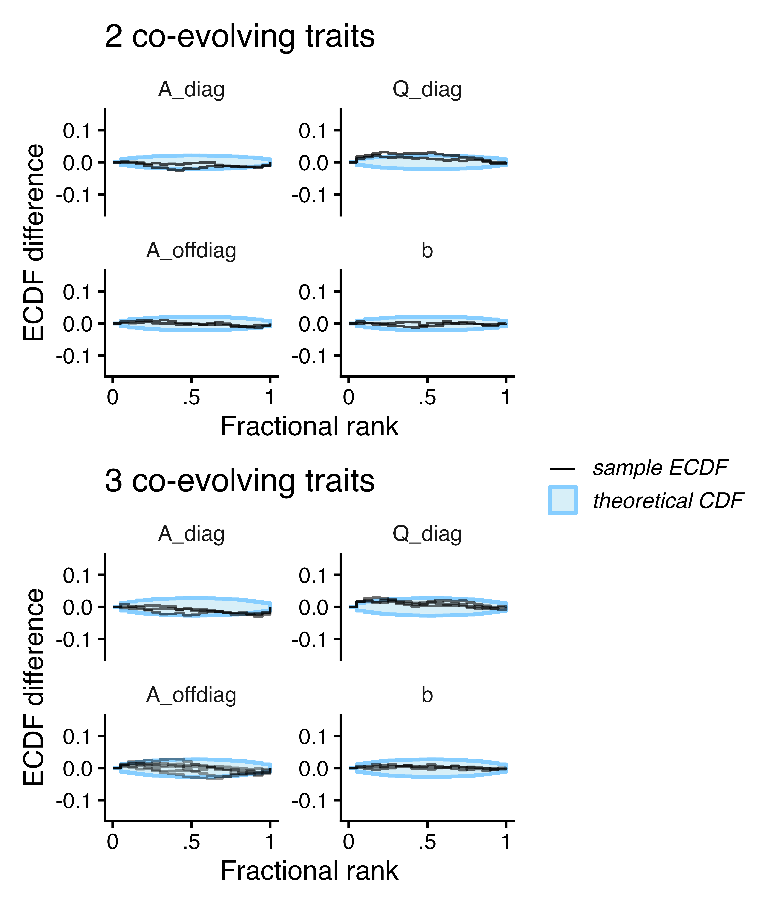
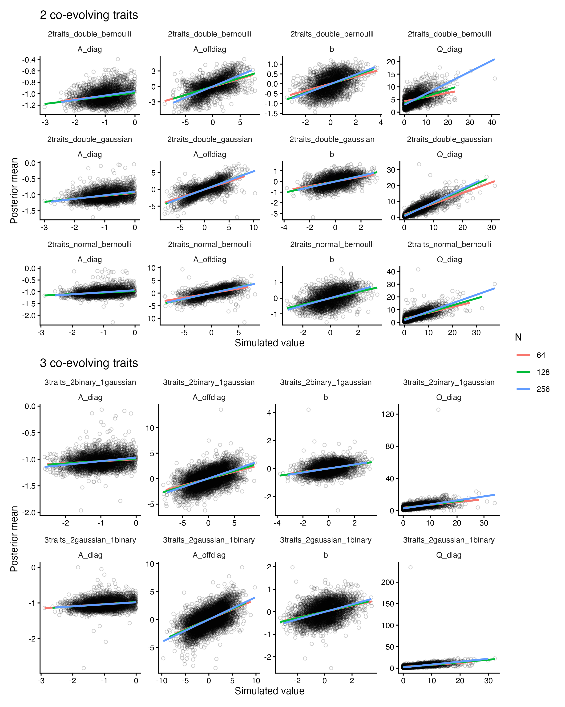
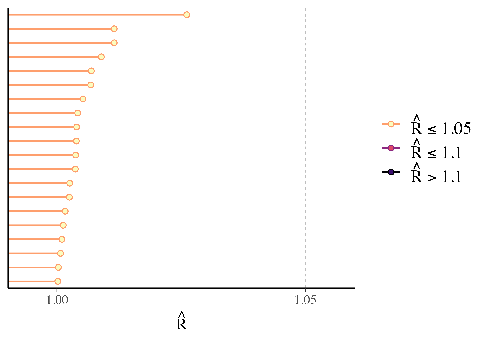
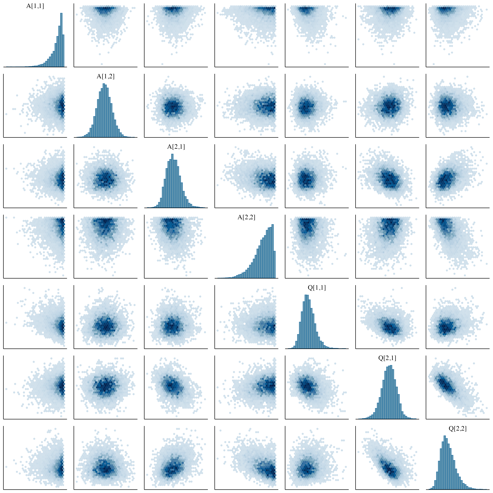

# Simulation-based calibration {#sec-SBC}

In order to validate our model beyond a single synthetic example, we performed simulation-based calibration (SBC) [@Modrak2023; @Talts2018]. To perform SBC, we first generated 500 simulated datasets for each of 15 configurations spanning a grid of sample sizes ($N$ = 64, 128, 256), number of traits (2 or 3), and response distributions. For 2-trait models, we tested three designs: (1) one Gaussian and one Bernoulli trait, (2) two Gaussian traits, and (3) two Bernoulli traits. For 3-trait models, we tested two designs: (1) two Gaussian and one Bernoulli trait, and (2) two Bernoulli and one Gaussian trait. We simulated using balanced trees via `ape::stree()` with Grafen branch lengths.

We used the following priors for all models:

- **Diagonal elements** (`A_diag`): `normal(-1.0, 0.5)`, constrained to be negative
- **Off-diagonal elements** (`A_offdiag`): `normal(0, 2.5)`
- **Diagonal elements** (`Q_sigma`): `normal(2, 1)`, constrained to be positive
- **Continuous-time intercept parameters** (`b`): `normal(0, 1)`

```{r, echo = F}
targets::tar_load(starts_with("sim_data"))

# Count rejected samples across all configurations
sim_data_names <- ls(pattern = "^sim_data_")
total_accepted <- 0
total_expected <- 0
for (name in sim_data_names) {
  sim_data <- get(name)
  total_accepted <- total_accepted + dim(sim_data$y_rep)[1]
  total_expected <- total_expected + 500
}
n_rejected <- total_expected - total_accepted
pct_rejected <- round(100 * n_rejected / total_expected, 1)
```

These parameter values were chosen to reflect the range of parameter values observed in previous empirical studies, while allowing for exploration of a wide range of between-trait correlations at the tips. For configurations involving Bernoulli traits, we used rejection sampling to exclude simulated datasets where any binary trait had no variance (i.e., all values were 0 or all values were 1), as we cannot learn about the trait coevolutionary dynamics for constant data. This resulted in `r n_rejected` rejected datasets (`r pct_rejected`% of total). Rejection sampling does not compromise the validity of SBC provided the rejection criterion depends only on the observed data and not on the unobserved parameter values [@Modrak2023]. After filtering out the rejected datasets, we fit the remaining datasets to the model for each configuration.

## Computation time {#sec-compute-time}

Although not the primary reason for our simulations, the repeated fits at different sample sizes and trait numbers offers a valuable look into how computation time scales with the number of species and traits. See @fig-compute-time for the distribution of per-fit times for relatively short fits used for SBC. For empirical analyses, we would almost always use more draws, so one can loosely extrapolate to "real world" computation times by multiplying the times in @fig-compute-time by 5-10x.

```{r, echo = F, message = F, warning = F}
#| label: fig-compute-time
#| fig-cap: "Computation time scaling across SBC fits. Distribution of per-fit times as a function of sample size (N) and number of traits. Times measured on an M3 MacBook Pro."
#| fig-width: 7
#| fig-height: 4.5

library(targets)
library(dplyr)
library(tidyr)
library(ggplot2)

# Get SBC target names
sbc_target_names <- c(
    "sbc_128_3traits", "sbc_256_3traits", "sbc_64_3traits", "sbc_256_2traits_double_gaussian", "sbc_64_3traits_2binary_1gaussian", "sbc_64_2traits_double_gaussian", "sbc_256_3traits_2gaussian_1binary", "sbc_256_3traits_2binary_1gaussian", "sbc_128_3traits_2gaussian_1binary", "sbc_128_2traits_double_gaussian", "sbc_64_2traits_double_bernoulli", "sbc_128_2traits", "sbc_128_2traits_double_bernoulli", "sbc_256_2traits", "sbc_256_2traits_double_bernoulli", "sbc_128_3traits_2binary_1gaussian", "sbc_64_3traits_2gaussian_1binary", "sbc_64_2traits"
)

# Extract per-fit times from each SBC result
fit_times <- lapply(sbc_target_names, function(tname) {
  sbc_result <- tar_read_raw(tname)
  
  # Extract time from each simulation's output messages
  times <- sapply(sbc_result$outputs, function(out) {
    # Find the message with "finished in X seconds"
    time_msg <- grep("finished in .* seconds", out, value = TRUE)
    if (length(time_msg) > 0) {
      # Extract the numeric time
      as.numeric(gsub(".*finished in ([0-9.]+) seconds.*", "\\1", time_msg[1]))
    } else {
      NA_real_
    }
  })
  
  data.frame(
    target = tname,
    N = as.numeric(gsub("sbc_(\\d+)_.*", "\\1", tname)),
    n_traits = ifelse(grepl("3traits", tname), 3, 2),
    seconds = times
  )
}) %>% bind_rows()

# Convert to minutes and create summary
fit_times <- fit_times %>%
  mutate(minutes = seconds / 60)

# Summary stats
time_summary <- fit_times %>%
  group_by(N, n_traits) %>%
  summarise(
    median_min = median(minutes, na.rm = TRUE),
    q25 = quantile(minutes, 0.25, na.rm = TRUE),
    q75 = quantile(minutes, 0.75, na.rm = TRUE),
    .groups = "drop"
  )

# Box plot showing distribution
ggplot(fit_times, aes(x = factor(N), y = minutes, fill = factor(n_traits))) +
  scale_y_log10(
    breaks = scales::trans_breaks("log10", function(x) 10^x),
    labels = scales::trans_format("log10", scales::math_format(10^.x))
  ) +
  geom_boxplot(outlier.size = 0.5, outlier.alpha = 0.3) +
  scale_fill_manual(values = c("2" = "#4292c6", "3" = "#08519c"),
                    labels = c("2" = "2 traits", "3" = "3 traits")) +
  labs(x = "Tree size (N)", 
       y = "Minutes per SBC fit",
       subtitle = "100 draws warmup, 200 draws sampling",
       fill = "Model") +
  theme_minimal(base_size = 12) +
  theme(legend.position = "top")
```

Computation time increases with both sample size and the number of traits (@fig-compute-time), as expected given the increased complexity of tree traversal and parameter estimation. For a typical empirical analysis with a single dataset (rather than 500 simulated datasets), users can expect model fitting to complete in minutes for smaller phylogenies to a few hours for larger trees with more traits.

## Calibration assessment

The logic of SBC rests on a fundamental property of Bayesian inference: if a model is correctly specified and the sampling algorithm is accurate, then the true parameter value should have no preferred location within its posterior distribution. In other words, averaging over many simulations, the true value should fall in the lower 10% of its posterior 10% of the time, in the upper 50% half the time, and so on. This property is formalized by computing the *rank* of the true parameter among the posterior draws---if calibration holds, these ranks should be uniformly distributed across simulations [@Talts2018].

Deviations from uniformity reveal specific problems: if ranks cluster near zero, the posterior is biased high (overestimation); if they cluster near the maximum, the posterior is biased low (underestimation); a U-shaped distribution indicates the posterior is too narrow (overconfident), while an inverted-U indicates it is too wide (underconfident). Thus, SBC provides a comprehensive diagnostic for both bias and uncertainty quantification.

Using the SBC R package [@Modrak2023], we evaluated calibration by plotting the difference between the empirical cumulative distribution function (ECDF) of ranks and a perfectly uniform CDF. If ranks are uniform, this difference should be zero everywhere (a flat line at y = 0). Systematic deviations appear as consistent departures from zero: positive values indicate ranks accumulating faster than expected (an excess of low ranks, indicating bias high), while negative values indicate slower accumulation (an excess of high ranks, indicating bias low). Oscillating patterns indicate over- or under-dispersion. Some deviation is expected due to sampling variation, but the lines should fall within the 95% simultaneous confidence envelope (shaded region). Indeed, this is what we find across our simulation configurations (@fig-sbc-results), suggesting that the estimates from our Stan program are well-calibrated across a range of sample sizes, trait numbers, and response distributions. We recommend that researchers perform additional calibration tests targeted to their unique analyses as part of the Bayesian workflow [@gelman2020bayesian].

{#fig-sbc-results width="80%"}

## Parameter recovery

{#fig-sbc-recovery width="80%"}

# Cichlid example computational details {#sec-cichlid-computation}

The R code to fit this example in `coevolve` is as follows:

```{r eval=FALSE}
#| class-output: OutputCode
effects_mat <- matrix(TRUE, nrow = 3, ncol = 3, dimnames = list(variables, variables))
effects_mat[1,2] = FALSE
effects_mat[3,2] = FALSE

fit <-
  coev_fit(
    data = sim$data,
    variables = list(
      Promiscuity = "normal",
      SpermSize = "normal",
      Predation = "normal"
    ),
    prior = list(A_offdiag = "normal(0, 2)", Q_sigma = "normal(0, 2)"),
    id = "species",
    tree = sim$tree,
    effects_mat = effects_mat, # elements of A to estimate
    estimate_Q_offdiag = F # assumes no correlated drift
  )
```

The required arguments of the function `coev_fit()` are a data frame of trait values, a list of variables to coevolve in the model (along with their associated response distributions), the column in the dataset that links to the phylogeny, and a phylogeny object of class `phylo`. The function generates the code and data list for Stan and fits the model. In cases where we have clear directional beliefs, we can set some elements of the A matrix to 0 via the `effects_mat` argument. Otherwise, the default is to estimate all directional effects. Users can get an overview of the fit model, as well as MCMC diagnostics, by calling `summary(fit)`:

```{r, echo = F}
#| class-output: OutputCode
library(targets)
tar_load(synthetic_summary)
cat(synthetic_summary[!grepl("^\\s*\\d+:", synthetic_summary)], sep = "\n")

```

The underlying Stan code can be exposed via `stancode(fit)`.

To visualize the trait coevolutionary dynamics (Figures 6 and 7 in the main text), we can use the function `coev_plot_pred_series()`:

```{r, eval=FALSE}
#| class-output: OutputCode
coev_plot_pred_series(fit, stochastic = T) # predicted co-evolutionary time series, with ancestral states sampled from the posterior LCA
coev_plot_pred_series(fit, eta_anc = c(-2, -1, 0), stochastic = F, prob = 0.9) # expected co-evolutionary time series, with user-defined ancestral states and 90% credible intervals
coev_plot_pred_series(fit, eta_anc = c(-2, -1, 0), stochastic = F, tmax = 0.1) # plot over a shorter time scale, tmax is a scaling factor where the default tmax=1 corresponds to the original tree depth

coev_plot_pred_series(fit, intervention_values = list(Promiscuity = NA, SpermSize = NA, Predation = 2)) # predicted time series given an intervention in Predation

```

To calculate the equilibrium trait values (Section 3.5 in the main text) we can run `coev_calculate_theta(fit)`.

# Primate example computational details {#sec-primate-computation}

## Model definition

$$
\text{body weight}_i \sim \text{Gamma}(\text{shape}_{\text{body}}, \frac{\text{shape}_{\text{body}}}{\mu_{\text{body}_i}})
$$

$$
\text{longevity}_i \sim \text{Gamma}(\text{shape}_{\text{longevity}}, \frac{\text{shape}_{\text{longevity}}}{\mu_{\text{longevity}_i}})
$$

$$
\text{maturity}_i \sim \text{Gamma}(\text{shape}_{\text{maturity}}, \frac{\text{shape}_{\text{maturity}}}{\mu_{\text{maturity}_i}})
$$

$$ \text{brain weight}_i \sim \text{Gamma}(\text{shape}_{\text{brain}}, \frac{\text{shape}_{\text{brain}}}{{\mu_{\text{brain}_i}}}) $$ $$\text{log}({\mu_{\text{brain}_i}}) = \alpha_{\text{brain}} + \beta_i\text{log(body size}_i)$$ $$ \beta_i = \text{log}(1 + \text{exp}(\pmb{\Lambda_{[2,]} \cdot \eta_i})) $$

$$\text{log}({\mu_{\text{body}_i}}) = \alpha_{\text{body}} + \pmb{\Lambda_{[1,]} \cdot \eta_i}$$ $$\text{log}({\mu_{\text{longevity}_i}}) = \alpha_{\text{longevity}} + \pmb{\Lambda_{[3,]} \cdot \eta_i}$$ $$\text{log}({\mu_{\text{maturity}_i}}) = \alpha_{\text{maturity}} + \pmb{\Lambda_{[4,]} \cdot \eta_i}$$

Where $\pmb{\eta}$ is a vector of latent variable values at the tips, following the SDE model in the main text (Section 3.1, Equation 1). The loadings for the life-history pace latent variable on body weight ($\pmb{\Lambda}_{[1,1]}$) and for the relative brain size latent variable on the allometric slope ($\pmb{\Lambda}_{[2,2]}$) were fixed to 1 for identification. All cross-loadings were fixed to 0. Gamma likelihoods were chosen because they are the maximum entropy (least informative) distribution for positive variables constrained only by their mean and geometric mean. To help facilitate model fitting and setting priors, the body weight, longevity, and maturity variables were scaled by their sample means. We set an informative prior on the root ancestral state for primate brain-body allometry based on the results of previous comparative studies [@Smaers2021; @grabowski2023both; @venditti2024co]. See Stan code below for priors and further details on the implementation.

## Stan code

The Stan program below is heavily annotated to make the connections between the mathematical model and the Stan code clear.

``` {.stan include="stan/GDPM_primate_annotated.stan"}
#| class-output: OutputCode
```

## MCMC diagnostics

Using Stan's Hamiltonian Monte Carlo algorithm, we ran 8 parallel chains for 250 iterations of warm-up and 1250 iterations of sampling. The computation time was approximately 30 minutes on an M3 MacBook Pro. There were no divergent transitions, and standard MCMC diagnostics (convergence and mixing of chains, $\hat{R}$) were visualized using the R package `bayesplot` [@bayesplot].

{width="80%"}

{width="60%"}

## Joint posterior



## Model checks

To assess the adequacy of our model for retrodicting the sample, we performed posterior predictive checks, comparing draws of synthetic replications of our data ($y_{\text{rep}}$) to the observed data ($y$). We visualized these checks using `bayesplot` [@bayesplot].

{#fig-primate-checks}

# Missing data, repeated measures, and measurement error {#sec-missing-data}

`coevolve` handles missing data, repeated measures, and measurement error as follows:

**Missing data.** When trait values are missing for some species, the likelihood contribution for that trait is omitted. The latent evolutionary process remains informed by the phylogenetic structure and observed traits, enabling imputation of missing values as part of posterior inference. This is implemented via conditional likelihood evaluation (e.g., `if (miss[i,j] == 0) target += ...`). The `coevolve` package handles this automatically when `NA` values are present in the data. To exclude tips with missing data, set `complete_case = TRUE` in `coev_fit()`.

**Repeated measures.** When multiple observations exist per taxon (e.g., multiple individuals or populations), in coevolve, taxon-level random effects are automatically estimated. These random effects represent within-species/population variance in the latent trait values. Estimation of the residual (co)variances can be disabled by setting `estimate_residual = FALSE` in `coev_fit()`.

**Measurement error.** Measurement error can be incorporated into the model, for Gaussian traits only, via the `measurement_error` argument in `coev_fit()`. This allows users to add known measurement error variances to the observational model at the tips.

# Extending coevolve for latent variable models {#sec-latent-tutorial}

The `coevolve` package provides a convenient interface for fitting GDPMs to observed traits, but does not currently support latent variable models (as of version 0.1.0.9009). This section demonstrates how to extend `coevolve`-generated Stan code to incorporate latent factors, using the primate brain evolution analysis (Section 4.2.1 in the main text) as a worked example.

## The primate latent variable structure

In the primate analysis, we modeled two latent factors measured by four observed variables:

| Latent Factor | Observed Variables | Loading |
|---------------|-------------------|---------|
| Life-History Pace ($\eta_1$) | Body mass | Fixed = 1 |
| | Longevity | Estimated ($\lambda_1$) |
| | Age at maturity | Estimated ($\lambda_2$) |
| Brain-Body Allometry ($\eta_2$) | Brain mass (allometric slope) | Fixed = 1 |

The key insight is that multiple observed traits can index a single underlying evolutionary dimension. Body mass, longevity, and maturity age all reflect a "pace of life" construct that evolves along the phylogeny, rather than three independent traits.

## Workflow overview

The workflow involves three steps:

1. **Generate base code** using `coev_make_standata()` and `coev_make_stancode()` with dummy normal variables as placeholders for latent factors
2. **Modify Stan code**: Add `N_latent` dimension and factor loading matrix $\Lambda$; replace `J` with `N_latent` in SDE parameters; write custom observational likelihood
3. **Modify data in R**: Set `N_latent` and `J`; replace dummy `y` with observed data

## Step 1: Generate base code

Use `coevolve` with dummy variables representing your latent factors:

```{r eval=FALSE}
library(coevolve)

# Create dummy data for 2 latent factors
d <- primate_data %>%
  mutate(slow_life = rnorm(n()), brain_allom = rnorm(n()))

# Generate base Stan code and data
standata <- coev_make_standata(
  data = d,
  variables = list(slow_life = "normal", brain_allom = "normal"),
  id = "species", tree = tree
)
stancode <- coev_make_stancode(
  data = d,
  variables = list(slow_life = "normal", brain_allom = "normal"),
  id = "species", tree = tree
)
writeLines(stancode, "my_model.stan")
```

## Step 2: Modify Stan code

**Data block**: Add `N_latent` for the number of latent factors; `J` now refers to observed traits. Note on parameter constraints: diagonal elements of the $A$ matrix are constrained to be negative via Stan's upper-bound declaration (`vector<upper=0>`), which is equivalent to truncation, not folding. Similarly, `Q_sigma` elements are constrained to be positive via lower-bound declarations. Fixed factor loadings (e.g., $\Lambda_{[1,1]} = 1$) are set as constants in the transformed parameters block and are not estimated; cross-loadings are fixed to zero.

```stan
data {
  // ... tree structure variables unchanged ...
  int<lower=2> J;                // Number of OBSERVED traits (was: latent)
  int<lower=1> N_latent;         // NEW: Number of latent factors
  array[N_latent, N_latent] int effects_mat;  // Now sized by N_latent
  matrix[N_obs, J] y;            // Actual observed data
  vector[J] y_mean;              // NEW: For scaling (optional)
}
```

**Parameters block**: Replace `J` with `N_latent` for all SDE-related parameters; add observational model parameters:

```stan
parameters {
  // SDE parameters: replace J → N_latent
  vector<upper=0>[N_latent] A_diag;
  vector[num_effects - N_latent] A_offdiag;
  vector<lower=0>[N_latent] Q_sigma;
  vector[N_latent] b;
  array[N_tree] vector[N_latent] eta_anc;
  array[N_tree, N_seg - 1] vector[N_latent] z_drift;
  array[N_tree] matrix[N_obs, N_latent] terminal_drift;
  
  // NEW: Observational model parameters
  vector[J] alpha;              // Intercepts
  vector<lower=0>[J] shape;     // Gamma shape parameters
  vector[J - N_latent] lambda_free;  // Free factor loadings
}
```

**Transformed parameters block**: Define $\Lambda$ to map latent factors to observed variables:

```stan
transformed parameters {
  // ... existing declarations, but sized by N_latent ...
  
  // Factor loading matrix Λ [J × N_latent]
  matrix[J, N_latent] Lambda = rep_matrix(0.0, J, N_latent);
  
  // Primate example structure:
  Lambda[1, 1] = 1.0;              // body → latent 1, fixed
  Lambda[2, 2] = 1.0;              // brain → latent 2, fixed
  Lambda[3, 1] = lambda_free[1];   // longevity → latent 1, estimated
  Lambda[4, 1] = lambda_free[2];   // maturity → latent 1, estimated
  
  // ... tree traversal code unchanged, but uses N_latent ...
}
```

**Model block**: Replace the direct mapping with your factor model:

```stan
model {
  // ... priors ...
  
  if (!prior_only) {
    for (i in 1:N_obs) {
      vector[N_tree] lp;
      for (t in 1:N_tree) {
        // Get latent values at tips
        vector[N_latent] eta_tips;
        for (n in 1:N_latent)
          eta_tips[n] = eta[t, tip_id[i]][n] + terminal_drift[t][i,n];
        
        // Terminal drift likelihood
        lp[t] = multi_normal_cholesky_lpdf(terminal_drift[t][i,] | 
                  rep_vector(0.0, N_latent), 
                  cholesky_decompose(VCV_tips[t, tip_id[i]]));
        
        // Observed trait likelihoods via Lambda
        lp[t] += gamma_lpdf(y[i,1]/y_mean[1] | shape[1], 
                   shape[1]/exp(alpha[1] + Lambda[1,1] * eta_tips[1]));
        // ... additional traits ...
      }
      target += log_sum_exp(lp);
    }
  }
}
```

## Step 3: Modify data preparation in R

```{r eval=FALSE}
# Start from coevolve-generated data
standata$N_latent <- 2
standata$J <- 4

# Replace dummy y with actual observations
standata$y <- as.matrix(data.frame(
  body = d$body_mass,
  brain = d$brain_mass,
  longevity = ifelse(is.na(d$longevity), -99, d$longevity),
  maturity = ifelse(is.na(d$maturity), -99, d$maturity)
))
standata$miss <- (standata$y == -99) * 1
standata$y_mean <- apply(standata$y, 2, function(x) mean(x[x != -99]))
```

# References {.unnumbered}

::: {#refs}
:::
