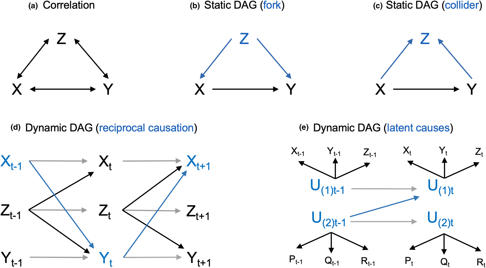
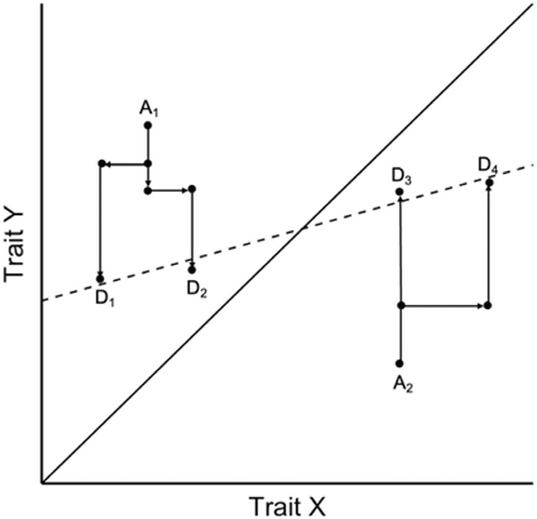
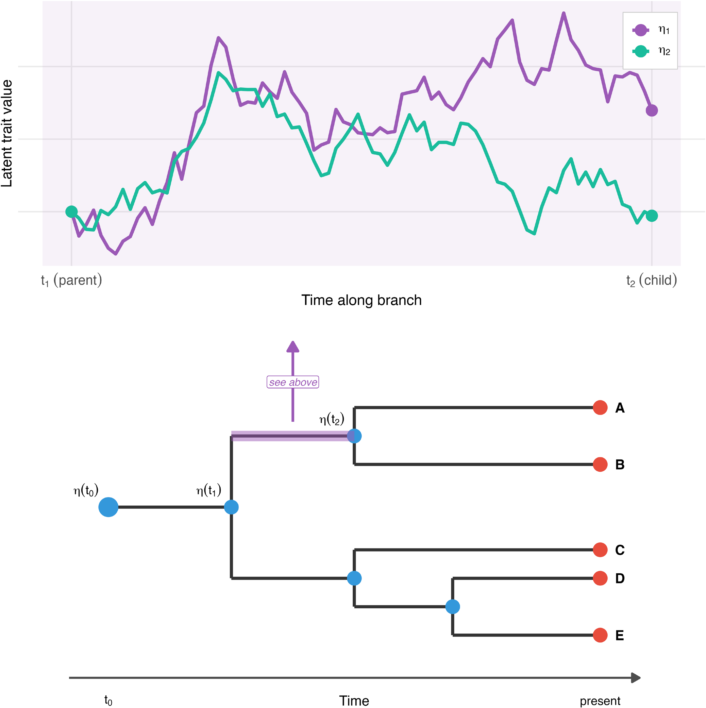
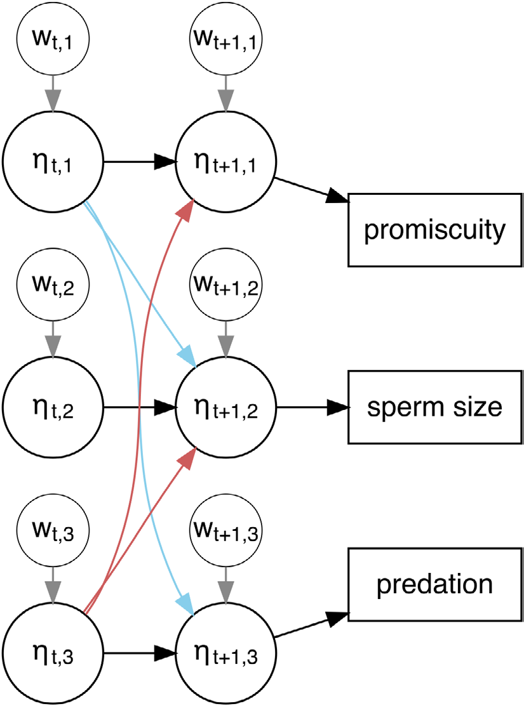
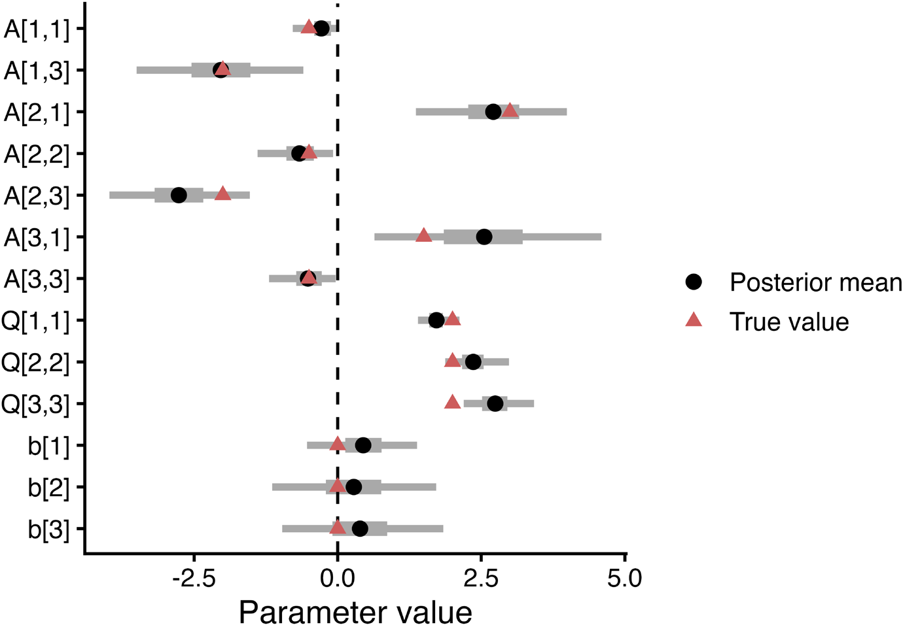
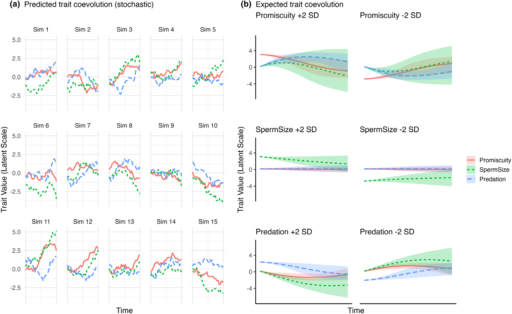
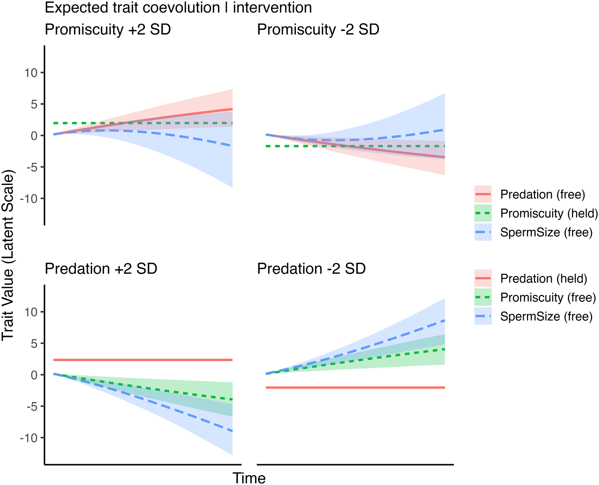
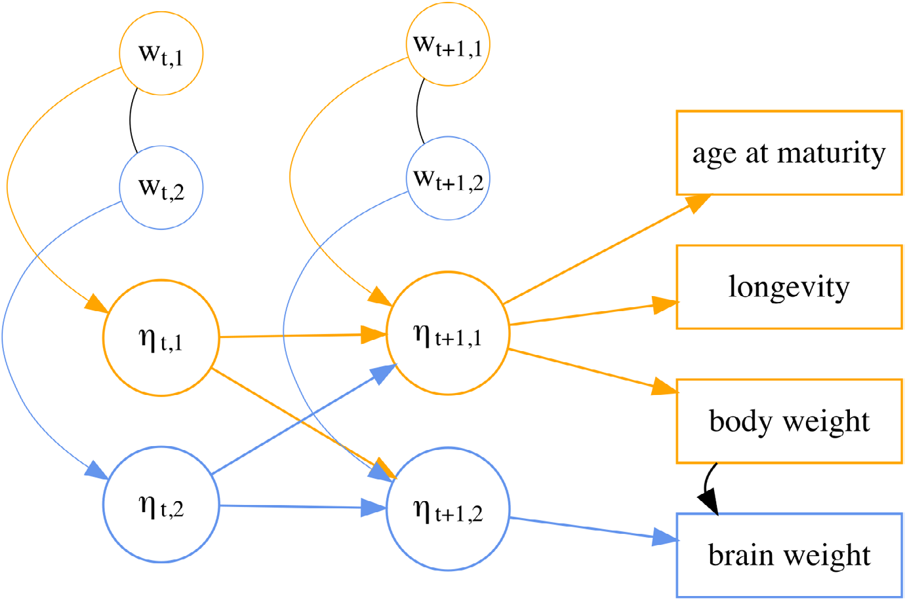
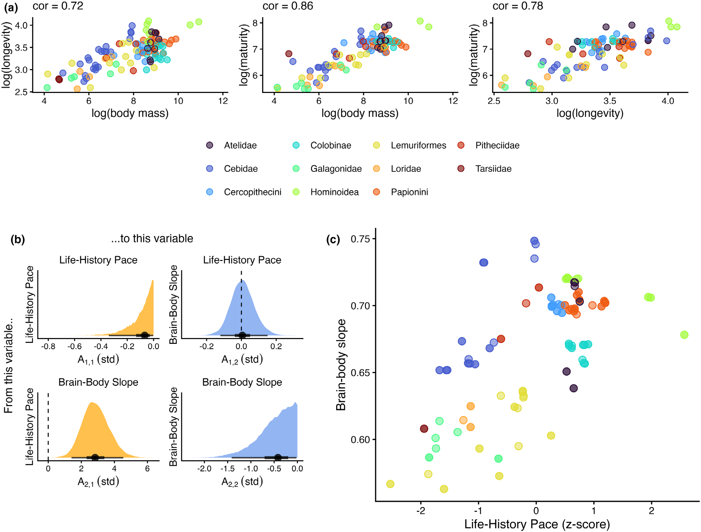

# Trait coevolution and causal inference using generalized dynamic phylogenetic models

**Erik J. Ringen**¹ | **Scott Claessens**² | **Jordan S. Martin**³ | **Adrian V. Jaeggi**⁴

¹ Independent Researcher
² Department of Anthropology and Archaeology, University of Bristol, Bristol, UK
³ Fish Ecology and Evolution, Eawag, Swiss Federal Institute of Aquatic Science and Technology, Kastanienbaum, Switzerland
⁴ Institute of Evolutionary Medicine, University of Zürich, Zürich, Switzerland

**Correspondence:** Erik J. Ringen — ringen.erik@gmail.com
**Handling Editor:** Russell Dinnage

*Methods in Ecology and Evolution*, 2026;00:1–19.
DOI: [10.1111/2041-210x.70303](https://doi.org/10.1111/2041-210x.70303)
Received: 31 January 2025 | Accepted: 7 March 2026
Research Article

> This is an open access article under the terms of the Creative Commons Attribution License, which permits use, distribution and reproduction in any medium, provided the original work is properly cited.
> © 2026 The Author(s). *Methods in Ecology and Evolution* published by John Wiley & Sons Ltd on behalf of British Ecological Society.

---

## Abstract

1. Phylogenetic comparative methods are widely used to study trait coevolution across biological and cultural domains. The most common methods are phylogenetic generalized linear (mixed) models, phylogenetic path analysis, Pagel's 'discrete' method and Ornstein–Uhlenbeck models. While some frameworks like generalized linear mixed models are quite flexible in terms of the data structure, they are ill-suited for inferring causal effects; others, like Pagel's 'discrete' can more explicitly infer causal sequences, but are limited in the number and types of traits that can be modelled. Here, we develop a novel class of *generalized dynamic phylogenetic models* (GDPMs) that overcomes these limitations and synthesizes the strengths of existing methods into a flexible framework for dynamic inference.

2. Treating the phylogeny as an implicit time series, GDPMs model trait coevolution for any number of traits undergoing both deterministic adaptation and stochastic drift, capable of inferring directed evolution (*X* ← *Y* vs. *Y* ← *X*), feedback (*X* ↔ *Y*), and contingencies (e.g. first *X*, then *Y*). We introduce the **coevolve** R package, a user-friendly interface for fitting GDPMs in a Bayesian framework using Stan.

3. To demonstrate the GDPM framework, we first work through a biologically motivated synthetic example of predation and mating system among cichlid fish. We also perform simulation-based calibration as a computational validation of our models. Additionally, we present some empirical applications of GDPMs, including analyses of brain size in non-human primates and societal complexity across human populations.

4. These examples highlight the flexibility and potential of the GDPM framework, which allows researchers to model latent variables, multilevel structures and repeated measures, measurement error, missing data and other complexities inherent in comparative data.

**KEYWORDS:** bayesian methods, comparative analysis, evolutionary biology, phylogenetics, statistics

---

## 1 | INTRODUCTION

Phylogenetic comparative methods (PCMs) are commonly used to study trait coevolution spanning topics such as anatomy and physiology (Dunn & Ryan, 2015; Garland Jr., 2005; Navalón et al., 2019; O'Connor & Cornwallis, 2022; Thayer et al., 2018), life history and behaviour (Bielby et al., 2007; Clayton & Cotgreave, 1994; MacLean et al., 2012; Salguero-Gómez et al., 2016) and cultural evolution (Mace & Holden, 2005; Navarrete et al., 2016; Watts et al., 2016). 'Coevolution' in this work refers to covariance among traits within lineages over time (Gintis, 2011; Sheehan et al., 2018; Xu, 2024)—not reciprocal selection between interacting species (e.g. predator–prey, host–parasite). Trait coevolution can be investigated using a diverse family of statistical techniques depending on the research question and type of data available (Garamszegi, 2014; Harvey & Pagel, 1991; Nunn, 2011).

Phylogenetic generalized linear (mixed) models (Grafen, 1989; Hadfield & Nakagawa, 2010; Symonds & Blomberg, 2014), phylogenetic path analysis (Gonzalez-Voyer & von Hardenberg, 2014; von Hardenberg & Gonzalez-Voyer, 2013), Pagel's (1994) discrete method and Ornstein–Uhlenbeck models of adaptation (Bartoszek et al., 2024; Hansen, 1997) are the most popular approaches for assessing trait coevolution. While each of these methods has clear benefits, they are all limited in their generality by strong assumptions regarding the direction of causal effects among traits, the process of evolutionary change and/or the statistical properties of the traits under investigation. We therefore introduce a novel class of PCM designed to address these challenges in a flexible statistical framework, implemented in the Stan probabilistic programming language (Carpenter et al., 2017).

We begin by briefly reviewing the strengths and limitations of current PCMs, particularly with regard to causal inference and the types of data that can be modelled. We then introduce a novel class of generalized dynamic phylogenetic models (GDPMs). We provide a worked synthetic example of trait coevolution involving three continuous traits—predation, promiscuity and sperm size among cichlid fish (inspired by Fitzpatrick et al., 2009)—to demonstrate the types of inferences that can be made with GDPMs. We also provide an accompanying code tutorial using our **coevolve** R package to aid empiricists in applying basic GDPMs. We then demonstrate the flexibility of our method with two empirical applications, which extend the model to non-Gaussian, higher dimensional scenarios using latent variables. Specifically, (1) a comparative dataset on primate brain size and life-history traits (DeCasien et al., 2017), and (2) two studies of cultural evolution across a global and a regional sample of non-industrial human societies (Erik J. Ringen et al., 2021; Sheehan et al., 2023).

---

## 2 | CURRENT APPROACHES AND MOTIVATION

Fundamental to PCMs is adjustment for shared evolutionary history using a phylogenetic tree (or set of trees) and a statistical model. In a basic sense, phylogenetic adjustment is crucial for causal inference, as shared evolutionary history tends to generate trait correlations among closely related species with similar phenotypes, creating the illusion of convergent trait coevolution even when traits evolve independently. Adjustment for phylogeny thus reduces the risks of type I (false-positive), type II (false-negative), type M (magnitude) and type S (sign) errors during statistical inference (Felsenstein, 1985; Harvey & Rambaut, 1998). Nonetheless, adjustment for phylogeny is not a magic fix for all sources of unobserved confounding (Uyeda et al., 2018), nor does it guarantee that resulting estimates are causally interpretable (Hansen, 2014). PCMs vary widely in their assumptions about the trait coevolutionary process, with most commonly used methods focusing—often implicitly—on evolutionary correlation (Figure 1a) rather than causation (Figure 1b–e).

### 2.1 | Phylogenetic generalized linear (mixed) models

Phylogenetic generalized linear (mixed) models are used to quantify how much trait (co)variation between species or populations is due to shared evolutionary history (likewise for their predecessor, independent contrasts; Blomberg et al., 2012; Grafen, 1989; Hadfield & Nakagawa, 2010; Lynch, 1991; Symonds & Blomberg, 2014). The most commonly assumed model of trait evolution is Brownian motion, which assumes that covariance (within a trait) for a given pair of species or populations is proportional to their amount of shared history (Felsenstein, 1985). This process is often interpreted as evolutionary drift (or neutral evolution), though for macroevolutionary traits such as body size and brain size it more likely reflects randomly fluctuating selection or movement of the adaptive peak over time (Hansen, 1997). Empirically, the actual degree of covariance between related species or populations may be less than expected under a pure Brownian motion model; in these cases, the 'phylogenetic signal' will be weaker (Blomberg et al., 2003; Kamilar & Cooper, 2013), motivating various branch length transformations (Pagel, 1999). Beyond Brownian motion, early burst models of adaptive radiation allow the rate of change to decrease over time (Harmon et al., 2010), while Ornstein–Uhlenbeck models characterize evolutionary change as the product of both stochastic and deterministic processes (Butler & King, 2004; Hansen, 2014).

Despite their differences, these models share often unstated assumptions. Specifically, they correspond to the static causal structures in Figure 1b,c, where trait relationships are contemporaneous: there is no reciprocal causation between traits over time, and the effects of past predictor values on the response are fully blocked by current predictor values. These are strong assumptions that are likely to be violated in many empirical datasets, limiting the applicability of phylogenetic generalized linear (mixed) models for theory testing and development. In contrast, the dynamic structures in Figure 1d,e allow for feedback and temporal contingencies that these models cannot represent. In addition, the most commonly used implementation of these models, phylogenetic generalized least squares (PGLS), suffers from various other constraints such as being limited to Gaussian errors, overfitting due to a lack of parameter regularization and a failure to accommodate many common data features such as repeated measures, missing data and measurement error (but see Ives et al., 2007). While generalized multilevel/mixed-effects approaches can be used to address these concerns (Hadfield & Nakagawa, 2010; Ives & Garland Jr., 2010; Ives & Helmus, 2011; Lynch, 1991; Martin et al., 2020; Ringen et al., 2019), they nonetheless share the same basic limitations and are not well suited for modelling adaptation (Hansen, 2014), see Box 1.



**FIGURE 1 Graphical models of trait coevolution** | Examples of distinct formal approaches to describing and explaining patterns of trait coevolution (large letters), with important properties represented in each graph highlighted by blue arrows and text. Approaches range in complexity from (a) simple non-causal models of phylogenetic correlations (indicated by bidirectional arrows; note that this is not a causal model, as the correlation could arise from multiple underlying causal processes such as mutational pleiotropy or correlational selection), to (b–e) directed acyclic graph models, which can be used to represent the causal effects (directed arrows) driving trait associations. Explicit causal models are crucial for deciding which traits should be included or excluded from a multiple regression analysis to avoid potential biases due to phenomena such as forks (b) and colliders (c). Causal models can also be further distinguished by whether they model relationships among traits as static (b–c) or dynamic (d–e). Only dynamic models can be used to quantify feedback processes (*t*−1 → *t* → *t*+1) generated by reciprocal causation (blue arrows) among traits and autoregressive effects within traits (grey arrows) over time (d). For high-dimensional problems, one might consider the inclusion of latent causes into the DAG (e), capturing dimensions of evolutionary integration among multiple traits.

### 2.2 | Phylogenetic path analysis

An advance in recent decades has been to realize that even conventional regressions with observational data can be used to infer causal effects, in some circumstances (Shipley, 2016). This is because specific causal models, usually represented as directed acyclic graphs (DAGs, see Figure 1), imply testable patterns of statistical independence among variables (Pearl, 2009). Following Pearl's do-calculus or the potential outcomes framework (Rubin, 2005), researchers can identify sets of variables to adjust for (or not) in order to test their causal hypotheses (Cinelli et al., 2024). Transparency about causal assumptions has become standard in fields such as epidemiology (Tennant et al., 2021) and is increasingly popular in evolutionary biology and ecology to justify modelling decisions (Deffner et al., 2022; McElreath, 2020; Shipley, 2016; Warrell & Gerstein, 2020).

Phylogenetic path analysis incorporates some of these insights by fusing traditional path analysis with phylogenetic generalized least squares (Gonzalez-Voyer & von Hardenberg, 2014; von Hardenberg & Gonzalez-Voyer, 2013). In this framework, researchers posit different graphical models and compare their fit to the data. For instance, Navarrete et al. (2016) presented several path models that all included links between life history and social group size with brain size, with variable direct or indirect effects of diet and technical intelligence.

However, the applicability of phylogenetic path analysis is limited to static causal models lacking any reciprocal effects over time. This is an issue because positive (or negative) evolutionary feedback loops are predicted by many theoretical models, for example, in response to life-history trade-offs and various forms of frequency- and density-dependence, suggesting that reciprocal causation is likely to be a widespread phenomenon impacting patterns of trait coevolution (Schoener, 2011; Svensson, 2018). For example, McNamara (2022) presents a model of the trait coevolution of paternal care and extra-pair paternity, which is driven by a frequency-dependent feedback loop over evolutionary time between males' tendency to seek extrapair copulations and the benefits of their paternal care. The inability to estimate dynamic feedback effects (as well as their general weakness for traits subject to selection, see Box 1) is a fundamental limitation of static regression models, thus motivating the use of dynamic methods.

---

> ### BOX 1 Traditional phylogenetic regression models underestimate causal effects
>
> An unintuitive aspect of traditional 'static' PCMs is that regression coefficients estimated using cross-sections of contemporary species are used to infer the change in some trait *Y* in response to another trait *X* over evolutionary time. The slope of a response trait on a predictor trait is known as the 'evolutionary regression coefficient' (Pagel, 1993). But these coefficients tend to underestimate causal effects: because evolution by natural selection is generally a gradual process, the total causal effect of one trait on another—which we define as the change in the optimal trait value of *Y* as a function of the value of *X* (Schölkopf et al. (2013) gives a similar definition of causal effects in systems of ordinary differential equations)—can take a long time to be fully realized. As such, we do not in general expect to observe species at equilibrium. This attenuation bias is a joint product of the strength of selection on the response trait and the rate of change in the predictor trait (Hansen, 2014; Hansen et al., 2008). Intuitively, if one trait changes too quickly, then the other will always be playing catch-up. See Figure 2 for an illustration of this process. A solution to this problem is to move beyond traditional regression-based PCMs and explicitly model trait change and the adaptive process using dynamic phylogenetic models. Ornstein–Uhlenbeck models and their extensions address this attenuation bias by directly estimating the effects of selection.
>
> 
>
> **FIGURE 2** Gradual adaptation flattens the evolutionary regression coefficient. Ancestral species ('A') evolve towards their optimal trait *Y* value, which depends on the value of trait *X* shown on the solid line. Ancestors speciate and their descendants ('D') inherit their maladapted trait values, resulting in a slope between the two traits (dashed line) that is flatter than the true relationship. Redrawn from Figure 14.4 in Hansen (2014).

---

### 2.3 | Dynamic methods for discrete traits

In contrast to the 'static' PCMs discussed thus far, dynamic PCMs treat the phylogeny as an implicit time series, opening the door for quasi-longitudinal analyses. To date, Pagel's (1994) and Pagel & Meade (2006) 'discrete' is the most widely used dynamic PCM. It is based on a continuous-time Markov model unfolding over the phylogenetic tree, with transition rates corresponding to the probability of moving between binary states. By reconstructing the coevolutionary sequence of two traits, researchers can infer directed and potentially reciprocal trait co-evolution through temporal contingency, referred to as 'Granger causality' in economics (Granger, 1969). For example, researchers can infer that *X* evolved first, or that the evolution of *X* made the subsequent evolution of *Y* more likely (although such inferences are purely descriptive in the absence of strong causal assumptions). This method has resulted in many high-profile publications (Cornwallis et al., 2017; Fitzpatrick et al., 2009; Kappeler & Pozzi, 2019; Sheehan et al., 2018; Shultz et al., 2011; Watts et al., 2016).

Despite its innovative approach to causal inference, Pagel's method is fundamentally limited to investigating the coevolution of discrete traits. Application of this method to continuous traits (e.g. morphology, life history, brain size, etc.) thus requires that researchers falsely dichotomize naturally occurring variation (e.g. Cornwallis et al., 2017; Fitzpatrick et al., 2009; Sheehan et al., 2018; Watts et al., 2016), which generally leads to loss of power, biased effect sizes and sensitivity of results to choice of cut-offs (Dawson & Weiss, 2012; Royston et al., 2006). For instance, Fitzpatrick et al. (2009) dichotomized continuously measured sperm length and speed by classifying traits below the species mean as 'low' and those above the species mean as 'high', and they collapsed a four-point scale of female promiscuity, based on behavioural and paternity data, into 'low' (levels 1 and 2) and 'high' (levels 3 and 4). Using Pagel's method, they then showed that sperm evolved to be faster and longer in response to increases in female promiscuity. Dichotomization is especially problematic for inferring Granger causality, as it conflates a species' distance from the arbitrary cut-off threshold with true causal temporal lags: species with trait values far from the threshold will take longer to transition in response to a causal variable, not because of genuine causal delays but because of the measurement artefact.

The limitation of Pagel's method to binary traits is further exacerbated when studying the (co)evolution of multiple continuous traits, which often motivates the use of latent variables (Figure 1e). We use 'latent variable' here in the statistical/measurement sense: unobserved constructs that are indexed by multiple observed indicators, not in the causal sense of unmeasured confounders. Such constructs are widely used in biology to capture theoretically pertinent dimensions that are difficult to quantify using a single measurement, such as size and shape dimensions in morphometrics (Zelditch et al., 2012), environmental quality and climate metrics in ecology (Arhonditsis et al., 2006), life-history variation (Stott et al., 2024) and canonical axes of correlational selection in evolutionary quantitative genetics (Blows & Brooks, 2003). Prior research has used data reduction techniques such as phylogenetic principal component analysis to handle high-dimensional data and then applied Pagel's method to the resulting scores (e.g. Cornwallis et al., 2017), but this approach still demands discretization and the principal component axes are merely linear combinations of observed variables rather than constructs embedded in a generative evolutionary model.

Pagel's method is subsumed under the more general 'Mk' model (Lewis, 2001), which can, in principle, accommodate any number of *k* discrete, unordered states. Unfortunately, this generalization suffers from the curse of dimensionality: the number of potential discrete-state combinations grows exponentially, demanding more data than is realistically attainable for most comparative analyses. One way to reduce this complexity is by imposing ordered constraints, that is, specifying that a species cannot jump directly from the lowest and highest levels of a trait without first transitioning through intermediate levels. Alternatively, one might use Hidden Markov models (HMMs) (Krogh et al., 1994), wherein a small number of latent discrete states map onto continuous observed variables. In the phylogenetic context, HMMs have been used for estimating rate heterogeneity of discrete traits over time (Boyko & Beaulieu, 2021) and for modelling structured dependencies among character states (Porto et al., 2025; Tarasov, 2019). A related approach is phylogenetic factor analysis (Hassler et al., 2022; Tolkoff et al., 2018), which maps a small number of latent factors onto observed variables—including discrete traits via the threshold model (Felsenstein, 2005, 2012)—but does not model dynamic causal processes. Regardless, HMMs and factor models are at best inefficient if the underlying process of evolution is continuous—and we expect continuity for most phenotypic traits. Synthesizing continuous and multivariate methods with dynamic causal inference, thus remains a major unmet need in contemporary PCMs.

### 2.4 | Dynamic methods with continuous traits

There are several other approaches to dynamic PCMs, based on the Ornstein–Uhlenbeck (OU) model (Uhlenbeck & Ornstein, 1930), that are capable of modelling continuous traits but that are subject to limitations in their current forms. The basic OU model is a mean-reverting, stationary Gauss–Markov process. It describes change in a trait due to both Gaussian noise and mean-reversion towards some central tendency that might change over time. In evolutionary biology, the mean-reverting quality is loosely interpreted as 'selection' and the Gaussian noise is labelled 'drift' (Hansen, 1997, 2014). The basic OU form describing the change in some trait (d*y*) over time (*t*) is:

$$dy(t) = \alpha(\theta - y_t) + \sigma\, dW(t)$$

Following Hansen (1997), α is understood as the rate of adaptation towards the primary optimum θ, and σ as the strength of stochastic evolution (which in macroevolution likely includes fluctuating selection rather than neutral drift alone). The simplest OU models assume a single evolutionary optimum (θ), or estimate an ancestral optimum along with a global optimum. More elaborate OU models imagine that θ changes as a function of other variables, turning it into a trait coevolutionary process with varying selection regimes (i.e. the Hansen model; Hansen, 1997). These approaches exploit the fact that, if selection regimes are piecewise-constant, the OU process can be solved for the expectation and covariance of a trait. (Butler & King, 2004) provided a maximum-likelihood algorithm for this approach, and Bayesian implementations have been developed by Ross et al. (2016) and Grabowski (2024). They assume that one trait influences the evolution of another, but not vice-versa (i.e. no feedback), and have been used to study the adaptive evolution of continuous traits such as brain size (Smaers et al., 2021) and immune system function (Malmstrøm et al., 2016). The multivariate OU model was further extended to allow the estimation of reciprocal, directed evolution between traits (Bartoszek et al., 2012), a method that has been implemented in the **mvslouch** (Bartoszek et al., 2024) and **mvMORPH** (Clavel et al., 2015) R packages. This approach aligns closest with our goals. However, current implementations only allow for traits with Gaussian errors and use maximum-likelihood estimation, demanding many repeated refits to stabilize potentially unreliable parameter estimates (Bartoszek et al., 2024). Overall, current methods for dynamic continuous trait coevolution lack sufficient flexibility to accommodate the diversity of comparative analyses in ecology and evolution, such as accounting for latent variables, missing data and repeated measures.

---

## 3 | GENERALIZED DYNAMIC PHYLOGENETIC MODELS

The limitations of current PCMs can be overcome by combining their respective strengths into an integrative framework. We have attempted to do so through the development of what we refer to as generalized dynamic phylogenetic models (GDPMs). In contrast to existing methods for dynamic discrete (Pagel, 1994) and continuous (Bartoszek et al., 2012, 2024) trait coevolution, our approach lifts restrictions on the type and number of traits that can be included, bringing the flexibility of generalized multilevel modelling (e.g. Hadfield & Nakagawa, 2010) to dynamic models. This is achieved by adapting the continuous-time structural equation modelling framework of Driver et al. (2017) to the phylogenetic context. Crucially, GDPMs have two layers: (1) a latent species or population-level evolutionary model, where 'latent' refers to the unobserved continuous evolutionary process (**η**) underlying the observed data, and (2) an observation-level measurement model that links **η** to potentially non-Gaussian observations at the tips. By decoupling the latent trait coevolutionary dynamics from the measurement process, GDPMs attain a high degree of structural flexibility. Our Bayesian implementation in the Stan probabilistic programming language (Carpenter et al., 2017) provides a foundation for phylogenetic modelling that can accommodate the diversity of comparative data. We provide a high-level summary of our method in comparison with other methods in Table 1.

**TABLE 1** Comparison of GDPMs with other popular PCMs used for inferring trait coevolution.

| Methods | Software | Dynamic | Non-gaussian | Repeated | Phylo unc | Meas. err. | Missing data | Estimation |
|---|---|:-:|:-:|:-:|:-:|:-:|:-:|---|
| PGLS | caper | | | | | | | ML |
| PGLMM | MCMCglmm, brms | | ✓ | ✓ | ✓ | ✓ | ✓ | MCMC |
| Discrete | BayesTraits | ✓ | ✓ᵃ | | ✓ | | ✓ | MCMC |
| Multivariate OU | mvSLOUCH | ✓ | | | | ✓ | ✓ | ML |
| **GDPM** | **coevolve** | ✓ | ✓ | ✓ | ✓ | ✓ | ✓ | MCMC |

*Note:* Software listed are examples for each method, not intended as a comprehensive list. Phylo unc. = phylogenetic uncertainty (ability to marginalize over a sample of trees); Meas. err. = measurement error. Software references: caper (Orme et al., 2013), MCMCglmm (Hadfield, 2010); brms (Bürkner, 2017); BayesTraits (Meade & Pagel, 2016); mvSLOUCH (Bartoszek et al., 2024); and coevolve (Claessens & Ringen, 2024). The final row (GDPM) was bolded to highlight the method/software introduced in this article.

ᵃDiscrete traits only.

### 3.1 | Latent evolutionary model

At the core of a GDPM is a system of stochastic differential equations that partitions evolutionary change into state-dependent deterministic selection and state-independent Brownian motion, similar to a multivariate OU process. The evolutionary history of a species' or population's traits is modelled as a time series unfolding across the segments of a phylogenetic tree:

$$d\boldsymbol{\eta}(t) = \big(\mathbf{A}\boldsymbol{\eta}(t) + \mathbf{b}\big) + \mathbf{G}\, dW(t)$$

$$dW(t) \sim \sqrt{dt}\,\mathcal{N}(0, 1) \tag{1}$$

Here **η**(*t*) ∈ ℝ^K is a vector of latent variables at time *t*, the matrix **A** ∈ ℝ^{K×K} represents 'selection' with strictly negative autoregressive terms on the diagonal analogous to −α in the univariate OU process (Section 2.4). Off-diagonals may be positive or negative, controlling the effect of each trait on the others (e.g. **A**[2, 1] represents the effect of η₁ on η₂), and **b** ∈ ℝ^K is a vector of continuous time intercepts that, along with **A**, determine the equilibrium values of η. Without **b**, all traits would revert back to 0. The matrix **G** is the Cholesky decomposition of the positive semi-definite 'drift' covariance matrix **Q** ∈ ℝ^{K×K} (not to be confused with the Q matrix of discrete-state continuous-time Markov models), such that **Q** = **GG**, which scales the Brownian motion process (*W*(*t*)). The square root of the diagonals in **Q** are equivalent to σ in the OU process (Section 2.4), with off-diagonals representing correlated stochastic evolution. We retain scare quotes around 'drift' throughout to emphasize that the stochastic component in macroevolution likely reflects a mixture of processes including fluctuating selection, rather than neutral genetic drift per se.

Following (Driver & Voelkle, 2018), we can solve Equation (1) for any finite time interval *t* − *t*₀, representing the amount of time between parent and child nodes on the tree. We decompose change due to selection (**A**_Δ), change due to the continuous time intercept (**b**_Δ), and the drift covariance (**Q**_Δ):

$$\mathbf{A}_\Delta = e^{\mathbf{A}(t - t_0)}$$

$$\mathbf{b}_\Delta = \mathbf{A}^{-1}\big(\mathbf{A}_\Delta - \mathbf{I}\big)\mathbf{b}$$

$$\mathbf{Q}_\Delta = \mathbf{Q}_{\Delta\infty} - \mathbf{A}_\Delta \mathbf{Q}_{\Delta\infty} \mathbf{A}_\Delta^{\top}$$

$$\mathbf{Q}_{\Delta\infty} = \mathrm{irow}\big(-(\mathbf{A} \otimes \mathbf{I} + \mathbf{I} \otimes \mathbf{A})^{-1}\,\mathrm{row}(\mathbf{Q})\big)$$

with ⊗ denoting the Kronecker product. **I** is an identity matrix, row() is an operation that takes elements of a matrix row-wise and puts them in a column vector, and irow() is the inverse of the row operation. Solving via the asymptotic covariance (**Q**_{Δ∞}) is efficient because it only needs to be calculated once for the whole tree (in the absence of clade-specific or time-varying parameters; Driver & Voelkle, 2018).

The **Q** matrix can be understood as governing the variance/covariance of random, short-term fluctuations, whereas the **A** matrix controls long-term selection and mean-reversion. Drift dominates at very small timescales because the differential effect of selection is proportional to d*t*, whereas for drift it is proportional to √(d*t*).

### 3.2 | Phylogenetic tree traversal

The stochastic differential equation (SDE) solution described above applies to a single time interval. To model trait evolution across an entire phylogeny, we traverse the tree from root to tips, applying the SDE solution to each branch segment (Figure 3). The algorithm proceeds as follows:



**FIGURE 3** Schematic of the GDPM tree traversal algorithm. *Top panel:* Two latent traits (η₁ and η₂) coevolve in continuous time according to the SDE, with their values at segment boundaries serving as inputs to subsequent segments. *Bottom panel:* The phylogenetic tree is decomposed into segments, with internal nodes (blue circles) representing latent trait values at branching points and tips (red circles, A–E) where latent values are linked to observed data. The algorithm traverses the tree from root (time *t*₀) to tips, computing trait values at each node using the SDE solution (shown in the equation box). Branch lengths (Δ*t*₁, Δ*t*₂, etc.) determine the amount of deterministic selection and stochastic drift accumulated along each segment.

1. **Initialize at root:** The ancestral trait values **η**₀ at the root of the tree are treated as parameters to be estimated (a reasonable default is to set a prior centred on the sample mean, otherwise an informative prior based on domain knowledge).

2. **Pre-order traversal:** The tree is traversed in pre-order (root-first, depth-first), visiting each internal node before its descendants. This ensures that parent trait values are always computed before their children's values are needed.

3. **Segment-wise SDE solution:** For each branch connecting a parent node (at time *t*₀) to a child node (at time *t*), we apply the discrete-time solution:

   $$\boldsymbol{\eta}(t) = \mathbf{A}_\Delta \boldsymbol{\eta}(t_0) + \mathbf{b}_\Delta + \boldsymbol{\varepsilon}$$

   where **ε** ∼ 𝒩(0, **Q**_Δ) represents the accumulated stochastic drift over the branch, and the branch length Δ*t* = *t* − *t*₀ determines **A**_Δ, **b**_Δ and **Q**_Δ via the equations above.

4. **Tip values:** At the tips of the tree, the latent trait values **η** are linked to observed data through the observational model (described below).

### 3.3 | Observational model

Let *y*[n,j] denote the observed value for trait *j* ∈ *J* from species or population *n* ∈ *N* at the tips of a phylogeny (although the same formulation could be used for internal nodes):

$$y_{[n,j]} \sim f\big(\mu_{[n,j]}, \phi_{[j]}\big)$$

$$g\big(\mu_{[n,j]}\big) = \boldsymbol{\Lambda}_{[j,]} \cdot \boldsymbol{\eta}_{[n]} + \ldots$$

where *f*() is a probability density or mass function with expected value μ and additional distributional parameters **ϕ**, which could, for example, control the dispersion, zero-inflation, shape or shift of a distribution. *g*() denotes a link function, which transforms the expected value from the support of the function *f*() latent values to the unbounded continuous space of evolutionary process, for example log, logit or just the identity link function, in which *g*(μ) = μ. **Λ** ∈ ℝ^{J×K} is a factor matrix that maps the latent trait values onto the observed variables. In this article, we only discuss models in which the latent **η** maps onto μ, but one could also model the evolution of distributional parameters (see Cathcart et al., 2023). In the simplest case where *K* = *J*, *g*() is the identity link, and **Λ** is an identity matrix, the GDPM is equivalent to a multivariate OU process. The ellipses denote the potential to add additional, non-dynamic terms to the observational model, such as group-level random effects to capture repeated observations or spatial autocorrelation.

### 3.4 | Implementation

We implemented GDPMs in a Bayesian framework using the Stan probabilistic programming language (Carpenter et al., 2017; e.g. see Supporting Information Stan code). Stan employs a computationally efficient Hamiltonian Monte Carlo algorithm to sample from the posterior distribution. Working in Stan allows for high degrees of flexibility, seamlessly extending the base GDPM model with additional features such as researcher-specified priors on model parameters, measurement error on observed variables and imputation of missing data.

### 3.5 | The coevolve R package

To aid researchers in applying the GDPM to their own data, we developed the **coevolve** R package (https://github.com/ScottClaessens/coevolve). This package provides a user-friendly interface, with simple functions for generating GDPM Stan code and data lists, fitting GDPMs to data using the **cmdstanr** package (Gabry et al., 2024), and post-processing and plotting model results. Besides offering an accessible user interface, the codebase has been re-factored for computational efficiency and flexibility compared to previous implementations (Ringen et al., 2021; Sheehan et al., 2023).

The development version of the **coevolve** package can be installed and loaded using the following R code:

```r
#install.packages("devtools")
library(devtools)
install_github("ScottClaessens/coevolve")
library(coevolve)
```

As of **coevolve** version 0.1.0.9009, the package supports the following response distributions: `normal`, `bernoulli_logit`, `poisson_softplus`, `negative_binomial_softplus`, `gamma_log` and `ordered_logistic`. Missing trait data and repeated observations per taxon are automatically handled during model fitting, and users can access the pointwise log-likelihood, which enables the use of contemporary Bayesian model comparison techniques (Vehtari et al., 2017). Additionally, **coevolve** supports samples of phylogenetic trees as `multiPhy` objects, integrating over phylogenetic uncertainty during model fitting rather than requiring the user to re-run their analyses for each sampled tree and pool the results. We plan to implement further response distributions and support for latent variables in future versions of the package, but for now, users can manually adapt the Stan code produced by the package to add these features (see Supporting Information Section 4). For technical details on how missing data, repeated measures and measurement error are handled at the Stan level, see Supporting Information Section 3. Further documentation and tutorials are available at https://scottclaessens.github.io/coevolve/.

### 3.6 | Synthetic example: Mating system, reproductive effort and predation among cichlid fish

We first introduce a biologically motivated synthetic example to illustrate the potential of GDPMs to shed light on trait coevolution. This section also serves as an example for how one might interpret the results of a GDPM and explore trait coevolutionary dynamics.

#### 3.6.1 | Generative model

Imagine that we are studying the highly diverse cichlid fish of Lake Tanganyika, investigating the relationship between female promiscuity and sperm size. In line with previous work, we predict that increases in promiscuity will select for increases in sperm size, but not vice versa (Fitzpatrick et al., 2009). However, we also suspect that this relationship may be confounded by predation: populations subject to high degrees of predation may have less promiscuity as a consequence of elevated predation risk during courtship and intrasexual competition (Dill et al., 1999; Kelly & Godin, 2001). Further assume that somatic investments in anti-predator defences trade-off with reproductive investment, making predation a confounder of promiscuity and sperm size. At the same time, the more cautious regime of low promiscuity may feed back into predation, leading to further reduction in predation rates—but we note that in reality these dynamics may be non-linear and context-specific. These assumptions are encoded as a dynamic DAG in Figure 4. Note that predation risk can be conceptualized as a potentially conserved and coevolving environmental trait within lineages (Harvey & Pagel, 1991), demonstrating the utility of GDPMs for investigating eco-evolutionary dynamics over phylogenetic timescales.



**FIGURE 4** Graphical model for synthetic example. Circular vertices denote latent variables (η) while rectangular vertices denote observed variables. The *w* vertices represent Wiener process (Brownian motion) noise that drives stochastic drift. Only two time points are shown for brevity, but the structure is assumed to repeat for all time points.

Using a previously published time-calibrated phylogeny of *N* = 265 cichlid fishes (Ronco et al., 2021), we performed a forward-simulation GDPM with the following parameter values:

$$
\mathbf{A} = \begin{bmatrix}
-0.5 & 0 & -2 \\
3 & -0.5 & -2 \\
1.5 & 0 & -0.5
\end{bmatrix}
\qquad
\mathbf{Q} = \begin{bmatrix}
2 & 0 & 0 \\
0 & 2 & 0 \\
0 & 0 & 2
\end{bmatrix}
\qquad
\mathbf{b} = [0, 0, 0]
$$

with the positive off-diagonal **A**[2,1] representing the effect of promiscuity on sperm size and the negative off-diagonals **A**[1,3], **A**[2,3] representing the effect of predation on promiscuity and sperm size, respectively; **A**[3,1] is the effect of promiscuity on predation. The diagonal **Q** matrix means that each trait has independent drift terms. For simplicity of demonstration, we assume each of these traits is Gaussian, with a simple 1:1 mapping between the observed variables and the latent traits. In all subsequent examples, we consider non-Gaussian traits.

We used the `coev_fit()` function from the **coevolve** package to fit our statistical model using the phylogenetic tree and simulated tip values of female promiscuity, sperm size and predation:

```r
fit <-
  coev_fit(
    data = sim$data,
    variables = list(
      Promiscuity = "normal",
      SpermSize = "normal",
      Predation = "normal"
    ),
    prior = list(A_offdiag = "normal(0, 2)", Q_sigma = "normal(0, 2)"),
    id = "species",
    tree = sim$tree,
    effects_mat = effects_mat, # elements of A to estimate
    estimate_correlated_drift = FALSE
  )
```

See Supporting Information Section 2 for a more detailed code tutorial. The model converges and is able to recover the true trait coevolutionary dynamics quite faithfully (see Figure 5). Generalizing beyond a single simulation and fixed set of parameters, we perform a more rigorous evaluation of the accuracy and calibration of our Stan program in Supporting Information Section 1.



**FIGURE 5** Recovery of synthetic example parameters. Bars represent 50% and 95% credible intervals.

The off-diagonal elements of **A** are partial derivatives of each variable with respect to the others, where time has been scaled by the total tree-depth. For traits with different scales, it can be informative to standardize **A** by the trait standard deviations, as in Figure 9b. While the **A** parameters convey immediate information about direct effects in the trait coevolutionary process, the dynamics of the system as a whole are best understood by generating predictions from the model in different parts of the state space.

#### 3.6.2 | Trait coevolutionary dynamics

After fitting, we can use the posterior draws to generate counterfactual histories that illustrate the trait coevolutionary dynamics implied by the model. **coevolve** offers the convenience functions `coev_pred_series()` and `coev_plot_pred_series()` for calculating and visualizing these dynamics, respectively. Figure 6a demonstrates the coupling and temporal contingencies of predation, promiscuity and sperm size, integrating both drift and selection. Figure 6b omits the stochastic component of the model, highlighting the expected pattern of trait coevolution. When promiscuity is high, both sperm size and predation are expected to increase over time. In contrast, neither promiscuity nor predation is expected to change in response to sperm size (their trajectories are nearly flat), implying that changes in promiscuity precede changes in sperm size. Finally, we can see that higher levels of predation lead to reductions in both promiscuity and sperm size.

There is some subtlety in interpreting these dynamics. Not only does the effect of one trait on the other unfold over time—the total effect is not instantaneous—but the traits also regress back towards their equilibrium values (see Section 3.6.3). One alternative is to examine the predicted time series under a hypothetical intervention in which we hold some traits at a constant value (see Figure 7), which can be implemented in **coevolve** via the `intervention_values` argument in the `coev_pred_series()` functions. However, this demands that we are willing to go beyond Granger causality and temporal contingencies and assume that our causal model is correct (i.e. there are no unmeasured confounders). And even if our causal model is correct, the projection of a perfect intervention over macroevolutionary timescales can result in high uncertainty and extreme predictions that extrapolate far beyond the sample data, straining credibility.



**FIGURE 6** Predicted trait coevolution among cichlid species over time, with the x-axis spanning the total depth of the phylogeny. (a) Simulated values with initial (ancestral) states sampled from the posterior distribution. Trajectories reflect change due to both deterministic selection and stochastic drift, and each panel represents a single draw from the posterior. (b) Expected trait values given different initial states. In each row, one focal trait is varied ± 2 standard deviations from the posterior mean of the tip species, while the other traits start at their mean values. Lines represent posterior means and shaded regions represent 90% credible intervals.



**FIGURE 7** Expected trait coevolution among cichlid species over time when one variable is held constant and the other traits start at their mean values. Time on the x-axis spans the total depth of the phylogeny. Lines represent posterior means and shaded regions represent 90% credible intervals.

#### 3.6.3 | Equilibrium analysis

In the OU process, d*y*/d*t* = 0 when *y* = θ (Section 2.4), where the optimal trait value θ can be a function of other coevolving traits. In contrast, GDPMs do not have explicit θ parameters. Instead, the multivariate equilibrium trait values emerge as a function of both the **A** and **b** parameters. For consistency with other PCMs, we refer to these values as **θ**, but elsewhere they are referred to as **b**_{Δ∞} (Driver & Voelkle, 2018):

$$\mathbf{b}_{\Delta\infty} = \boldsymbol{\theta} = \mathbf{A}^{-1}\mathbf{b}$$

These are the values of **η** that the system will approach as time goes to infinity, in the absence of interventions. The solution follows from the idea that there exists some set of trait values for which the effects of **A** and **b** are perfectly balanced, leading to zero change. Alternatively, if we hold some variables constant at some value(s) (denoted **η**_h) and let others evolve freely (denoted **η**_f), we can partition the parameters as follows:

- **A**_ff: selection coefficients to/from the free variables.
- **A**_fh: selection coefficients to the free variables from the held variables.
- **b**_f: continuous time intercepts for the free variables.

We can then calculate the equilibrium values for the free variables (**θ**_f):

$$\boldsymbol{\theta}_f = -\mathbf{A}_{ff}^{-1}\big(\mathbf{A}_{fh}\boldsymbol{\eta}_h + \mathbf{b}_f\big) \tag{2}$$

Building upon the previous solution by adding the constant selection effects of the held variables on the free variables (**A**_{fh}**η**_h). The overall equilibrium vector is then a mixture of free and held values:

$$\boldsymbol{\theta} \mid \boldsymbol{\eta}_h = \begin{bmatrix} \boldsymbol{\theta}_f \\ \boldsymbol{\eta}_h \end{bmatrix}$$

We can understand **θ** | **η**_h as the values the traits would approach as we extend the time axis to infinity. Both **θ** and **θ** | **η**_h can be calculated in **coevolve** using the `coev_calculate_theta()` function. By plugging different trait values into Equation (2), we can calculate the change in the equilibrium value of the free trait(s) resulting from an increase in the held trait(s), denoted Δθ in recent applications of GDPMs (Ringen et al., 2021; Sheehan et al., 2023). However, the same caveats about causality and extrapolation from Section 3.6.2 apply. Also note that by constraining the diagonals of **A** to be negative we guarantee that an equilibrium exists, but we cannot guarantee stability (i.e. small perturbations may propel the system away from the equilibrium). If the system is unstable, these quantities may not be appropriate summaries of the trait coevolutionary dynamics.

### 3.7 | Empirical applications

To illustrate the flexibility and scope of our method, we present empirical applications that involve multiple non-Gaussian traits and latent variables. Section 3.7.1 presents an analysis of existing data on primate brain size evolution, while Section 3.7.2 summarizes two published examples of cultural evolution in humans.

#### 3.7.1 | Brain size evolution in primates

Brain size, both in absolute terms and relative to body size, varies tremendously among taxa, with primates as a group having larger brains than other mammals, and humans having the largest brains of all primates (Boddy et al., 2012; Isler et al., 2008; Miller et al., 2019; Smaers et al., 2021). This has motivated a large number of comparative phylogenetic analyses on correlates of brain size, typically framed as testing social or ecological explanations for the evolution of larger brains (DeCasien et al., 2017; Dunbar & Shultz, 2017; Isler & van Schaik, 2009). However, many have recognized that this approach has reached an impasse, as conclusions are sensitive to the specific dataset and modelling decisions (Powell et al., 2017; Wartel et al., 2019), with issues such as variable patterns of missingness and very high collinearity among the predictors of brain size. At the same time, reciprocal causation is inherent in most theoretical models (e.g. larger brains allow access to better diet which removes energetic constraints on larger brains; Isler & Van Schaik, 2014), but such feedbacks are not represented in most statistical models. Pagel's discrete method has to our knowledge never been utilized to study brain size because it is not amenable to discretization. One recent analysis applied OU models to study of primate brain size evolution (Grabowski et al., 2023), but only estimated how socio-ecological variables affect brain size rather than assessing reciprocal effects. In the GDPM framework, we can quantify both bi-directional evolutionary relationships and represent highly integrated traits using latent variables (Figure 8).



**FIGURE 8** Graphical model for primate GDPM. Edges with arrows represent directed relationships while edges without arrowheads represent undirected relationships, that is, correlated drift. The *w* vertices represent Wiener process (Brownian motion) noise that drives stochastic drift.

To illustrate the potential of GDPMs to shed light on brain size evolution, we used the dataset of DeCasien et al. (2017), augmented by life-history variables from Herculano-Houzel (2019), and a consensus phylogeny from 10kTrees (Arnold et al., 2010) pruned to the *N* = 143 species in our compiled dataset. We modelled relative brain size as the allometric slope for the brain–body relationship, which coevolves with a 'pace of life' latent variable (Healy et al., 2019; Wright et al., 2019) that was indexed by total body weight, female age at sexual maturity and longevity (Figure 8). Our analysis used all available data rather than case-wise deletion of species with missing values on one or more traits. In text, we report posterior means as point estimates alongside 90% credible intervals. See Supporting Information Section 2 for additional details about the data, model and computation, including the underlying Stan code.

We found strong evidence that slower life-history pace leads to increases in brain–body mass (BBM) (standardized A_{LHP→BBM} = 2.87 [1.64, 4.24]), but we found minimal evidence that BBM leads to changes in life history pace (standardized A_{BBM→LHP} = 0.01 [−0.1, 0.12]). This is consistent with the observations that repeated changes in size characterized mammalian evolution as lineages radiated into new niches (Pagel et al., 2022) and changes in body size associated with new niches were arguably primarily responsible for changes in relative brain size (Smaers et al., 2021). In contrast, the drift terms of life-history pace and brain–body are negatively correlated (−0.47 [−0.68, −0.21]), contrary to the positive directional selection effect of life history on BBM. Why are there opposing signs in the short and long-term trait coevolution of these traits? First, recall that we are looking at brain size relative to the body as a whole. Any mutation that increases the quantity of non-brain tissue will necessarily decrease relative brain size, at least in the absence of compensatory increases in brain tissue, which might be temporally lagged. Negative correlations in the drift terms could also be due to genetic architecture (e.g. linkage disequilibrium) or resource allocation trade-offs: brain tissue has very high metabolic costs (Herculano-Houzel, 2012; Kuzawa et al., 2014) which might be redirected to digestive tissue as animals need more energy to grow and maintain larger bodies. The 'expensive-tissue' hypothesis posits that some primates overcome this trade-off by transitioning to a higher quality diet, which has been corroborated in a broad-sense by previous comparative analyses (DeCasien et al., 2017; Grabowski et al., 2023). Finally, we note that our findings are consistent with the slightly curvilinear relationship between body size and the brain–body slope observed across mammals and birds: the largest-bodied species having a lower-than-expected slope perhaps due to a gradual adaptive process at odds with short-term aforementioned trade-offs (Venditti et al., 2024).



**FIGURE 9** Primate trait coevolutionary analysis results. (a) Bi-variate scatterplots of observed variables contributing to the 'Life-History Pace' latent variable, shown on the natural log scale to enhance visualization. (b) Directional effects of coevolving traits. For enhanced comparability of effects across variables, values of the **A** matrix were scaled by the standard deviation of each variable among tip species. (c) Posterior mean values of primate brain–body allometric slope, with colours highlighting different primate families.

Overall, the inferences made possible by GDPMs can both corroborate and challenge theories of primate brain size evolution. For example, the expensive brain framework (Isler & van Schaik, 2009), which emphasizes the costs of encephalization in terms of slower life history and reduced reproductive rate, is subverted as evolutionary changes in life-history pace precede encephalization, rather than slower life history resulting from increases in relative brain size. Many extensions of this model are possible, and more theoretically motivated causal models should be explored to further advance our understanding of brain size evolution. For example, primate socioecology (diet, social organization, cultural learning) might also be incorporated using latent variables. The quality of the analysis could also be improved by incorporating measurement error (Grabowski et al., 2023) and fossil data to inform ancestral states (Smaers et al., 2021). Thus, we emphasize that this analysis is intended to demonstrate the potential of GDPMs rather than provide definitive conclusions about primate brain evolution.

#### 3.7.2 | Cultural evolution

Human societies are tremendously diverse in terms of scale, social organization and behaviour. Anthropologists and other social scientists have long used comparative approaches to better understand this diversity (Hooper & Jaeggi, 2024; Nunn, 2011), including many applications of Pagel's discrete method (Sheehan et al., 2018; Watts et al., 2016). Here, we briefly summarize two published applications of GDPMs to cultural evolution. Full methods and results are available in the cited papers; we include these summaries to illustrate the breadth of problems that GDPMs can address.

Ringen et al. (2021) examined the rise of societal complexity using a global sample of 186 pre-industrial societies that ranged from hunter-gatherers to agrarian empires. They included nine measures of complexity and three measures of subsistence, which they represented with a two-factor model (as proposed by Chick (1997) and supported by model comparison), labelled 'resource-use intensification' and 'technological and social differentiation'. A GDPM analysing the coevolution of the two latent variables found that, while these two variables are highly correlated, increases in resource-use intensification were inferred to cause increases in technological and social differentiation but not vice versa. In other words, subsistence intensification is a leader, not a follower, in the evolution of complex societies.

Sheehan et al. (2023) studied the coevolution of religious and political authority in 97 Austronesian societies. Religious and political authority were both coded as four-level ordinal variables: absent, sub-local authority, local authority and supra-local authority. Mapping these variables onto a phylogeny of Austronesian languages revealed that both religious and political authority had high phylogenetic signals, suggesting that a GDPM could be used to assess their trait coevolution. Instead of dichotomizing the two ordinal variables to use Pagel's discrete method, as previous work had done (Sheehan et al., 2018; Watts et al., 2016), the authors modelled both variables as ordinal in a GDPM. They found that both religious and political authority trait coevolved reciprocally over time. In other words, increases in religious authority led to strong positive selection on political authority and, likewise, increases in political authority led to strong positive selection on religious authority. This trait coevolutionary relationship makes sense in light of Austronesian ethnographies, which describe how both forms of authority are intertwined and have historically served to legitimize one another (e.g. Goodenough, 2002).

In cultural evolution, traits can also spread horizontally through contact, borrowing, and diffusion between unrelated groups (Gray et al., 2010; Mace & Holden, 2005). Language phylogenies used in cultural phylogenetics reflect vertical transmission of linguistic features, but the cultural traits mapped onto these trees may have more complex transmission histories (Currie et al., 2010). To partially address this, Sheehan et al. (2023) included a Gaussian Process spatial term over longitude and latitude as an additive component in the observational model. This spatial random effect captures residual similarity among geographically proximate societies not explained by shared ancestry. Importantly, this spatial term operates independently of the temporal dynamics in the latent evolutionary model: it does not constitute formal phylogeography but instead treats geographical proximity as a potential confounder.

---

## 4 | CONCLUSIONS AND LIMITATIONS

We presented a novel class of phylogenetic model that has several advantages over existing methods for estimating trait coevolution, accommodating the realities of comparative datasets. Our dynamic approach can detect evolutionary contingencies and reciprocal causation and is coupled with the enormous flexibility of a Bayesian implementation in the Stan programming language, allowing researchers to account for latent variables, repeated measures, measurement error or missing data. The **coevolve** R package should facilitate the adoption of this method by empiricists, with support for several different response distributions and automated handling of missing data, phylogenetic uncertainty, repeated measures and measurement error. For analyses that demand greater flexibility, users can extract the Stan code from **coevolve** models as a foundation to build from, or view the code provided with our worked examples (Supporting Information Section 2). As with all Bayesian estimation, GDPMs can be computationally costly, though we note that the Hamiltonian Monte Carlo sampler of Stan is efficient compared to older samplers (Hoffman & Gelman, 2014), typically requiring only a few thousand instead of millions of iterations to achieve adequate posterior draws. All the models presented in this paper took between a few minutes to a few hours to run on a modern laptop (see Supporting Information Section 1.1 for an assessment of how computation time scales with tree size).

Despite the advances afforded by GDPMs, inference about trait coevolution with phylogenetic comparative methods still presents many challenges. In general, the bar for causal inference is high. Not only do we need to (1) get the parametric model of evolution right, but we must also (2) assume no unmeasured confounding and (3) assume no selection-bias on the coevolving traits (e.g. that extant trait variation reflects past variation, that available phylogenies accurately reflect true evolutionary history). All three must hold for unbiased causal inference, although the weaker inference of Granger causality does not demand (2). Thus, GDPMs provide a modelling framework that is inclusive to a much broader array of causal scenarios than traditional comparative methods, but the validity of causal inference will always depend upon strong assumptions.

Regarding parametric assumptions, a potential weakness of our GDPMs is that the selection effects are linear (on the latent scale of the link function). This can be somewhat relaxed by using clade-specific parameters (i.e. random effects for **A**, **Q** and **b**), though the effects will still be 'locally' linear within each clade. Relatedly, our formulation implies a constant set of optimal trait values (**θ**) across the phylogeny, so it cannot accommodate sudden shifts in coevolutionary dynamics. A natural extension of our approach would be to combine the continuous dynamics with discrete shifts in the adaptive regime (Butler & King, 2004; Hansen, 1997; Uyeda & Harmon, 2014). In practice, one can assess the adequacy of GDPMs using prior and posterior predictive checks, which can reveal misspecification and identify areas for improving the model. For example, posterior predictive checks of our primate GDPM suggests that Hominoids are longer lived than expected by the model (see Supporting Information Figure S7). Model comparison techniques that penalize complexity can also be used to balance the nuance of the coevolutionary model with the risk of over-fitting to limited data (Vehtari et al., 2017).

We also note that since GDPMs work as a time series, our inference is limited by uncertain reconstruction of past states. Expert knowledge about ancestral states should be included whenever possible, in the form of paleontological, archaeological or historical data assigned to internal nodes of the tree or as prior distributions on past trait values. As an example, in our empirical analysis of primate brain size evolution, we set an informative prior on the brain–body allometry of the last common ancestor based on previous studies (see Supporting Information Section 3). Although many traits of interest do not fossilize, substantive prior information is often available that—combined with theoretically motivated causal models and the powerful inference engine of GDPMs—can make full use of the comparative record to shed light on trait coevolution.

---

## AUTHOR CONTRIBUTIONS

Erik J. Ringen conceived the ideas, developed the statistical methodology, conducted the analyses (synthetic example, simulation-based calibration and primate case study) and led the writing of the manuscript. Scott Claessens developed the **coevolve** R package and contributed to the methodology and writing. Jordan S. Martin contributed to the methodology and writing. Adrian V. Jaeggi contributed to the conception of the ideas and writing. All authors contributed critically to the drafts.

## ACKNOWLEDGEMENTS

We thank everyone who encouraged and supported the development of this method, including many colleagues who gave positive feedback at conferences and seminars or who cited our preprint, with special thanks to Richard McElreath for highlighting our method in his Statistical Rethinking lectures. We also thank three anonymous reviewers and the associate editor for their generous and insightful comments. Open access publishing facilitated by Universitat Zurich, as part of the Wiley - Universitat Zurich agreement via the Consortium Of Swiss Academic Libraries.

## CONFLICT OF INTEREST STATEMENT

The authors declare no conflict of interest.

## PEER REVIEW

The peer review history for this article is available at https://www.webofscience.com/api/gateway/wos/peer-review/10.1111/2041-210x.70303.

## DATA AVAILABILITY STATEMENT

Data and code for reproducing this article are available via https://doi.org/10.5281/zenodo.19236264 (Ringen et al., 2026). Tutorials and installation instructions for the **coevolve** package are at https://scottclaessens.github.io/coevolve/.

## ORCID

- Erik J. Ringen — https://orcid.org/0000-0002-3565-6961
- Jordan S. Martin — https://orcid.org/0000-0001-8704-6076

---

## REFERENCES

Arhonditsis, G. B., Stow, C. A., Steinberg, L. J., Kenney, M. A., Lathrop, R. C., McBride, S. J., & Reckhow, K. H. (2006). Exploring ecological patterns with structural equation modeling and Bayesian analysis. *Ecological Modelling*, 192(3–4), 385–409.

Arnold, C., Matthews, L. J., & Nunn, C. L. (2010). The 10kTrees website: A new online resource for primate phylogeny. *Evolutionary Anthropology: Issues, News, and Reviews*, 19(3), 114–118. https://doi.org/10.1002/evan.20251

Bartoszek, K., Clarke, J. T., Fuentes-González, J., Mitov, V., Pienaar, J., Piwczyński, M., Puchałka, R., Spalik, K., & Voje, K. L. (2024). Fast mvSLOUCH: Multivariate Ornstein–Uhlenbeck-based models of trait evolution on large phylogenies. *Methods in Ecology and Evolution*, 15, 1507–1515.

Bartoszek, K., Pienaar, J., Mostad, P., Andersson, S., & Hansen, T. F. (2012). A phylogenetic comparative method for studying multivariate adaptation. *Journal of Theoretical Biology*, 314, 204–215.

Bielby, J., Mace, G. M., Bininda-Emonds, O. R. P., Cardillo, M., Gittleman, J. L., Jones, K. E., Orme, C. D. L., & Purvis, A. (2007). The fast-slow continuum in mammalian life history: An empirical reevaluation. *The American Naturalist*, 169(6), 748–757. https://doi.org/10.1086/516847

Blomberg, S. P., Garland, T., Jr., & Ives, A. R. (2003). Testing for phylogenetic signal in comparative data: Behavioral traits are more labile. *Evolution*, 57(4), 717–745. https://doi.org/10.1111/j.0014-3820.2003.tb00285.x

Blomberg, S. P., Lefevre, J. G., Wells, J. A., & Waterhouse, M. (2012). Independent contrasts and PGLS regression estimators are equivalent. *Systematic Biology*, 61(3), 382–391. https://doi.org/10.1093/sysbio/syr118

Blows, M. W., & Brooks, R. (2003). Measuring nonlinear selection. *The American Naturalist*, 162(6), 815–820.

Boddy, A. M., McGowen, M. R., Sherwood, C. C., Grossman, L. I., Goodman, M., & Wildman, D. E. (2012). Comparative analysis of encephalization in mammals reveals relaxed constraints on anthropoid primate and cetacean brain scaling. *Journal of Evolutionary Biology*, 25(5), 981–994. https://doi.org/10.1111/j.1420-9101.2012.02491.x

Boyko, J. D., & Beaulieu, J. M. (2021). Generalized hidden Markov models for phylogenetic comparative datasets. *Methods in Ecology and Evolution*, 12(3), 468–478.

Bürkner, P.-C. (2017). Brms: An r package for Bayesian multilevel models using Stan. *Journal of Statistical Software*, 80, 1–28.

Butler, M. A., & King, A. A. (2004). Phylogenetic comparative analysis: A modeling approach for adaptive evolution. *The American Naturalist*, 164(6), 683–695.

Carpenter, B., Gelman, A., Hoffman, M. D., Lee, D., Goodrich, B., Betancourt, M., Brubaker, M. A., Guo, J., Li, P., & Riddell, A. (2017). Stan: A probabilistic programming language. *Journal of Statistical Software*, 76, 1. https://doi.org/10.18637/jss.v076.i01

Cathcart, C., Karakostis, F. A., & Jäger, G. (2023). *Rate Variation in Language Change: Toward Distributional Phylogenetic Modeling*.

Chick, G. (1997). Cultural complexity: The concept and its measurement. *Cross-Cultural Research*, 31(4), 275–307. https://doi.org/10.1177/106939719703100401

Cinelli, C., Forney, A., & Pearl, J. (2024). A crash course in good and bad controls. *Sociological Methods & Research*, 53(3), 1071–1104.

Claessens, S., & Ringen, E. (2024). *Coevolve: Fit Bayesian dynamic coevolutionary models using 'Stan'*. https://github.com/ScottClaessens/coevolve

Clavel, J., Escarguel, G., & Merceron, G. (2015). mvMORPH: An r package for fitting multivariate evolutionary models to morphometric data. *Methods in Ecology and Evolution*, 6(11), 1311–1319.

Clayton, D. H., & Cotgreave, P. (1994). Relationship of bill morphology to grooming behaviour in birds. *Animal Behaviour*, 47(1), 195–201. https://doi.org/10.1006/anbe.1994.1022

Cornwallis, C. K., Botero, C. A., Rubenstein, D. R., Downing, P. A., West, S. A., & Griffin, A. S. (2017). Cooperation facilitates the colonization of harsh environments. *Nature Ecology & Evolution*, 1(3), 0057. https://doi.org/10.1038/s41559-016-0057

Currie, T. E., Greenhill, S. J., Gray, R. D., Hasegawa, T., & Mace, R. (2010). Rise and fall of political complexity in Island South-East Asia and the Pacific. *Nature*, 467(7317), 801–804.

Dawson, N. V., & Weiss, R. (2012). Dichotomizing continuous variables in statistical analysis: A practice to avoid. *Medical Decision Making*, 32(2), 225–226. https://doi.org/10.1177/0272989X12437605

DeCasien, A. R., Williams, S. A., & Higham, J. P. (2017). Primate brain size is predicted by diet but not sociality. *Nature Ecology & Evolution*, 1(5), 0112. https://doi.org/10.1038/s41559-017-0112

Deffner, D., Rohrer, J. M., & McElreath, R. (2022). A causal framework for cross-cultural generalizability. *Advances in Methods and Practices in Psychological Science*, 5(3), 25152459221106366. https://doi.org/10.1177/25152459221106366

Dill, L. M., Hedrick, A. V., & Fraser, A. (1999). Male mating strategies under predation risk: Do females call the shots? *Behavioral Ecology*, 10(4), 452–461.

Driver, C. C., Oud, J. H. L., & Voelkle, M. C. (2017). Continuous time structural equation modeling with R package ctsem. *Journal of Statistical Software*, 77, 1–35. https://doi.org/10.18637/jss.v077.i05

Driver, C. C., & Voelkle, M. C. (2018). Hierarchical Bayesian continuous time dynamic modeling. *Psychological Methods*, 23(4), 774–799.

Dunbar, R. I. M., & Shultz, S. (2017). Why are there so many explanations for primate brain evolution? *Philosophical Transactions of the Royal Society, B: Biological Sciences*, 372(1727), 20160244. https://doi.org/10.1098/rstb.2016.0244

Dunn, C. W., & Ryan, J. F. (2015). The evolution of animal genomes. *Current Opinion in Genetics & Development*, 35, 25–32. https://doi.org/10.1016/j.gde.2015.08.006

Felsenstein, J. (1985). Phylogenies and the comparative method. *The American Naturalist*, 125(1), 1–15.

Felsenstein, J. (2005). Using the quantitative genetic threshold model for inferences between and within species. *Philosophical Transactions of the Royal Society, B: Biological Sciences*, 360(1459), 1427–1434. https://doi.org/10.1098/rstb.2005.1669

Felsenstein, J. (2012). A comparative method for both discrete and continuous characters using the threshold model. *The American Naturalist*, 179(2), 145–156. https://doi.org/10.1086/663681

Fitzpatrick, J. L., Montgomerie, R., Desjardins, J. K., Stiver, K. A., Kolm, N., & Balshine, S. (2009). Female promiscuity promotes the evolution of faster sperm in cichlid fishes. *Proceedings of the National Academy of Sciences*, 106(4), 1128–1132. https://doi.org/10.1073/pnas.080999010

Gabry, J., Češnovar, R., Johnson, A., & Bronder, S. (2024). *cmdstanr: R Interface to 'CmdStan'*. https://mc-stan.org/cmdstanr/

Garamszegi, L. Z. (2014). *Modern phylogenetic comparative methods and their application in evolutionary biology: Concepts and practice*. Springer.

Garland, T., Jr., Bennett, A. F., & Rezende, E. L. (2005). Phylogenetic approaches in comparative physiology. *Journal of Experimental Biology*, 208(16), 3015–3035. https://doi.org/10.1242/jeb.01745

Gintis, H. (2011). Gene–culture coevolution and the nature of human sociality. *Philosophical Transactions of the Royal Society, B: Biological Sciences*, 366(1566), 878–888.

Gonzalez-Voyer, A., & von Hardenberg, A. (2014). An introduction to phylogenetic path analysis. In L. Z. Garamszegi (Ed.), *Modern phylogenetic comparative methods and their application in evolutionary biology: Concepts and practice* (pp. 201–229). Springer Berlin Heidelberg. https://doi.org/10.1007/978-3-662-43550-2_8

Goodenough, W. H. (2002). *Under Heaven's brow: Pre-Christian religious tradition in Chuuk*. American Philosophical Society.

Grabowski, M. (2024). Blouch: Bayesian linear Ornstein-Uhlenbeck models for comparative hypotheses. *Systematic Biology*, 73, syae044.

Grabowski, M., Kopperud, B. T., Tsuboi, M., & Hansen, T. F. (2023). Both diet and sociality affect primate brain-size evolution. *Systematic Biology*, 72(2), 404–418.

Grafen, A. (1989). The phylogenetic regression. *Philosophical Transactions of the Royal Society of London. B, Biological Sciences*, 326(1233), 119–157. https://doi.org/10.1098/rstb.1989.0106

Granger, C. W. J. (1969). Investigating causal relations by econometric models and cross-spectral methods. *Econometrica: Journal of the Econometric Society*, 37, 424–438. https://doi.org/10.2307/1912791

Gray, R. D., Bryant, D., & Greenhill, S. J. (2010). On the shape and fabric of human history. *Philosophical Transactions of the Royal Society, B: Biological Sciences*, 365(1559), 3923–3933.

Hadfield, J. D. (2010). MCMC methods for multi-response generalized linear mixed models: The MCMCglmm r package. *Journal of Statistical Software*, 33, 1–22.

Hadfield, J. D., & Nakagawa, S. (2010). General quantitative genetic methods for comparative biology: Phylogenies, taxonomies and multi-trait models for continuous and categorical characters. *Journal of Evolutionary Biology*, 23(3), 494–508. https://doi.org/10.1111/j.1420-9101.2009.01915.x

Hansen, T. F. (1997). Stabilizing selection and the comparative analysis of adaptation. *Evolution*, 51(5), 1341–1351.

Hansen, T. F. (2014). Use and misuse of comparative methods in the study of adaptation. In L. Z. Garamszegi (Ed.), *Modern phylogenetic comparative methods and their application in evolutionary biology: Concepts and practice* (pp. 351–379). Springer Berlin Heidelberg. https://doi.org/10.1007/978-3-662-43550-2_14

Hansen, T. F., Pienaar, J., & Orzack, S. H. (2008). A comparative method for studying adaptation to a randomly evolving environment. *Evolution*, 62(8), 1965–1977.

Harmon, L. J., Losos, J. B., Davies, T. J., Gillespie, R. G., Gittleman, J. L., Jennings, W. B., Kozak, K. H., Jonathan Davies, T., Bryan Jennings, W., McPeek, M. A., Moreno-Roark, F., Near, T. J., Purvis, A., Ricklefs, R. E., Schluter, D., Schulte Ii, J. A., Seehausen, O., Sidlauskas, B. L., Torres-Carvajal, O., … Mooers, A. Ø. (2010). Early bursts of body size and shape evolution are rare in comparative data. *Evolution*, 64(8), 2385–2396.

Harvey, P. H., & Pagel, M. D. (1991). *The comparative method in evolutionary biology*. Oxford University Press.

Harvey, P. H., & Rambaut, A. (1998). Phylogenetic extinction rates and comparative methodology. *Proceedings of the Royal Society of London. Series B: Biological Sciences*, 265(1406), 1691–1696.

Hassler, G. W., Tolkoff, M. R., Allen, W. L., Ho, L. S. T., Lemey, P., & Suchard, M. A. (2022). Phylogenetic factor analysis. *Methods in Ecology and Evolution*, 13(2), 436–449. https://doi.org/10.1111/2041-210X.13920

Healy, K., Ezard, T. H. G., Jones, O. R., Salguero-Gómez, R., & Buckley, Y. M. (2019). Animal life history is shaped by the pace of life and the distribution of age-specific mortality and reproduction. *Nature Ecology & Evolution*, 3(8), 1217–1224. https://doi.org/10.1038/s41559-019-0938-7

Herculano-Houzel, S. (2012). The remarkable, yet not extraordinary, human brain as a scaled-up primate brain and its associated cost. *Proceedings of the National Academy of Sciences*, 109(supplement_1), 10661–10668.

Herculano-Houzel, S. (2019). Longevity and sexual maturity vary across species with number of cortical neurons, and humans are No exception. *Journal of Comparative Neurology*, 527(10), 1689–1705. https://doi.org/10.1002/cne.24564

Hoffman, M. D., & Gelman, A. (2014). The No-u-turn sampler: Adaptively setting path lengths in Hamiltonian Monte Carlo. *Journal of Machine Learning Research*, 15(1), 1593–1623.

Hooper, P. L., & Jaeggi, A. V. (2024). Political Organization. In J. Koster, B. Scelza, & M. K. Shenk (Eds.), *Human behavioral ecology* (pp. 180–202. Cambridge Studies in Biological and Evolutionary Anthropology). Cambridge University Press. https://doi.org/10.1017/9781108377911.009

Isler, K., Christopher Kirk, E., Miller, J. M. A., Albrecht, G. A., Gelvin, B. R., & Martin, R. D. (2008). Endocranial volumes of primate species: Scaling analyses using a comprehensive and reliable data set. *Journal of Human Evolution*, 55(6), 967–978. https://doi.org/10.1016/j.jhevol.2008.08.004

Isler, K., & van Schaik, C. P. (2009). The expensive brain: A framework for explaining evolutionary changes in brain size. *Journal of Human Evolution*, 57(4), 392–400. https://doi.org/10.1016/j.jhevol.2009.04.009

Isler, K., & Van Schaik, C. P. (2014). How humans evolved large brains: Comparative evidence. *Evolutionary Anthropology: Issues, News, and Reviews*, 23(2), 65–75. https://doi.org/10.1002/evan.21403

Ives, A. R., & Garland, T., Jr. (2010). Phylogenetic logistic regression for binary dependent variables. *Systematic Biology*, 59(1), 9–26. https://doi.org/10.1093/sysbio/syp074

Ives, A. R., & Helmus, M. R. (2011). Generalized linear mixed models for phylogenetic analyses of community structure. *Ecological Monographs*, 81(3), 511–525. https://doi.org/10.1890/10-1264.1

Ives, A. R., Midford, P. E., & Garland, T., Jr. (2007). Within-species variation and measurement error in phylogenetic comparative methods. *Systematic Biology*, 56(2), 252–270.

Kamilar, J. M., & Cooper, N. (2013). Phylogenetic signal in primate behaviour, ecology and life history. *Philosophical Transactions of the Royal Society, B: Biological Sciences*, 368(1618), 20120341. https://doi.org/10.1098/rstb.2012.0341

Kappeler, P. M., & Pozzi, L. (2019). Evolutionary transitions toward pair living in nonhuman primates as stepping stones toward more complex societies. *Science Advances*, 5(12), eaay1276. https://doi.org/10.1126/sciadv.aay1276

Kelly, C. D., & Godin, J.-G. J. (2001). Predation risk reduces male-male sexual competition in the Trinidadian guppy (*Poecilia reticulata*). *Behavioral Ecology and Sociobiology*, 51, 95–100.

Krogh, A., Brown, M., Mian, I. S., Sjölander, K., & Haussler, D. (1994). Hidden Markov models in computational biology: Applications to protein modeling. *Journal of Molecular Biology*, 235(5), 1501–1531.

Kuzawa, C. W., Chugani, H. T., Grossman, L. I., Lipovich, L., Muzik, O., Hof, P. R., Wildman, D. E., Sherwood, C. C., Leonard, W. R., & Lange, N. (2014). Metabolic costs and evolutionary implications of human brain development. *Proceedings of the National Academy of Sciences*, 111(36), 13010–13015.

Lewis, P. O. (2001). A likelihood approach to estimating phylogeny from discrete morphological character data. *Systematic Biology*, 50(6), 913–925.

Lynch, M. (1991). Methods for the analysis of comparative data in evolutionary biology. *Evolution*, 45(5), 1065–1080. https://doi.org/10.1111/j.1558-5646.1991.tb04375.x

Mace, R., & Holden, C. J. (2005). A phylogenetic approach to cultural evolution. *Trends in Ecology & Evolution*, 20(3), 116–121.

MacLean, E. L., Matthews, L. J., Hare, B. A., Nunn, C. L., Anderson, R. C., Aureli, F., Brannon, E. M., Call, J., Drea, C. M., Emery, N. J., Haun, D. B. M., Herrmann, E., Jacobs, L. F., Platt, M. L., Rosati, A. G., Sandel, A. A., Schroepfer, K. K., Seed, A. M., Tan, J., … Wobber, V. (2012). How does cognition evolve? Phylogenetic comparative psychology. *Animal Cognition*, 15, 223–238. https://doi.org/10.1007/s10071-011-0448-8

Malmstrøm, M., Matschiner, M., Tørresen, O. K., Star, B., Snipen, L. G., Hansen, T. F., Baalsrud, H. T., Nederbragt, A. J., Hanel, R., Salzburger, W., Stenseth, N. C., Jakobsen, K. S., & Jentoft, S. (2016). Evolution of the immune system influences speciation rates in teleost fishes. *Nature Genetics*, 48(10), 1204–1210.

Martin, J. S., Ringen, E. J., Duda, P., & Jaeggi, A. V. (2020). Harsh environments promote Alloparental care across human societies. *Proceedings of the Royal Society B: Biological Sciences*, 287(1933), 20200758. https://doi.org/10.1098/rspb.2020.0758

McElreath, R. (2020). *Statistical rethinking: A Bayesian course with examples in R and Stan* (2nd ed.). CRC Press. http://xcelab.net/rm/statistical-rethinking/

McNamara, J. M. (2022). Game theory in biology: Moving beyond functional accounts. *The American Naturalist*, 199(2), 179–193. https://doi.org/10.1086/717429

Meade, A., & Pagel, M. (2016). *BayesTraits*. http://www.evolution.rdg.ac.uk/BayesTraits.html

Miller, I. F., Barton, R. A., & Nunn, C. L. (2019). Quantitative uniqueness of human brain evolution revealed through phylogenetic comparative analysis. *eLife*, 8, e41250. https://doi.org/10.7554/eLife.41250

Navalón, G., Bright, J. A., Marugán-Lobón, J., & Rayfield, E. J. (2019). The evolutionary relationship among beak shape, mechanical advantage, and feeding ecology in modern birds. *Evolution*, 73(3), 422–435. https://doi.org/10.1111/evo.13655

Navarrete, A. F., Reader, S. M., Street, S. E., Whalen, A., & Laland, K. N. (2016). The coevolution of innovation and technical intelligence in primates. *Philosophical Transactions of the Royal Society, B: Biological Sciences*, 371(1690), 20150186. https://doi.org/10.1098/rstb.2015.0186

Nunn, C. L. (2011). *The comparative approach in evolutionary anthropology and biology*. University of Chicago Press.

O'Connor, E. A., & Cornwallis, C. K. (2022). Immunity and lifespan: Answering long-standing questions with comparative genomics. *Trends in Genetics*, 38(7), 650–661. https://doi.org/10.1016/j.tig.2022.02.014

Orme, D., Freckleton, R., Thomas, G., Petzoldt, T., Fritz, S., Isaac, N., & Pearse, W. (2013). The caper package: Comparative analysis of phylogenetics and evolution in r. *R package version* 5 (2): 1–36.

Pagel, M. (1993). Seeking the evolutionary regression coefficient: An analysis of what comparative methods measure. *Journal of Theoretical Biology*, 164(2), 191–205. https://doi.org/10.1006/jtbi.1993.1148

Pagel, M. (1994). Detecting correlated evolution on phylogenies: A general method for the comparative analysis of discrete characters. *Proceedings of the Royal Society of London. Series B: Biological Sciences*, 255(1342), 37–45. https://doi.org/10.1098/rspb.1994.0006

Pagel, M. (1999). The maximum likelihood approach to reconstructing ancestral character states of discrete characters on phylogenies. *Systematic Biology*, 48(3), 612–622.

Pagel, M., & Meade, A. (2006). Bayesian analysis of correlated evolution of discrete characters by reversible-jump Markov Chain Monte Carlo. *The American Naturalist*, 167(6), 808–825.

Pagel, M., O'Donovan, C., & Meade, A. (2022). General statistical model shows that macroevolutionary patterns and processes are consistent with Darwinian gradualism. *Nature Communications*, 13(1), 1113. https://doi.org/10.1038/s41467-022-28595-z

Pearl, J. (2009). *Causality*. Cambridge University Press.

Porto, D. S., Tarasov, S., & Bhullar, B.-A. S. (2025). Structured hidden Markov models for phylogenetic comparative analysis of discrete morphological traits. *bioRxiv*. https://doi.org/10.1101/2025.01.02.631126

Powell, L. E., Isler, K., & Barton, R. A. (2017). Re-evaluating the link between brain size and Behavioural ecology in primates. *Proceedings of the Royal Society B: Biological Sciences*, 284(1865), 20171765. https://doi.org/10.1098/rspb.2017.1765

Ringen, E. J., Claessens, S., Martin, J. S., & Jaeggi, A. V. (2026). *Data and code for: Trait coevolution and causal inference using generalized dynamic phylogenetic models*. Zenodo. https://doi.org/10.5281/zenodo.19236264

Ringen, E. J., Duda, P., & Jaeggi, A. V. (2019). The evolution of daily food sharing: A Bayesian phylogenetic analysis. *Evolution and Human Behavior*, 40(4), 375–384.

Ringen, E. J., Martin, J. S., & Jaeggi, A. V. (2021). Novel phylogenetic methods reveal that resource-use intensification drives the evolution of "complex" societies. *EcoEvoRxiv*. https://doi.org/10.32942/osf.io/wfp95

Ronco, F., Matschiner, M., Böhne, A., Boila, A., Büscher, H. H., El Taher, A., Indermaur, A., Malinsky, M., Ricci, V., Kahmen, A., Jentoft, S., & Salzburger, W. (2021). Drivers and dynamics of a massive adaptive radiation in cichlid fishes. *Nature*, 589(7840), 76–81.

Ross, C. T., Strimling, P., Ericksen, K. P., Lindenfors, P., & Mulder, M. B. (2016). The origins and maintenance of female genital modification across Africa: Bayesian phylogenetic modeling of cultural evolution under the influence of selection. *Human Nature*, 27, 173–200.

Royston, P., Altman, D. G., & Sauerbrei, W. (2006). Dichotomizing continuous predictors in multiple regression: A bad idea. *Statistics in Medicine*, 25(1), 127–141. https://doi.org/10.1136/bmj.332.7549.1080

Rubin, D. B. (2005). Causal inference using potential outcomes: Design, modeling, decisions. *Journal of the American Statistical Association*, 100(469), 322–331. https://doi.org/10.1198/016214504000001880

Salguero-Gómez, R., Jones, O. R., Jongejans, E., Blomberg, S. P., Hodgson, D. J., Mbeau-Ache, C., Zuidema, P. A., De Kroon, H., & Buckley, Y. M. (2016). Fast-slow continuum and reproductive strategies structure plant life-history variation worldwide. *Proceedings of the National Academy of Sciences*, 113(1), 230–235. https://doi.org/10.1073/pnas.1506215112

Schoener, T. W. (2011). The newest synthesis: Understanding the interplay of evolutionary and ecological dynamics. *Science*, 331(6016), 426–429.

Schölkopf, B., Janzing, D., Peters, J., Sgouritsa, E., Zhang, K., & Mooij, J. (2013). Semi-supervised learning in causal and Anticausal settings. In B. Schölkopf, Z. Luo, & V. Vovk (Eds.), *Empirical inference: Festschrift in honor of Vladimir n. Vapnik* (pp. 129–141). Springer Berlin Heidelberg. https://doi.org/10.1007/978-3-642-41136-6_13

Sheehan, O., Watts, J., Gray, R. D., & Atkinson, Q. D. (2018). Coevolution of Landesque capital intensive agriculture and sociopolitical hierarchy. *Proceedings of the National Academy of Sciences*, 115(14), 3628–3633. https://doi.org/10.1073/pnas.1714558115

Sheehan, O., Watts, J., Gray, R. D., Bulbulia, J., Claessens, S., Ringen, E. J., & Atkinson, Q. D. (2023). Coevolution of religious and political authority in Austronesian societies. *Nature Human Behaviour*, 7(1), 38–45. https://doi.org/10.1038/s41562-022-01471-y

Shipley, B. (2016). *Cause and correlation in biology: A user's guide to path analysis* (Structural Equations and Causal Inference with R). Cambridge University Press.

Shultz, S., Opie, C., & Atkinson, Q. D. (2011). Stepwise evolution of stable sociality in primates. *Nature*, 479(7372), 219–222. https://doi.org/10.1038/nature10601

Smaers, J. B., Rothman, R. S., Hudson, D. R., Balanoff, A. M., Beatty, B., Dechmann, D. K. N., de Vries, D., Dunn, J. C., Fleagle, J. G., Gilbert, C. C., Goswami, A., Iwaniuk, A. N., Jungers, W. L., Kerney, M., Ksepka, D. T., Manger, P. R., Mongle, C. S., Rohlf, F. J., Smith, N. A., … Safi, K. (2021). The evolution of mammalian brain size. *Science Advances*, 7(18), eabe2101. https://doi.org/10.1126/sciadv.abe2101

Stott, I., Salguero-Gómez, R., Jones, O. R., Ezard, T. H. G., Gamelon, M., Lachish, S., Lebreton, J.-D., Simmonds, E. G., Gaillard, J.-M., & Hodgson, D. J. (2024). Life histories are not just fast or slow. *Trends in Ecology & Evolution*, 39, 830–840. https://doi.org/10.1016/j.tree.2024.06.001

Svensson, E. I. (2018). On reciprocal causation in the evolutionary process. *Evolutionary Biology*, 45(1), 1–14.

Symonds, M. R. E., & Blomberg, S. P. (2014). A primer on phylogenetic generalised least squares. In L. Z. Garamszegi (Ed.), *Modern phylogenetic comparative methods and their application in evolutionary biology: Concepts and practice* (pp. 105–130). Springer Berlin Heidelberg. https://doi.org/10.1007/978-3-662-43550-2_5

Tarasov, S. (2019). Integration of anatomy ontologies and Evo-Devo using structured Markov models suggests a new framework for modeling discrete phenotypic traits. *Systematic Biology*, 68(5), 698–716. https://doi.org/10.1093/sysbio/syz005

Tennant, P. W. G., Murray, E. J., Arnold, K. F., Berrie, L., Fox, M. P., Gadd, S. C., Harrison, W. J., Keeble, C., Ranker, L. R., Textor, J., Tomova, G. D., Gilthorpe, M. S., & Ellison, G. T. H. (2021). Use of directed acyclic graphs (DAGs) to identify confounders in applied health research: Review and recommendations. *International Journal of Epidemiology*, 50(2), 620–632.

Thayer, Z. M., Wilson, M. A., Kim, A. W., & Jaeggi, A. V. (2018). Impact of prenatal stress on offspring glucocorticoid levels: A phylogenetic meta-analysis across 14 vertebrate species. *Scientific Reports*, 8(1), 1–9. https://doi.org/10.1038/s41598-018-23169-w

Tolkoff, M. R., Alfaro, M. E., Baele, G., Lemey, P., & Suchard, M. A. (2018). Phylogenetic factor analysis. *Systematic Biology*, 67(3), 384–399. https://doi.org/10.1093/sysbio/syx066

Uhlenbeck, G. E., & Ornstein, L. S. (1930). On the theory of the Brownian motion. *Physical Review*, 36(5), 823–841.

Uyeda, J. C., & Harmon, L. J. (2014). A novel Bayesian method for inferring and interpreting the dynamics of adaptive landscapes from phylogenetic comparative data. *Systematic Biology*, 63(6), 902–918.

Uyeda, J. C., Zenil-Ferguson, R., & Pennell, M. W. (2018). Rethinking phylogenetic comparative methods. *Systematic Biology*, 67(6), 1091–1109.

Vehtari, A., Gelman, A., & Gabry, J. (2017). Practical Bayesian model evaluation using leave-one-out cross-validation and WAIC. *Statistics and Computing*, 27, 1413–1432.

Venditti, C., Baker, J., & Barton, R. A. (2024). Co-evolutionary dynamics of mammalian brain and body size. *Nature Ecology & Evolution*, 8(8), 1534–1542.

von Hardenberg, A., & Gonzalez-Voyer, A. (2013). Disentangling evolutionary cause-effect relationships with phylogenetic confirmatory path analysis. *Evolution*, 67(2), 378–387. https://doi.org/10.1111/j.1558-5646.2012.01790.x

Warrell, J., & Gerstein, M. (2020). Cyclic and multilevel causation in evolutionary processes. *Biology & Philosophy*, 35(5), 50. https://doi.org/10.1007/s10539-020-09753-3

Wartel, A., Lindenfors, P., & Lind, J. (2019). Whatever you want: Inconsistent results are the rule, not the exception, in the study of primate brain evolution. *PLoS One*, 14(7), e0218655. https://doi.org/10.1371/journal.pone.0218655

Watts, J., Sheehan, O., Atkinson, Q. D., Bulbulia, J., & Gray, R. D. (2016). Ritual human sacrifice promoted and sustained the evolution of stratified societies. *Nature*, 532(7598), 228–231. https://doi.org/10.1038/nature17159

Wright, J., Bolstad, G. H., Araya-Ajoy, Y. G., & Dingemanse, N. J. (2019). Life-history evolution under fluctuating density-dependent selection and the adaptive alignment of pace-of-life syndromes. *Biological Reviews*, 94(1), 230–247. https://doi.org/10.1111/brv.12451

Xu, K. (2024). When sexual selection meets genetic drift: The coevolution of male traits and female P in finite populations. *bioRxiv*, 2024–11.

Zelditch, M., Swiderski, D., & Sheets, H. D. (2012). *Geometric morphometrics for biologists: A primer*. Academic Press.

---

## SUPPORTING INFORMATION

Additional supporting information can be found online in the Supporting Information section at the end of this article.

**Figure S1.** Computation time scaling across SBC fits. Distribution of per-fit times as a function of sample size (*N*) and number of traits. Times measured on an M3 MacBook Pro.

**Figure S2.** Simulation-based calibration. ECDF differences between the empirical cumulative distribution function (ECDF) and a perfectly uniform cumulative distribution function. Blue ovals represent theoretical deviations for these values at the 95% level.

**Figure S3.** Parameter recovery. Scatterplots of simulated versus posterior mean for key model parameters.

**Figure S4.** Overlaid histogram of posterior ranks for each Markov chain. An ideal plot would show the ranks as uniformly distributed.

**Figure S5.** R̂ of population parameters, sorted from greatest to smallest.

**Figure S6.** Joint posterior distribution of the **A** and **Q** matrix parameters. Strong correlations can indicate poor identifiability of parameters, which often results in poor sampling. In this case, the correlations are all small-to-moderate.

**Figure S7.** Posterior predictive checks for observed variables in primate trait coevolutionary model. Each thin line (*y*_rep) represents a draw from the posterior cumulative density function while the thick, darker lines represent the observed empirical cumulative density (ECDF). If the observed ECDF is far from the bulk of the posterior draws (e.g. in the Colobinae and Hominoidea subplots for longevity), this suggests some degree of model misspecification.

---

**How to cite this article:** Ringen, E. J., Claessens, S., Martin, J. S., & Jaeggi, A. V. (2026). Trait coevolution and causal inference using generalized dynamic phylogenetic models. *Methods in Ecology and Evolution*, 00, 1–19. https://doi.org/10.1111/2041-210x.70303
