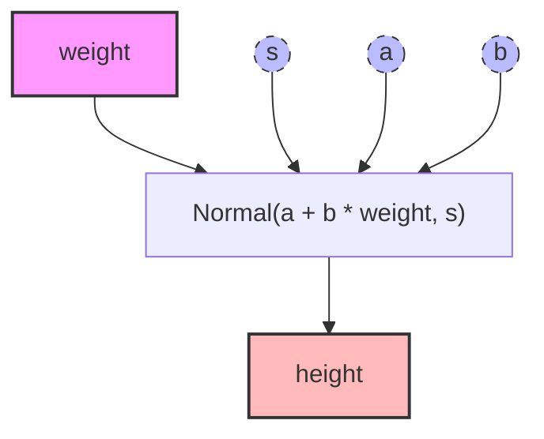
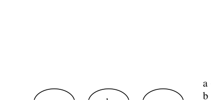

# BI Workflow Research Report

## Data Profiling
### `m.df`
- **Shape**: `(544, 4)`
- **Columns/Types**:
  - `height`: `float64`
  - `weight`: `float64`
  - `age`: `float64`
  - `male`: `int64`

## Causal Workflow DAG


## Probabilistic Plate Diagram


## NumPyro Computational Graph
```python
import numpyro
# Use this logic to render the plate diagram locally:
numpyro.render_model(model, model_args=(weight, height), render_distributions=True)
```

## Statistical Formulation
$$
\begin{aligned}
height \sim \text{Normal}(a + b * weight, s) \\
s \sim \text{Uniform}(0, 50) \\
b \sim \text{LogNormal}(0, 1) \\
a \sim \text{Normal}(178, 20)
\end{aligned}
$$

## Probabilistic Model Structure
* **a**: `normal(178, 20)`
* **b**: `log_normal(0, 1)`
* **normal**: `normal(<parameter>, <parameter>)`
* **s**: `uniform(0, 50)`

## Causal Analysis
- **Outcome (Y)**: `height`
- **Predictors (X)**: `weight`
- **Latent Parameters ($	heta$)**: `s`, `a`, `b`

## Model Archetype
- **Type**: `Simple Regression Model`
- **Suggested Next Steps**: Run Posterior Predictive Checks (PPC) to verify if the model captures the data variance and skewness.

## Generative Model (Simulation)
```python
# Generate `height` through a normal distribution based on the likelihood model
a = m.dist.normal(sample=True, 178, 20, name='a')
b = m.dist.log_normal(sample=True, 0, 1, name='b')
s = m.dist.uniform(sample=True, 0, 50, name='s')
ht = m.dist.normal(a + b * weight, s)
```

## MCMC Diagnostics Analysis
⚠️ Diagnostics Warning:
- Parameter `a` low ESS tail (ESS_tail = 363 < 400) — tail quantiles unreliable
- Parameter `b` low ESS tail (ESS_tail = 336 < 400) — tail quantiles unreliable

### Full Summary Table
```text
     mean    sd  hdi_5.5%  hdi_94.5%  mcse_mean  mcse_sd  ess_bulk  ess_tail  r_hat
a  138.28  0.40    137.69     138.94       0.02     0.02    465.12    362.51    NaN
b   25.95  0.42     25.30      26.58       0.02     0.02    548.76    335.77    NaN
s    9.38  0.30      8.97       9.91       0.01     0.01    490.84    404.80    NaN
```

### Advanced Sampler Diagnostics
**R-hat (ArviZ)**: All < 1.01 ✅

**ESS bulk (ArviZ)**: All ≥ 400 ✅

**ESS tail**: error — 'Dataset' object is not callable

**Divergences**: 0/500 ✅

**BFMI**: not recorded (rerun with `extra_fields=('energy',)`)

### Posterior Predictive Check
**Site**: `x` | **Draws**: 500 | **N**: 544

| Statistic | Observed | PPC mean | PPC SD |
|-----------|----------|----------|--------|
| Mean | 138.264 | 138.259 | 0.571 |
| Std  | 27.577 | 27.572 | 0.545 |
| Min  | 53.975 | 68.668 | — |
| Max  | 179.070 | 197.114 | — |

**89% PPC Coverage**: 90.1% of observed within interval ✅
**Bayesian p-value (mean)**: 0.484 ✅  _(extreme values near 0 or 1 signal misfit)_

_Interactive plot: [ppc_plot.html](ppc_plot.html)_