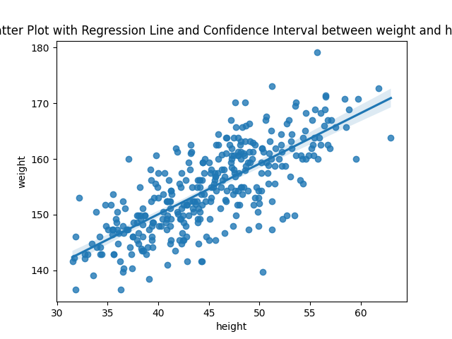

# Bayesian Linear Regression for continuous vairables
## General Principles
To study relationships between two continuous vairables (e.g. heigth and weigth), we can use : _Linear regression approach_. Basically, we draw a line that cross the points clouds of the two tested variables:


We model the relationship between the input feature (_X_) and the target variable (Y) using the following equation:

$$
Y = \alpha +X * W + ε
$$

Where:
- _Y_ is the target variable.
- _X_ is the input variable.
- _W_ is the regression coefficient.
- \alpha is the intercept term.
- _ε_ is the error term assumed to be normally distributed.

Concretly in the figure, _b_ is the starting point of the line,  _W_ is the slope of the line (e.g. the angle between the _b_ and an horizontal line) and _ε_ is the spread of points btween the line. 

We can interpret _b_ as the mean for of _Y_ for the smaller value of _X_ (like a starting point). We can interpret _W_ as how much _Y_ increase for each increment of  _X_. And we can interpret _ε_ as the error arround the prediction. So _W_ give the strength of the relationship between _W_ and _Y_ and _ε_ the amount of error in the model.

## Conciderations
Unlike traditional linear regression, Bayesian linear regression considers uncertainty in the model parameters and provides a full posterior distribution over them. We thus need to decalre prior distribution for  _W_
,  _b_  and _ε_. 

Ussually, we use _Normal_ distribution for  _W_, _b_. As we concider that data is standardized we use a distribution of mean 0 and of standard deviation of 1. Ussually, we use an exponetial distributiuon for _ε_ (why?)

<span style="font-size:1em; color : red">
<i>
Additional conciderations : 
</i>
</span>

- Gaussian regression deals directly with continuous outcomes, estimating a linear relationship between predictors and the outcome variable without needing a link function. This simplifies interpretation, as coefficients represent direct changes in the outcome variable.

## Example

Below is an example code snippet demonstrating Bayesian linear regression using TensorFlow Probability:

```python
import bi
# Import data
d = pd.read_csv('/home/sosa/BI/data/Howell1.csv', sep=';')

# Manipulate and scale data
d = d[d.age > 18]
#self.df["weight.per.g"].pipe(lambda x: (x - x.mean()) / x.std())
d.weight = d.weight - d.weight.mean()
d.age = d.age - d.age.mean()
weight = jnp.array(d.weight.values)

# Define your model
def model():
    s = yield uniform(1, 0, 50)
    a = yield normal(1, 178, 20)
    b = yield normal(1, 0, 1)    
    y = yield Independent(Normal(a+b*weight, s))
    
posterior, sample_stats = NUTStrans(model, 
                                    obs = jnp.array(d.height.values), 
                                    n_chains = 4)
```

## Mathematical Details
We can express the Bayesian linear regression model using probability distributions as follows:
$$
p(Y | X, W, b) = Normal(X * W + b, σ^2)
$$

$$
p(W) = Normal(0, α^2)
$$

$$
p(b) = Normal(0, β^2)
$$

Where:
- _p(Y | X, W, b)_ is the likelihood function.
- _p(W) and p(b)_ are the prior distributions for the regression coefficients and intercept.
- _σ²_, _α²_, and _β²_ are hyperparameters controlling the variance of the likelihood and priors.
