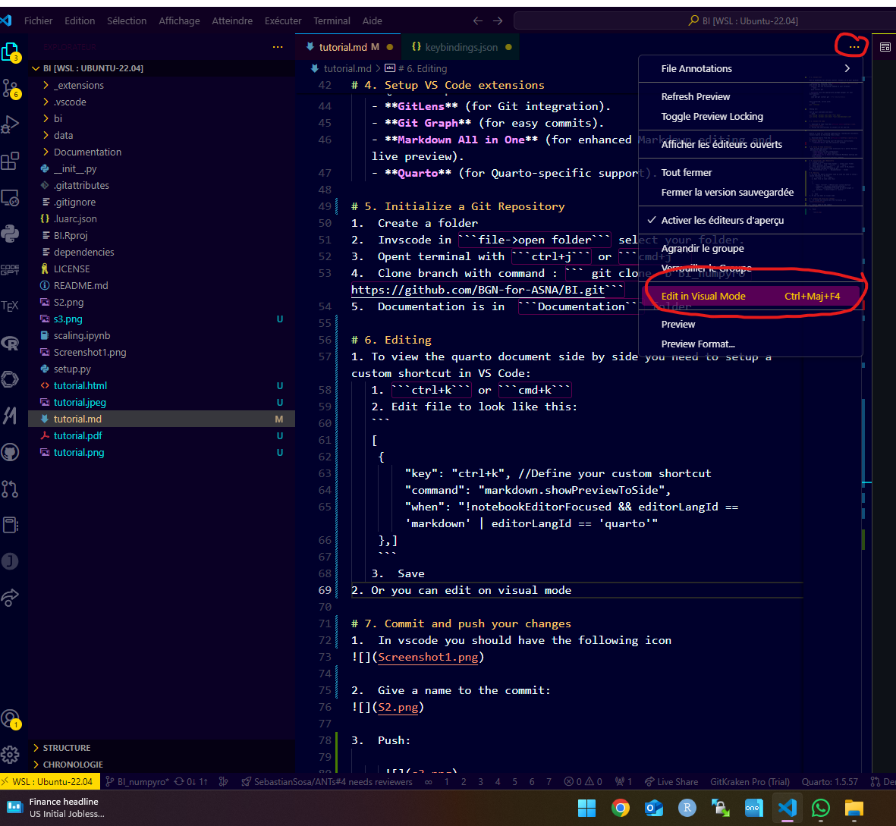
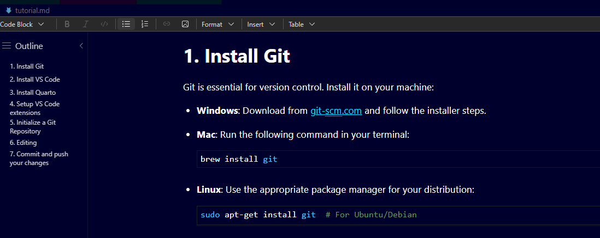
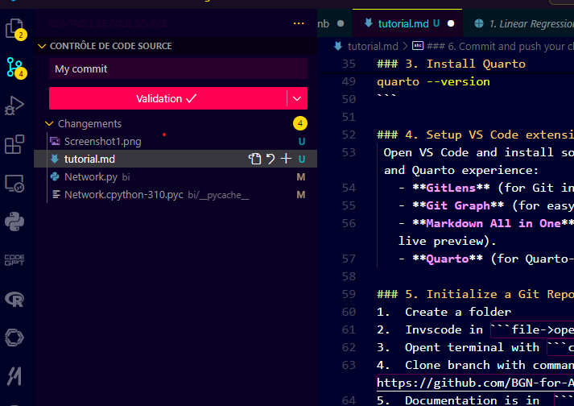
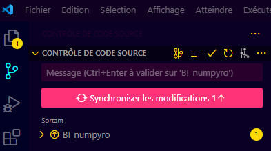

# 1. Install Git 

Git is essential for version control. Install it on your machine:

-   **Windows**: Download from [git-scm.com](https://git-scm.com/) and follow the installer steps.

-   **Mac**: Run the following command in your terminal:

    ``` bash
    brew install git
    ```

-   **Linux**: Use the appropriate package manager for your distribution:

    ``` bash
    sudo apt-get install git  # For Ubuntu/Debian
    ```

Once installed, verify with:

``` bash
git --version
```

#Setup Git:

Set up your username and email:

``` bash
git config --global user.name "Your Name"
git config --global user.email "your.email@example.com"
```

# 2. Install VS Code

1.  Download VS Code from the [official website](https://code.visualstudio.com/).
2.  Follow the instructions to install it for your OS.

# 3. Install Quarto

Quarto is used for creating high-quality, reproducible documents. Install Quarto by following these steps:

1.  Download Quarto from the [official site](https://quarto.org/docs/get-started/).
2.  Install Quarto following your OS-specific instructions:
    -   **Windows/Mac**: Run the installer package.

# 4. Setup VS Code extensions

Open VS Code and install some extensions for a better Markdown and Quarto experience: - **GitLens** (for Git integration). - **Git Graph** (for easy commits). - **Markdown All in One** (for enhanced Markdown editing and live preview). - **Quarto** (for Quarto-specific support).

# 5. Initialize a Git Repository

1.  Create a folder
2.  Invscode in `file->open folder` select your folder.
3.  Opent terminal with `ctrl+j` or `cmd+j`
4.  Clone branch with command : `git clone -b BI_numpyro https://github.com/BGN-for-ASNA/BI.git`
5.  Documentation is in `Documentation` folder

# 6. Editing

1.  To view the Quarto document side by side, you need to set up a custom shortcut in VS Code::

    1.  `ctrl+k` or `cmd+k`
    2.  Edit the file to look like this:

    ```         
    [
     {
         "key": "ctrl+k", //Define your custom shortcut
         "command": "markdown.showPreviewToSide",
         "when": "!notebookEditorFocused && editorLangId == 'markdown' | editorLangId == 'quarto'"
     },]
    ```

    3.  Save

2.  Or you can edit in visual mode: 1


3. If you want to add comments for the moment, use Quarto comments: ```<!-- This is a comment -->```. These will appear in the commit.

# 7. Commit and push your changes

1.  In vscode you should have the following icon 

2.  Give a name to the commit: 

3.  Push:

    